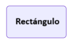
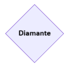
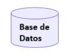
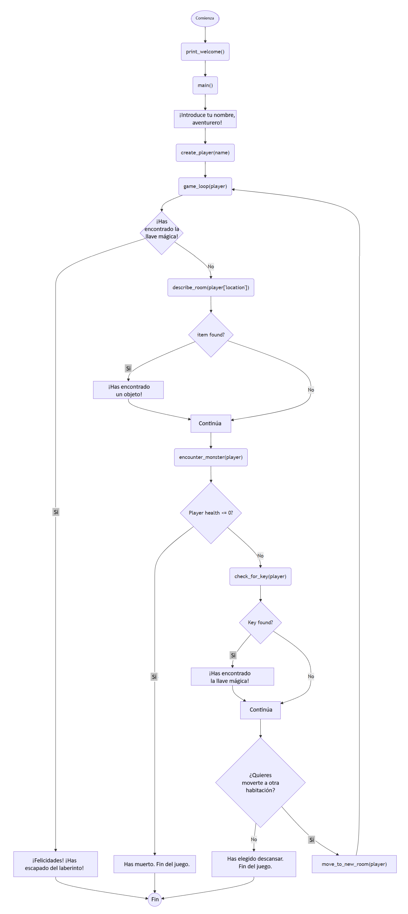

<script type="module">
  import mermaid from 'https://cdn.jsdelivr.net/npm/mermaid@10/dist/mermaid.esm.min.mjs';
  mermaid.initialize({ startOnLoad: true });
</script>

# Día 1. Entiende tu código. Aventura en Python: 🧟‍♂️ Laberinto de Monstruos
{: .no_toc }
¿Te sientes un poco perdido cuando tus agentes de **Vibe Coders** escupen líneas de código de Python? ¡No estás solo! Muchos desarrolladores aspirantes se encuentran mirando una sintaxis desconocida, preguntándose cómo interpretar la lógica detrás de las creaciones de sus agentes. Esta lección intensiva está diseñada para **desterrar esa confusión**. Nos sumergiremos en los elementos esenciales de Python – sus tipos de datos fundamentales, operaciones comunes y flujo de control básico – equipándote con el conocimiento para leer y entender con confianza el código que tus agentes generan. Deja de sentirte marginado y empieza a colaborar de verdad con tu IA; **¡desbloquea el poder de entender** el código, no solo de generarlo!

---

<details open markdown="block">
<summary>
Índice de contenidos
</summary>
{: .text-delta }
1. TOC
{:toc}
</details>


---
## 🧭 1.1. ¿Cómo se explica? <a href="#top" class="back-to-top-link" aria-label="Back to Top">↑</a>

Para cubrir todos los conceptos básicos de Python, vamos a crear un **mini juego basado en texto** llamado **“Laberinto de Monstruos”**. Es divertido, simple y abarca todos los temas listados.

Estás atrapado en un laberinto. En cada turno, decides moverte por las habitaciones, recoger objetos y luchar contra monstruos aleatorios. El objetivo es encontrar la **llave mágica** para escapar.

---

## 🧠 1.2. ¿Qué aprenderás? <a href="#top" class="back-to-top-link" aria-label="Back to Top">↑</a>

| Concepto                 | Cubierto en                                               | Uso/Propósito                                     |
| ----------------------- | --------------------------------------------------------- | ------------------------------------------------- |
| Impresión               | `print()`                                                 | Mostrar salida de texto al usuario                |
| Tipos de Datos          | `int`, `str`, `list`, `dict`, `bool`                      | Almacenar diferentes tipos de información         |
| Declaraciones Condicionales | `if`, `elif`, `else`, y `random.random()`               | Tomar decisiones basadas en condiciones           |
| Aleatorización          | `random.choice()`, `random.random()`                      | Generar valores impredecibles                     |
| Bucles For              | Búsqueda en inventario o expansiones opcionales           | Repetir acciones para cada ítem en una colección    |
| Bucles While            | Bucle de entrada de usuario                               | Repetir acciones hasta que se cumpla una condición |
| Funciones               | Todos los bloques definidos (`main`, `game_loop`, etc.)   | Organizar el código en bloques reutilizables      |
| Funciones con Entradas  | `create_player(name)`                                     | Pasar datos a funciones para su procesamiento     |
| Funciones con Salidas   | `return` en `create_player`, `describe_room`              | Obtener resultados de las funciones               |
| Diccionarios            | Objeto `player`                                           | Almacenar pares clave-valor para una fácil búsqueda |
| Comentarios             | En todo el código                                         | Explicar el código para lectores humanos          |
| Depuración              | Estructura clara para rastreo, rutas de fin de juego      | Encontrar y corregir errores en tu código         |
| Manipulación de Cadenas | `f"{player['health']}"`, `.lower()`, arte ASCII           | Modificar y formatear texto                       |
| Conversión de Tipos     | No es necesario aquí directamente, pero se puede añadir `int(input())` | Cambiar datos de un tipo a otro         |
| f-Strings               | `"f"¡Encontraste {item}!"` etc.                           | Formatear cadenas con variables incrustadas       |
| Listas Anidadas         | Opcional en expansiones                                   | Crear listas dentro de listas para datos complejos |
| Errores de Índice       | Se puede simular con `inventory[5]` durante la enseñanza  | Manejar intentos de acceso fuera de rango         |
| Recursividad            | `game_loop()` se llama a sí misma                         | La función se llama a sí misma para repetir el procesamiento |
| Range                   | Usar `range()` si se añaden turnos o pasos                | Generar secuencias de números                     |
| Ámbito / Variable Global| `found_key`, palabra clave `global`                       | Controlar dónde se pueden acceder a las variables |
| Espacios de Nombres     | Explicado separando funciones y `main`                    | Organizar nombres para evitar conflictos          |
| Docstrings              | `"""Docstrings"""` en todas las funciones                 | Documentar el propósito y uso de la función       |
| Arte ASCII              | En `print_welcome()`                                      | Crear gráficos basados en texto                   |
| Mejora de la UI         | A través de emojis, diseño, mensajes de entrada           | Mejorar la experiencia del usuario                |
| Descomposición de Problemas | El juego se divide en funciones pequeñas y comprobables | Resolver problemas complejos pieza por pieza      |

---

## 🧱 1.3. Codificación Paso a Paso <a href="#top" class="back-to-top-link" aria-label="Back to Top">↑</a>

### 📦 1.3.1. Importar módulo y Comentarios <a href="#top" class="back-to-top-link" aria-label="Back to Top">↑</a>
La declaración `import` en Python te permite incluir y usar código de otros módulos en tu programa actual. Por ejemplo, en el código de abajo:
```python
# Importación simple - acceso con nombre_modulo.item
import random
# Ejemplo de importación con randint
random_number = random.randint(1, 10)  # Genera un entero aleatorio entre 1 y 10
```
Python busca un módulo llamado "random" o un archivo llamado random.py en varias ubicaciones y ejecuta su código una vez. Se crea un espacio de nombres llamado "random" en tu programa y luego puedes acceder a las funciones y variables del módulo. En el ejemplo, la función `randint` se usa para crear un número entero aleatorio entre 1 y 10.
En Python, todo lo que se escribe después de "#" hasta el final de la línea se interpreta como un comentario y los editores generalmente los muestran en verde o gris.

### 📋 1.3.2. Constantes y Listas <a href="#top" class="back-to-top-link" aria-label="Back to Top">↑</a>

En Python, las variables que deben permanecer sin cambios a lo largo de un programa a menudo se escriben en MAYÚSCULAS para indicar que son **constantes**. Aunque Python no impone esto (las variables aún se pueden cambiar), es una convención para señalar a otros programadores que estos valores no deben ser modificados.

Las **listas** son colecciones ordenadas que pueden almacenar múltiples ítems de cualquier tipo. Se crean usando corchetes `[]` con los ítems separados por comas. Aquí hay un ejemplo de nuestro juego Laberinto de Monstruos:

```python
# Constantes definidas como listas
ROOMS = ["Salón", "Cocina", "Biblioteca", "Mazmorra", "Jardín"]
ITEMS = ["espada", "poción", "escudo"]
MONSTERS = ["Goblin", "Trol", "Esqueleto"]
```

En este ejemplo:
- `ROOMS` es una lista que contiene 5 elementos de cadena que representan ubicaciones del juego
- `ITEMS` es una lista de 3 objetos coleccionables en el juego
- `MONSTERS` es una lista de 3 tipos de enemigos que el jugador podría encontrar

Las listas son increíblemente versátiles en Python:
- Se puede acceder a ellas por índice: `ROOMS[0]` devolvería "Salón"
- Su longitud se puede encontrar con `len(ROOMS)` (devuelve 5)
- Se pueden añadir elementos con `append()` o `insert()`
- Puedes iterar a través de ellas usando un bucle `for`: `for room in ROOMS:`

Más adelante en nuestro juego, seleccionaremos elementos aleatorios de estas listas usando `random.choice()` para crear una jugabilidad impredecible.


### 🌐 1.3.3. Variables globales, Funciones e Impresión <a href="#top" class="back-to-top-link" aria-label="Back to Top">↑</a>
Las variables globales en Python son variables que se definen fuera de cualquier función y se pueden acceder desde todo el programa, incluso dentro de las funciones. La variable global `found_key` obtiene el valor `False` al principio de monster_maze.py
```python
# Variable global
found_key = False
```

Las **funciones** de Python son bloques de código reutilizables que realizan una tarea específica. Se utilizan para organizar el código, mejorar la legibilidad y promover la reutilización del código al descomponer problemas complejos en piezas más pequeñas y manejables. En el bloque de código de abajo, la variable global `counter` comienza con un valor de 0, luego se declara una función `increment()` usando `def <nombre de la función>` y ":". El código que se ejecuta cada vez que se llama a la función. Python identifica el código que pertenece a la función porque está sangrado exactamente 4 espacios. En el ejemplo, la función `increment()` aumenta la variable `counter` en 1 cada vez que se llama.
```python
counter = 0

def increment(): # Crea la función increment() sin variables
    global counter  # Declara que queremos usar la variable global
    counter += 1 # Aumenta la variable counter en 1. Es lo mismo que counter = counter + 1
    
increment() # Ejecuta la función increment()
print(counter)  # Salida: 1
increment() # Ejecuta la función increment()
print(counter)  # Salida: 2
```
Para modificar una variable global dentro de una función, necesitas usar la palabra clave `global` como en el ejemplo.
El comando `<print(counter)>` escribe el valor de la variable `counter` en la terminal. **Print** es el principal comando de depuración. También se utiliza para enviar mensajes de texto al usuario como en la función `print_welcome()`.
```python
def print_welcome():
    """Imprime el mensaje de bienvenida con arte ASCII."""
    print("""
    🧟‍♂️ LABERINTO DE MONSTRUOS 🧟‍♀️
    ¡Escapa del laberinto, derrota a los monstruos y encuentra la llave!
    """)  # Manipulación e impresión de cadenas
```
La cadena escrita debajo de la función con triples `"""` contiene un
texto de documentación corto llamado **"Docstrings"** que se utiliza para transmitir el propósito y la funcionalidad de las funciones, módulos y clases de Python.

### 🔑 1.3.4. Diccionarios, Listas de Diccionarios, Tuplas y Rebanado <a href="#top" class="back-to-top-link" aria-label="Back to Top">↑</a>

Los **diccionarios** son una de las estructuras de datos más potentes de Python. Almacenan datos como pares clave-valor, lo que te permite recuperar valores rápidamente usando sus claves asociadas (similar a cómo buscas definiciones en un diccionario real). Los diccionarios se crean usando llaves `{}` con cada par clave-valor separado por comas.

En nuestro juego Laberinto de Monstruos, la función `create_player()` crea y devuelve un diccionario de jugador:

```python
def create_player(name):
    """Devuelve un nuevo diccionario de jugador."""
    return {
        "name": name,
        "health": 100,
        "inventory": [],
        "location": random.choice(ROOMS)  # Módulo random
    }
```

En este diccionario:
- Las claves son cadenas como `"name"`, `"health"`, `"inventory"` y `"location"`
- Los valores pueden ser de cualquier tipo: una cadena para `"name"`, un entero para `"health"`, una lista para `"inventory"`, etc.
- Accedes a los valores usando sus claves: `player["health"]` te daría `100`
- Los valores se pueden modificar: `player["health"] -= 20` reduciría la salud en 20

Las **listas de diccionarios** son estructuras de datos potentes que pueden almacenar múltiples registros con campos con nombre. Son ideales para colecciones de objetos similares.

```python
# Lista de diccionarios para múltiples jugadores
players = [
    {"name": "Alex", "health": 100, "inventory": ["espada"]},
    {"name": "Taylor", "health": 80, "inventory": ["poción", "escudo"]},
    {"name": "Jordan", "health": 120, "inventory": []}
]

# Accediendo a los datos
print(players[0]["name"])  # Salida: Alex
print(players[1]["inventory"][0])  # Salida: poción

# Añadiendo un nuevo jugador a la lista
players.append({"name": "Casey", "health": 90, "inventory": ["mapa"]})

# Recorriendo todos los jugadores
for player in players:
    print(f"{player['name']} tiene {player['health']} de salud")
```

Las **tuplas** son secuencias inmutables similares a las listas pero encerradas en paréntesis. Una vez creadas, sus valores no pueden ser cambiados.

```python
# Creación básica de tupla
coordinates = (10, 20)
rgb_color = (255, 0, 128)

# Desempaquetado de tuplas - asigna cada valor a una variable
x, y = coordinates
print(f"X: {x}, Y: {y}")  # Salida: X: 10, Y: 20

# Las tuplas pueden contener tipos de datos mixtos
player_data = ("Alex", 100, ["espada", "poción"])
name, health, inventory = player_data

# Las tuplas son inmutables - esto causaría un error:
# coordinates[0] = 15

# Pero si una tupla contiene un objeto mutable, ese objeto puede ser modificado:
player_data[2].append("escudo")  # ¡Esto funciona!
```

El **rebanado** (slicing) te permite extraer porciones de secuencias (listas, cadenas, tuplas) usando la sintaxis `[inicio:parada:paso]`.

```python
# Rebanando una lista
items = ["espada", "escudo", "poción", "llave", "mapa"]
primeros_dos = items[0:2]  # ["espada", "escudo"]
ultimos_tres = items[2:]  # ["poción", "llave", "mapa"]
items_del_medio = items[1:4]  # ["escudo", "poción", "llave"]

# Los índices negativos cuentan desde el final
ultimo_item = items[-1]  # "mapa"
penultimo = items[-2]  # "llave"
todo_menos_el_ultimo = items[:-1]  # ["espada", "escudo", "poción", "llave"]

# El parámetro de paso salta elementos
cada_segundo = items[::2]  # ["espada", "poción", "mapa"]
lista_invertida = items[::-1]  # ["mapa", "llave", "poción", "escudo", "espada"]

# El rebanado de cadenas funciona de la misma manera
name = "Laberinto de Monstruos"
primera_palabra = name[:9]  # "Laberinto"
ultima_palabra = name[10:]  # "de Monstruos"
nombre_invertido = name[::-1]  # "sortsnoM ed otnirebaL"
```

El rebanado es una forma concisa y potente de manipular secuencias en Python, mientras que las listas de diccionarios y las tuplas proporcionan opciones flexibles para organizar estructuras de datos complejas en tus juegos.

### ⚙️ 1.3.5 Funciones con Entrada y Salida <a href="#top" class="back-to-top-link" aria-label="Back to Top">↑</a>
Las **funciones con entrada** son funciones a las que se les pasa una variable como valor cuando se llaman. Esto se hace en nuestro código cuando se llama a `game_loop(player)` en `main()`.
Las **funciones con salida** son funciones que devuelven valores para ser utilizados en otras partes de tu código. En Python, la declaración `return` se usa para especificar qué valor debe devolver una función. Sin una declaración `return`, las funciones devuelven `None` por defecto.

Nuestra función `create_player()` de arriba es un ejemplo perfecto:
1. Toma un parámetro de entrada `name`
2. Crea un diccionario con los atributos del jugador
3. Devuelve ese diccionario, que luego puede ser asignado a una variable
4. El código que la llama puede usar ese diccionario devuelto: `player = create_player("Alex")`

Los valores de retorno son esenciales cuando una función necesita calcular o crear algo que será utilizado por otras partes de tu programa. En nuestro juego, el diccionario del jugador es central para el estado de todo el programa, por eso tenemos una función dedicada que lo devuelve.

**Funciones con entrada desconocida** En Python, es posible crear una función que acepte un número desconocido de argumentos usando `*args` y `**kwargs`. Aquí hay un desglose de cuándo y por qué usamos cada uno:

`*args` (Argumentos Posicionales Arbitrarios): Se usa cuando necesitas crear una función que pueda operar en un número no especificado de entradas del mismo tipo.

Cómo funciona:
- La sintaxis `*args` en la definición de una función recoge todos los argumentos posicionales adicionales pasados a la función en una tupla.
- El nombre `args` es una convención; podrías usar `*loquesea` si quisieras, pero `*args` es ampliamente entendido y recomendado.

Ejemplo:

```python
def sum_all_numbers(*args):
    total = 0
    for num in args:
        total += num
    return total

print(sum_all_numbers(1, 2, 3))         # Salida: 6
print(sum_all_numbers(10, 20, 30, 40))  # Salida: 100
print(sum_all_numbers())                # Salida: 0
```

`**kwargs` (Argumentos de Palabra Clave Arbitrarios): se usa cuando quieres que una función acepte cualquier número de argumentos de palabra clave (argumentos pasados con una sintaxis `clave=valor`).

Cómo funciona:
- La sintaxis `**kwargs` en la definición de una función recoge todos los argumentos de palabra clave adicionales pasados a la función en un diccionario.
- El nombre `kwargs` es una convención; podrías usar `**otra_cosa` pero `**kwargs` es el estándar.

Ejemplo:
```python
def configure_settings(**kwargs):
    settings = {
        "theme": "dark",
        "font_size": 12,
        "language": "en"
    }
    for key, value in kwargs.items():
        settings[key] = value
    return settings

print(configure_settings(theme="light", font_size=14))
# Salida: {'theme': 'light', 'font_size': 14, 'language': 'en'}

print(configure_settings(language="fr", debug_mode=True))
# Salida: {'theme': 'dark', 'font_size': 12, 'language': 'fr', 'debug_mode': True}

print(configure_settings())
# Salida: {'theme': 'dark', 'font_size': 12, 'language': 'en'}
```
Puedes combinar `*args` y `**kwargs`, por ejemplo `def generic_printer(arg1, *args, **kwargs):`


### 🔀 1.3.6. Declaraciones Condicionales y Formateo de Cadenas <a href="#top" class="back-to-top-link" aria-label="Back to Top">↑</a>

Las **declaraciones condicionales** (if/elif/else) son bloques de construcción fundamentales en Python que permiten a tu programa tomar decisiones. Ejecutan diferentes bloques de código según si ciertas condiciones son verdaderas o falsas. Veamos la función `describe_room()` como ejemplo:

```python
def describe_room(room):
    """Describe la habitación actual."""
    print(f"\nAhora estás en la {room}.")
    if random.random() < 0.4:  # Declaración condicional
        item = random.choice(ITEMS)
        print(f"¡Encontraste un {item}!")
        return item
    return None
```

En esta función:
- La declaración `if` comprueba si `random.random() < 0.4` es verdadero
- `random.random()` genera un número flotante aleatorio entre 0.0 y 1.0
- Si la condición es verdadera (40% de probabilidad), el bloque sangrado se ejecuta, seleccionando un ítem
- Si la condición es falsa (60% de probabilidad), la función salta a `return None`

Una estructura completa if/elif/else funciona así:
```python
if condicion1:
    # Código que se ejecuta si condicion1 es Verdadera
elif condicion2:
    # Código que se ejecuta si condicion1 es Falsa pero condicion2 es Verdadera
else:
    # Código que se ejecuta si todas las condiciones son Falsas
```

El **formateo de cadenas** se demuestra de varias maneras en esta función:

1. Las **f-strings** (cadenas literales formateadas) son una característica potente introducida en Python 3.6. Comienzan con `f` y te permiten incrustar expresiones dentro de cadenas literales usando llaves `{}`.
   ```python
   print(f"\nAhora estás en la {room}.")
   ```
   Aquí, el valor de la variable `room` se inserta directamente en la cadena. Esto es mucho más limpio que métodos más antiguos como `print("\nAhora estás en la " + room + ".")`.

2. Las **secuencias de escape** como `\n` son combinaciones de caracteres especiales que representan caracteres que serían difíciles de escribir directamente:
   - `\n` representa un carácter de nueva línea, comenzando el texto en una nueva línea
   - Otras comunes incluyen `\t` (tabulación), `\"` (comilla) y `\\` (barra invertida)

3. **`random.choice()`** selecciona un elemento aleatorio de una secuencia como una lista. En nuestra función:
   ```python
   item = random.choice(ITEMS)
   ```
   Esto selecciona aleatoriamente un ítem de nuestra lista `ITEMS` ("espada", "poción" o "escudo").

La combinación de estas características hace que nuestro código sea funcional y legible. Observa cómo la función utiliza condiciones para crear una jugabilidad dinámica (a veces encontrando ítems, a veces no) y cadenas formateadas para comunicar claramente lo que le está sucediendo al jugador.


### 🔢 1.3.7. Range() y Operadores Lógicos <a href="#top" class="back-to-top-link" aria-label="Back to Top">↑</a>

La **función `range()`** es una función incorporada de Python que genera una secuencia de números. Se usa comúnmente en bucles `for` para ejecutar código un número específico de veces.

Uso básico: `range(parada)` o `range(inicio, parada, paso)`:
- `range(5)` genera los números 0, 1, 2, 3, 4
- `range(2, 8)` genera 2, 3, 4, 5, 6, 7
- `range(1, 10, 2)` genera 1, 3, 5, 7, 9

Aunque nuestra función `move_to_new_room()` no usa `range()` directamente, utiliza un concepto relacionado llamado comprensión de listas, que se puede implementar con `range`:

```python
def move_to_new_room(player):
    """Mueve al jugador a una nueva habitación aleatoria."""
    previous = player["location"]
    player["location"] = random.choice([r for r in ROOMS if r != previous])
```

Esta función:
1. Almacena la habitación actual en `previous`
2. Crea una nueva lista con todas las habitaciones *excepto* la actual usando una comprensión de listas
3. Selecciona aleatoriamente una habitación de esa lista

La misma comprensión de listas podría escribirse con `range()` así:
```python
[ROOMS[i] for i in range(len(ROOMS)) if ROOMS[i] != previous]
```

Los **operadores de comparación** se utilizan para comparar valores y devolver resultados booleanos (Verdadero o Falso):

| Operador | Descripción | Ejemplo |
|----------|-------------|---------|
| `==` | Igual a | `if name == "Alex":` |
| `!=` | No igual a | `if r != previous:` (de nuestra función) |
| `<` | Menor que | `if random.random() < 0.4:` |
| `>` | Mayor que | `if player["health"] > 50:` |
| `<=` | Menor o igual que | `if player["health"] <= 0:` |
| `>=` | Mayor o igual que | `if score >= 100:` |

Los **operadores lógicos** te permiten combinar múltiples condiciones:

| Operador | Descripción | Ejemplo |
|----------|-------------|---------|
| `and` | Verdadero si ambas condiciones son verdaderas | `if health > 0 and found_key:` |
| `or` | Verdadero si alguna de las condiciones es verdadera | `if choice in ["yes", "y"]:` |
| `not` | Invierte un valor booleano | `if not found_key:` |

En nuestra función `move_to_new_room()`, la comprensión de listas utiliza el operador `!=` para crear una lista de habitaciones que no son la habitación actual. Esto asegura que el jugador siempre se mueva a una habitación diferente.

Otro ejemplo de nuestro código que muestra operadores lógicos está en el bucle del juego:

```python
if choice in ["yes", "y"]:
    move_to_new_room(player)
    game_loop(player)  # Recursión
    break # Sale del bucle
elif choice in ["no", "n"]:
    print("🛌 Elegiste descansar. Fin del juego.")
    break 
```
Aquí, el operador `in` comprueba si un valor existe en una lista y actúa como una condición lógica. La condición `choice in ["yes", "y"]` es verdadera si el usuario escribió "yes" o "y".

La combinación de operadores te permite crear una lógica de decisión compleja:
```python
# Ejemplo de condición compuesta
if player["health"] < 30 and "potion" in player["inventory"]:
    print("¡Usas una poción para restaurar la salud!")
    player["health"] += 50
    player["inventory"].remove("potion")
```

Estos operadores son esenciales para crear programas dinámicos y receptivos que pueden tomar decisiones basadas en condiciones cambiantes. En monster_maze.py esto se usa nuevamente para jugar encuentros con monstruos.

```python
def encounter_monster(player):
    """Encuentro aleatorio con un monstruo con posibilidad de luchar."""
    if random.random() < 0.3:
        monster = random.choice(MONSTERS)
        print(f"\n⚔️ ¡Aparece un {monster} salvaje!")
        if "sword" in player["inventory"]:
            print("¡Lo derrotas con tu espada!")
        else:
            player["health"] -= 20
            print("¡No tienes espada! ¡Te han herido!")
            print(f"Salud: {player['health']}")
            if player["health"] <= 0:
                print("💀 Has muerto. Fin del juego.")
                exit() # Sale del script
```

### 🔄 1.3.8. Bucles While y For para Controlar el Flujo. Recursión de Funciones <a href="#top" class="back-to-top-link" aria-label="Back to Top">↑</a>

Aquí es donde ponemos al ordenador a trabajar de verdad para nosotros usando bucles `while` y `for` para repetir acciones. Los **bucles while** ejecutan un bloque de código repetidamente mientras una condición permanezca verdadera. Son ideales cuando no sabes de antemano cuántas iteraciones necesitarás.

En nuestro juego, usamos un bucle `while` para seguir pidiendo al jugador una entrada hasta que proporcione una respuesta válida:

```python
# Bucle while para validación de entrada
while True:
    choice = input("\n¿Quieres moverte a otra habitación? (sí/no): ").lower()
    if choice in ["sí", "s"]:
        move_to_new_room(player)
        game_loop(player)  # Recursión
        break
    elif choice in ["no", "n"]:
        print("🛌 Elegiste descansar. Fin del juego.")
        break
    else:
        print("Por favor, responde sí o no.")
```

El `while True:` crea un bucle infinito que solo saldrá cuando encuentre una declaración `break`. Esto sucede cuando el jugador introduce "sí"/"s" o "no"/"n". Si introduce cualquier otra cosa, el bucle continúa y le vuelve a preguntar. Este comportamiento, si no se codifica correctamente, puede terminar en nunca alcanzar una condición falsa y tener que detener el programa usando Ctrl+C o, peor aún, Ctrl+Alt+Supr. Para evitar esto, también puedes añadir un contador a la condición para limitar el número máximo de iteraciones.

```python
# Bucle while con un contador para evitar bucles infinitos
max_attempts = 3
attempt_count = 0

while attempt_count < max_attempts:
    choice = input("\n¿Quieres moverte a otra habitación? (sí/no): ").lower()
    attempt_count += 1  # Incrementa el contador con cada iteración
    
    if choice in ["sí", "s"]:
        move_to_new_room(player)
        game_loop(player)
        break
    elif choice in ["no", "n"]:
        print("🛌 Elegiste descansar. Fin del juego.")
        break
    else:
        remaining = max_attempts - attempt_count
        if remaining > 0:
            print(f"Por favor, responde sí o no. {remaining} intentos restantes.")
        else:
            print("Demasiadas entradas no válidas. Continuando...")
```

Esta versión le da al jugador tres oportunidades para introducir una entrada válida antes de continuar, evitando un bucle infinito. El contador registra los intentos y da información útil sobre las oportunidades restantes.

Los **bucles for** iteran sobre una secuencia (como una lista o una cadena) y ejecutan código para cada ítem:

```python
# Ejemplo de un bucle for con el inventario del jugador
def show_inventory(player):
    print("Tu inventario contiene:")
    for item in player["inventory"]:
        print(f"- {item}")
```

Esto imprimiría todos los ítems en el inventario del jugador.

La **recursión** es cuando una función se llama a sí misma. En nuestro juego, `game_loop()` se llama a sí misma cuando el jugador se mueve a una nueva habitación:

```python
if choice in ["sí", "s"]:
    move_to_new_room(player)
    game_loop(player)  # Recursión
    break
```

Esto crea una cadena de llamadas a funciones que continúan hasta que se cumple una condición de terminación (encontrar la llave o morir). La recursión es potente pero necesita una condición de salida clara para evitar una recursión infinita.

### 🏃 1.3.9. Ejecución Principal y Diagrama de Flujo <a href="#top" class="back-to-top-link" aria-label="Back to Top">↑</a>

La **ejecución de un script de Python** sigue un orden específico:

1. Python lee el script de arriba a abajo
2. Define funciones y variables pero no ejecuta el código de la función hasta que se llama a la función
3. Cuando se llama a una función, Python salta temporalmente a esa función, ejecuta su código y luego vuelve a donde lo dejó

En nuestro juego Laberinto de Monstruos, usamos un patrón común de Python:

```python
# Programa principal
def main():
    """Inicia el juego."""
    print_welcome()
    name = input("Introduce tu nombre, aventurero: ")
    player = create_player(name)
    game_loop(player)

if __name__ == "__main__":
    main()
```

La comprobación `if __name__ == "__main__":` asegura que la función `main()` solo se ejecute cuando el script se ejecuta directamente (no cuando se importa como un módulo). Esta es una buena práctica para los programas de Python.

Un **diagrama de flujo** es una representación visual de la lógica de un programa. Los diagramas de flujo ayudan a visualizar lógicas complejas e identificar posibles problemas antes de codificar. Lo bueno ahora es que puedes pedirle a un Modelo de Lenguaje Grande como Gemini o ChatGPT que te cree uno a partir del código. Esta es una excelente manera de familiarizarse con algún código.

En los diagramas de flujo:
- Los rectángulos con esquinas cuadradas o redondeadas significan un paso en el proceso. Representan un paso en el proceso, una operación o una tarea. Aquí es donde se hace algo. Por ejemplo: "Realizar cálculo", "Imprimir informe", "Leer datos".



- Los rombos son para decisiones (o if, then, else): Indican un punto donde se debe tomar una decisión, típicamente una pregunta de "Sí/No" o "Verdadero/Falso". Los caminos que divergen del rombo se etiquetan con las posibles respuestas.



- Óvalos/Cápsulas (Inicio/Fin - Terminal): Representan el comienzo o el final de un proceso.


- Cilindros: Representan datos almacenados en una base de datos u otro medio de almacenamiento.



- Flechas: Conectan los símbolos e indican la dirección del flujo o la secuencia de operaciones.<br/>
**→**


Para Laberinto de Monstruos, el diagrama de flujo se ve así:



### 🐛 1.3.10. Depuración <a href="#top" class="back-to-top-link" aria-label="Back to Top">↑</a>

La **depuración** es el proceso de encontrar y corregir errores (bugs) en tu código. Las técnicas comunes de depuración en Python incluyen:

1. **Depuración con `print`**: Añadir declaraciones `print()` para mostrar los valores de las variables:
   ```python
   print(f"DEBUG: salud del jugador = {player['health']}")
   ```

2. **Usando el depurador de Python** (`pdb`):
   ```python
   import pdb; pdb.set_trace()  # El código se pausará aquí
   ```

3. **Depuración en VS Code**:
   - Establece puntos de interrupción haciendo clic en el margen izquierdo junto a los números de línea
   - Presiona F5 para iniciar la depuración
   - Usa la barra de herramientas de depuración para recorrer el código (Paso a paso por encima, Paso a paso por dentro, Continuar)
   - Pasa el ratón sobre las variables para ver sus valores
   - Usa el panel de Variables para inspeccionar todas las variables actuales
   - Usa la Consola de Depuración para ejecutar comandos en la posición pausada

En nuestro juego Laberinto de Monstruos, los posibles puntos de depuración incluyen:
- Comprobar las transiciones de las habitaciones
- Verificar la deducción de salud después de los encuentros con monstruos
- Confirmar que los ítems se añaden al inventario
- Probar las condiciones de victoria/derrota

Buenas prácticas de depuración:
- Empieza con piezas de código pequeñas y comprobables
- Prueba una característica a la vez
- Usa declaraciones `print` descriptivas
- Comprueba los casos límite (listas vacías, valores cero, etc.)

### 🔧 1.3.11. Refactorizar y Probar, Estructura del Código y Pulido de la UI <a href="#top" class="back-to-top-link" aria-label="Back to Top">↑</a>

La **refactorización** es el proceso de reestructurar el código sin cambiar su comportamiento. Los beneficios incluyen:
- Legibilidad mejorada
- Mejor organización
- Mantenimiento más fácil
- Rendimiento más eficiente

Cuándo refactorizar:
- Después de tener una versión básica funcionando
- Cuando encuentras código repetido
- Cuando las funciones son demasiado largas o hacen demasiadas cosas
- Cuando los nombres podrían ser más claros

Mejores prácticas de **estructura de código**:
1. **Principio de Responsabilidad Única**: Cada función debe hacer una cosa bien
2. **DRY (No te repitas)**: Extrae la lógica repetida en funciones
3. **Nomenclatura Coherente**: Usa nombres descriptivos y convenciones coherentes
4. **Modularidad**: Organiza las funciones relacionadas juntas
5. **Separación de Preocupaciones**: Separa la lógica del juego, la Interfaz de Usuario (UI) y los datos

Nuestro ejemplo de Laberinto de Monstruos sigue una buena estructura:
- Las funciones se centran en tareas específicas (create_player, encounter_monster, etc.)
- El flujo principal del juego está aislado en `game_loop`
- Las variables tienen nombres claros y descriptivos

El **pulido de la UI** mejora la experiencia del usuario:
1. **Instrucciones Claras**: Ayuda a los usuarios a entender qué hacer
2. **Mejoras Visuales**: Usa arte ASCII, emojis y formato
3. **Validación de Entradas**: Maneja las entradas inesperadas con elegancia
4. **Mensajería Coherente**: Usa un tono y estilo coherentes
5. **Ritmo**: Añade pausas cuando sea apropiado para la legibilidad

En nuestro juego, usamos varias mejoras de la UI:
- Iconos de emoji para momentos clave (🧟‍♂️, 🔑, 💀, [más...](https://unicode.org/emoji/charts/full-emoji-list.html))
- Indicaciones claras para la entrada del usuario
- Nuevas líneas (`\n`) para organizar el texto visualmente
- Retroalimentación coherente para las acciones del jugador

Como paso final, las pruebas exhaustivas aseguran que tu código funcione como se espera en diferentes escenarios y casos límite.

---

## 📝 1.4 Preguntas de Reflexión <a href="#top" class="back-to-top-link" aria-label="Back to Top">↑</a>

<details markdown="block">
  <summary>
1. ¿Qué pasa si una función no devuelve (`return`) nada?
  </summary>
Devolverá `None`
</details>

<details markdown="block">
  <summary>
2. ¿En qué se diferencian las variables globales y locales en el juego?
  </summary>
Una variable global en el juego es `found_key`, que es accesible y puede ser modificada desde cualquier función dentro del programa. En contraste, las variables locales se definen dentro de una función específica, como `player` en la función `game_loop` o `item` en `describe_room`, y su ámbito se limita a esa función. Esto significa que solo se pueden usar y modificar dentro de la función donde se definen.
</details>

<details markdown="block">
  <summary>
3. ¿Qué tipo de bucle usarías para repetir hasta que se cumpla una condición?
   </summary>
Para repetir hasta que se cumpla una condición, un bucle `while` sería adecuado, ya que continúa ejecutándose mientras una condición especificada sea verdadera.
</details> 

<details markdown="block">
  <summary> 
4. ¿Y para recorrer una lista de habitaciones?
  </summary>
Para recorrer una lista de habitaciones, un bucle `for` sería apropiado, ya que itera sobre cada ítem en una secuencia.
</details>

<details markdown="block">
  <summary>
5. ¿Cuáles son algunas formas de evitar quedarse atascado en un bucle infinito?
  </summary>
Para evitar quedarse atascado en un bucle infinito:

- Asegúrate de que la condición del bucle finalmente se vuelva falsa: Para los bucles `while`, asegúrate de que la condición que controla el bucle en algún momento se evalúe como `Falsa`.
- Incluye una condición de ruptura: Usa declaraciones `break` para salir del bucle cuando se cumpla una cierta condición.
- Limita las iteraciones: Para bucles que podrían ejecutarse indefinidamente, considera añadir un contador y romper el bucle después de un número máximo de iteraciones.
</details>

<details markdown="block">
  <summary>
6. ¿Puedes romper el juego introduciendo una entrada inesperada?
  </summary>
Sí, puedes romper el juego introduciendo una entrada inesperada. La función `game_loop` incluye una solicitud de `input` que espera "sí" o "no" (o "s" o "n"). Si se introduce cualquier otra entrada, el programa imprimirá repetidamente "Por favor, responde sí o no." debido al bucle `while True` y la condición `else`, quedando efectivamente atascado en un bucle pidiendo una entrada válida hasta que se introduzca "sí" o "no". Esto evita que el juego progrese a la siguiente habitación o termine, y aunque no es un bucle infinito en el sentido de bloquear el programa, detiene el flujo previsto del juego hasta que se proporcione una entrada válida.
</details>

---


## 🎯 1.5. Ejercicios <a href="#top" class="back-to-top-link" aria-label="Back to Top">↑</a>

#### 🧪 Práctica 1: Armas Personalizadas
> Modifica la lista `ITEMS` para incluir nuevas armas como "láser", "arco" o "bola de fuego". Haz que la lógica de encuentro con monstruos las reconozca.

#### 🧪 Práctica 2: Estadísticas de Monstruos
> Crea un diccionario `monster_stats` que le dé a cada monstruo una `fuerza`. Compárala con la salud del jugador.

#### 🧪 Práctica 3: Sistema de Subida de Nivel
> Añade un sistema de experiencia: cada monstruo derrotado da puntos. A los 100 puntos, imprime “¡Subida de Nivel!”

#### 🧪 Práctica 4: Añadir un Mapa
> Registra qué habitaciones has visitado. Imprime un mini-mapa o una lista al final mostrando dónde has estado.


---

¡Feliz Hacking! 🧙‍♀️

