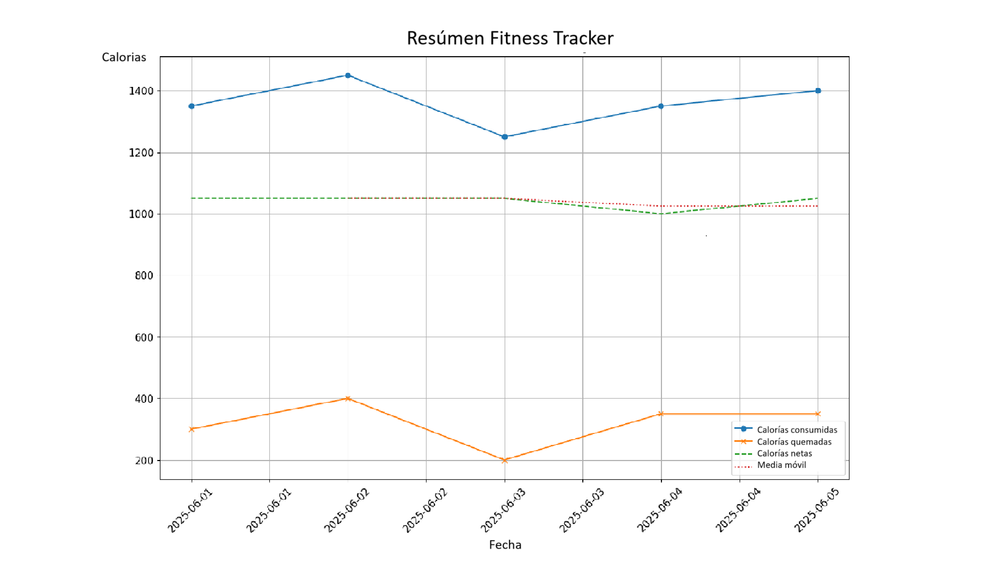

# Día 2. Python Intermedio. 🏋️ Seguimiento de Fitness y Dieta
{: .no_toc }
En el Día 1 aprendimos las funciones básicas de Python que nos permiten procesar tareas repetitivas y elecciones. Hoy avanzaremos un poco más y veremos modos más potentes de gestionar la información, aprendiendo a manipular otros archivos, trabajando con objetos y clases y trazando datos.


---

<details open markdown="block">
  <summary>
    Índice de contenidos
  </summary>
  {: .text-delta }
1. TOC
{:toc}
</details>


---
## 🧭 ¿Cómo se explica? <a href="#top" class="back-to-top-link" aria-label="Back to Top">↑</a>

Esta vez vamos a construir un seguimiento de fitness y dieta que calculará las calorías netas de cada día y trazará el historial en un gráfico. Esta herramienta de línea de comandos:
- Registra entrenamientos y comidas
- Lee y limpia datos CSV
- Realiza análisis de datos
- Visualiza tendencias usando gráficos
- Usa POO para un código estructurado

## 📦 Prerrequisitos, instalación de módulos y entorno.<a href="#top" class="back-to-top-link" aria-label="Back to Top">↑</a>
Necesitarás:
- Python 3.x
- pandas y matplotlib
que puedes instalar ejecutando el siguiente comando en bash:
```bash
pip install pandas matplotlib
```

## 🗂 **Paso 1**: Prepara Tus Datos. <a href="#top" class="back-to-top-link" aria-label="Back to Top">↑</a>

### 👉 Entendiendo la Estructura de Archivos 📁 y Rutas en Python<a href="#top" class="back-to-top-link" aria-label="Back to Top">↑</a>

Una **estructura de archivos** (también conocida como **estructura de directorios**) se refiere a cómo se organizan los archivos y carpetas en tu ordenador. Es como un árbol:
- En la parte superior está la **raíz** (p. ej., C:\ en Windows o / en Unix/Linux).
- Dentro de ella hay **carpetas/directorios** (p. ej., Documentos, Escritorio, etc.)
- Las carpetas pueden contener **archivos** (como .txt, .csv, .py) u **otras carpetas** (subdirectorios).

### 👉 Necesitamos estructuras de archivos para **organizar datos, localizar archivos,** y **construir aplicaciones escalables**.<a href="#top" class="back-to-top-link" aria-label="Back to Top">↑</a>

Una ruta de archivo es la dirección a un archivo o carpeta en el ordenador. Hay dos tipos:
1. Ruta Absoluta que apunta a la ubicación exacta desde la raíz y siempre comienza desde la unidad o el directorio raíz.
```python
"C:/Users/structuralwizard/Desktop/mi_archivo.txt"  # Windows
"/home/structuralwizard/documents/mi_archivo.txt"   # Linux/macOS
```
1. Ruta Relativa que apunta a una ubicación relativa al directorio de trabajo actual.
```python
"data/mi_archivo.txt"    # Significa dentro de la carpeta 'data'
"./mi_archivo.txt"       # Directorio actual
"../mi_archivo.txt"      # Una carpeta arriba
```

La barra inclinada hacia adelante se usa en Unix/macOS/Linux, y también en Python en todas las plataformas. `\` La barra invertida se usa en Windows.

{: .note }
>Mejor práctica: Usa barras inclinadas hacia adelante `/` en Python o usa el módulo `os.path` para compatibilidad.

### 👉Python y el **Módulo OS**<a href="#top" class="back-to-top-link" aria-label="Back to Top">↑</a>

El módulo `os` ayuda a interactuar con el sistema de archivos reduciendo errores de sintaxis y realizando ciertas funciones básicas.

```python
import os

print(os.getcwd()) # Obtener el directorio actual

print(os.listdir(".")) # Listar archivos y carpetas en un directorio

file_path = os.path.join("data", "file.csv") # Unir rutas de forma segura
print(file_path)

print(os.path.exists(file_path))# Comprobar si la ruta existe
```

En el seguimiento de fitness, `os` se usa para crear la ruta a los archivos de entrada:
```python
DATA_DIR = os.path.join(os.path.dirname(__file__), 'data')
WORKOUTS_FILE = os.path.join(DATA_DIR, 'workouts.csv')
MEALS_FILE = os.path.join(DATA_DIR, 'meals.csv')
```


### 👉 **Estructura de archivos** y archivos **csv**<a href="#top" class="back-to-top-link" aria-label="Back to Top">↑</a>

Para este ejemplo, almacenaremos los registros de nuestros entrenamientos y comidas en los archivos csv en la subcarpeta `data`.


```kotlin
fitness_tracker/
├── data/
│   ├── workouts.csv
│   └── meals.csv
└── fitness_tracker.py
```
CSV significa Valores Separados por Comas. Es un archivo de texto plano usado para almacenar datos tabulares (como una hoja de cálculo o una base de datos) en un formato simple.

Cada fila es una línea en el archivo, y cada valor de columna está separado por una coma (,).

🔹 Reglas Clave de Formato

| Elemento        | Descripción                                           |
| --------------- | ----------------------------------------------------- |
| **Coma (,)**    | Separador por defecto entre valores                   |
| **Nueva Línea** | Separa filas                                          |
| **Primera fila**| A menudo se usa como **encabezado** (nombres de columna) |
| **Comillas ("")**| Se usan alrededor de campos que contienen comas o saltos de línea |
| **.csv**        | Extensión de archivo para archivos CSV                |

Para este ejemplo, los archivos csv son:

<details markdown="block">
  <summary>
    `data/workouts.csv`
  </summary>
```csv
date,type,duration_minutes,calories_burned
2025-06-01,Running,30,300
2025-06-02,Cycling,45,400
2025-06-03,Yoga,60,200
2025-06-04,Swimming,30,350
2025-06-05,Running,40,350
```
</details>
<details markdown="block">
  <summary>
    `data/meals.csv`
  </summary>
```csv
date,meal_type,food,calories
2025-06-01,Breakfast,Oatmeal,250
2025-06-01,Lunch,Chicken Salad,500
2025-06-01,Dinner,Pasta,600
2025-06-02,Breakfast,Eggs,300
2025-06-02,Lunch,Sandwich,450
2025-06-02,Dinner,Steak,700
2025-06-03,Breakfast,Smoothie,200
2025-06-03,Lunch,Rice and Beans,550
2025-06-03,Dinner,Grilled Fish,500
2025-06-04,Breakfast,Yogurt with Granola,320
2025-06-04,Lunch,Vegetable Soup,380
2025-06-04,Dinner,Chicken Curry,650
2025-06-05,Breakfast,Avocado Toast,400
2025-06-05,Lunch,Caesar Salad,420
2025-06-05,Dinner,Salmon with Vegetables,580
```
</details>

## 🐍 **Paso 2**: Crear fitness_tracker.py. **Clases** y **Programación Orientada a Objetos**<a href="#top" class="back-to-top-link" aria-label="Back to Top">↑</a>


¡Vamos a sumergirnos en la **Programación Orientada a Objetos (POO)** con una analogía simple!

### 👉 ¿Qué es la **Programación Orientada a Objetos** (POO)?<a href="#top" class="back-to-top-link" aria-label="Back to Top">↑</a>

Imagina que quieres construir una flota de diferentes tipos de vehículos: coches, motocicletas y camiones. En lugar de listar cada detalle para cada vehículo que construyes (p. ej., "Este coche tiene 4 ruedas, color rojo, puede acelerar, puede frenar. Este otro coche tiene 4 ruedas, color azul, puede acelerar, puede frenar..."), la POO te ayuda a organizar tu diseño.

**La POO es una forma de organizar tu código en torno a "objetos" en lugar de solo funciones y datos**. Piénsalo como un sistema de planos para crear cosas.

### 👉 ¿Qué son las **Clases**?<a href="#top" class="back-to-top-link" aria-label="Back to Top">↑</a>

Continuemos con la analogía de la "Fábrica de Vehículos":

**Las clases** son como los Planos: Antes de construir cualquier vehículo, necesitas un diseño. Tendrías un Plano de Coche, un Plano de Motocicleta y un Plano de Camión. Estos planos definen qué características (como número de ruedas, color) y comportamientos (como acelerar, frenar) tendrán todos los coches, motocicletas o camiones.
**Los objetos** son como los Vehículos Reales: Una vez que tienes un plano, puedes construir vehículos reales a partir de él. Así, un coche rojo específico que acabas de construir, una motocicleta azul o un camión verde son todos objetos. Cada uno es una **instancia** única creada a partir de su respectivo plano.

### 👉 **¿Por qué** es útil la POO y Cuándo?<a href="#top" class="back-to-top-link" aria-label="Back to Top">↑</a>

La POO es útil para:
- *Organización y Modularidad*: Te ayuda a descomponer problemas complejos en piezas más pequeñas y manejables (objetos). Esto hace que tu código sea más fácil de entender, mantener y depurar. En lugar de un manual de instrucciones gigante para todo, tienes planos separados para coches, motocicletas, etc.
- *Reutilización*: Puedes reutilizar tus planos (clases) para crear muchos objetos similares. No necesitas redibujar el plano del coche cada vez que quieras construir un coche nuevo. Simplemente usas el existente.
- *Flexibilidad y Mantenibilidad*: Si necesitas cambiar cómo aceleran todos los coches, solo modificas el "Plano de Coche". Todos los coches construidos a partir de ese plano tendrán entonces el comportamiento de aceleración actualizado. Si decides que todos los coches ahora deberían tener capacidades de conducción autónoma, actualizas el Plano de Coche, y todos los coches nuevos que construyas a partir de él tendrán esa característica.
- *Manejo de la Complejidad*: A medida que tus programas crecen, la POO ayuda a gestionar la complejidad encapsulando datos y comportamientos relacionados juntos.

### 👉 **¿Cuándo** es útil?<a href="#top" class="back-to-top-link" aria-label="Back to Top">↑</a>

La POO brilla cuando estás tratando con:
- *Sistemas complejos*: Juegos, simulaciones, grandes aplicaciones empresariales.
- *Programas con muchas "cosas" similares*: Piensa en un sistema de gestión de usuarios (muchos objetos "usuario"), un sitio de comercio electrónico (muchos objetos "producto") o una interfaz gráfica de usuario (muchos objetos "botón", "campo de texto", "ventana").
- *Cuando quieres colaborar en el código*: Diferentes desarrolladores pueden trabajar en diferentes partes del sistema (diferentes clases) más fácilmente.

### 👉 ¿Qué son los **Métodos** y **Atributos**?<a href="#top" class="back-to-top-link" aria-label="Back to Top">↑</a>

Volvamos a nuestra analogía de vehículos:
- *Objetos*: Como se explicó, estas son las "cosas" reales creadas a partir de un plano (clase). Por ejemplo, mi_coche_rojo, la_moto_de_juan.
- *Atributos* (Propiedades/Datos): Estas son las características o datos asociados con un objeto. Son como los detalles en el plano que describen qué es el vehículo. Para un objeto Coche, los atributos podrían ser color (p. ej., "rojo"), numero_de_ruedas (p. ej., 4), marca (p. ej., "Toyota").
- *Métodos* (Comportamientos/Funciones): Estas son las acciones que un objeto puede realizar. Son como las instrucciones en el plano que describen qué puede hacer el vehículo. Para un objeto Coche, los métodos podrían ser acelerar(), frenar(), encender_luces().

¿Cómo se crea un objeto a partir de una clase en Python?

Primero, defines una clase (nuestro plano):
```python
class Coche:
    # Este es el plano para un Coche

    def __init__(self, color, marca, num_ruedas=4):
        # Este es un método especial llamado "constructor".
        # Es como la línea de montaje inicial para un coche nuevo.
        # 'self' se refiere al objeto coche específico que se está creando.
        self.color = color         # Establece el atributo de color para este coche
        self.marca = marca         # Establece el atributo de marca para este coche
        self.num_ruedas = num_ruedas # Establece el número de ruedas (por defecto 4)

    def acelerar(self):
        # Este es un método (comportamiento) para un objeto Coche
        print(f"¡El coche {self.color} {self.marca} está acelerando!")

    def frenar(self):
        # Otro método
        print(f"El coche {self.color} {self.marca} está frenando.")
```

Ahora, para crear un objeto (un coche específico) a partir de esta clase Coche:

```python
# Creando un objeto (un coche específico) de la clase Coche
mi_coche_rojo = Coche("rojo", "Toyota")
coche_azul_de_juan = Coche("azul", "Honda")
mi_coche_rojo.acelerar()
mi_coche_rojo.frenar()
```
lo que devolverá
```bash
$ python fabrica_de_coches.py
¡El coche rojo Toyota está acelerando!
El coche rojo Toyota está frenando.
```

Para acceder o establecer atributos, usas la notación de punto (.) para acceder o establecer atributos:
```python
# Accediendo a los atributos
print(f"El color de mi coche: {mi_coche_rojo.color}")
print(f"La marca del coche de Juan: {coche_azul_de_juan.marca}")

# Estableciendo (modificando) un atributo
mi_coche_rojo.color = "amarillo"
print(f"El nuevo color de mi coche: {mi_coche_rojo.color}")
```

### 👉 ¿Qué es la **Herencia de Clases**?<a href="#top" class="back-to-top-link" aria-label="Back to Top">↑</a>

La herencia es un concepto poderoso de la POO que te permite crear nuevas clases basadas en las existentes. Piénsalo como crear planos más especializados a partir de unos generales.

Tienes un "Plano de Vehículo" general. A partir de este, puedes crear un "Plano de Coche", un "Plano de Motocicleta" y un "Plano de Camión". Un Coche es un Vehículo, una Motocicleta es un Vehículo. El plano de Coche hereda automáticamente todas las características y comportamientos generales de un Vehículo (como tener ruedas, poder moverse) y luego añade los suyos específicos (como tener puertas, asientos específicos).

La herencia promueve la reutilización del código y ayuda a modelar relaciones del mundo real.

En Python:

```python
class Vehiculo: # Plano general
    def __init__(self, num_ruedas, velocidad_maxima):
        self.num_ruedas = num_ruedas
        self.velocidad_maxima = velocidad_maxima

    def moverse(self):
        print("El vehículo se está moviendo.")

class Coche(Vehiculo): # Coche hereda de Vehiculo
    def __init__(self, color, marca):
        super().__init__(4, 200) # Llama al constructor del padre (Vehiculo)
        self.color = color
        self.marca = marca

    def acelerar(self): # Coche tiene su propio método específico
        print(f"¡El coche {self.color} {self.marca} está acelerando!")

class Motocicleta(Vehiculo): # Motocicleta también hereda de Vehiculo
    def __init__(self, cilindrada):
        super().__init__(2, 180) # Llama al constructor del padre (Vehiculo)
        self.cilindrada = cilindrada

    def hacer_un_caballito(self):
        print(f"¡La motocicleta está haciendo un caballito!")

mi_coche = Coche("verde", "BMW")
mi_coche.moverse() # Coche puede usar el método moverse de Vehiculo
mi_coche.acelerar()

mi_moto = Motocicleta("1000cc")
mi_moto.moverse()
mi_moto.hacer_un_caballito()
```

### 👉 **Creando** las clases Comidas, Entrenamientos y Fecha<a href="#top" class="back-to-top-link" aria-label="Back to Top">↑</a>

En nuestro seguimiento de fitness, usaremos tres clases, una para las fechas, otra para los entrenamientos y otra para las comidas. Cada una de las columnas en entrenamientos y comidas será un atributo diferente.

```python
class LogEntry:
    def __init__(self, date):
        self.date = date

class Workout(LogEntry): # Workout hereda de LogEntry
    def __init__(self, date, workout_type, duration, calories):
        super().__init__(date) # Llama al padre (Logentry)
        self.workout_type = workout_type
        self.duration = duration
        self.calories = calories

class Meal(LogEntry): # Meal hereda de LogEntry
    def __init__(self, date, meal_type, food, calories):
        super().__init__(date) # Llama al padre (Logentry)
        self.meal_type = meal_type
        self.food = food
        self.calories = calories
```

## 📄 **Paso 3**: Leer y Limpiar **Archivos CSV**<a href="#top" class="back-to-top-link" aria-label="Back to Top">↑</a>
### 👉 Lectura Manual con el Módulo CSV<a href="#top" class="back-to-top-link" aria-label="Back to Top">↑</a>

Hay dos rutas principales para cargar el archivo csv. La primera es usando el módulo `csv` y cargarlo en una lista. Al hacerlo, usamos los métodos `strip()` e `int()`.
El método `strip()` se usa para eliminar los espacios en blanco iniciales y finales (espacios, tabulaciones, saltos de línea) de una cadena. Esto ayuda a prevenir problemas comunes de entrada de datos causados por la entrada de datos humana o automatizada, comparaciones/búsquedas precisas y errores al aplicar otra conversión de tipo, por ejemplo con `int()`.
La función `int()` se usa para convertir una cadena o un flotante en un entero para que podamos realizar operaciones numéricas con él.

```python
import csv

def read_workouts_manual(file_path):
    workouts = []
    with open(file_path, newline='') as csvfile: # Abre y cierra automáticamente al terminar
        reader = csv.reader(csvfile) # Crea un objeto que puede iterar sobre las líneas
        next(reader)  # Omitir encabezado
        for row in reader:
            # Crea un objeto Workout para cada fila y lo añade a la lista de workouts
            date = row[0].strip()
            workout_type = row[1].strip()
            duration = int(row[2].strip())
            calories = int(row[3].strip())
            workouts.append(Workout(date, workout_type, duration, calories))
    return workouts

```

### 👉 Usando Pandas<a href="#top" class="back-to-top-link" aria-label="Back to Top">↑</a>

El segundo módulo que se usa para cargar archivos csv y trabajar con su información es pandas. Pandas carga la información del archivo csv en un dataframe de pandas. Un **Dataframe** es una estructura de datos etiquetada bidimensional con columnas de tipos potencialmente diferentes. Esta es la estructura de datos principal de Pandas y es esencialmente una tabla u hoja de cálculo.

Puedes acceder a una celda de un dataframe haciendo `df.loc[etiqueta_fila, etiqueta_columna]` y a una columna refiriéndote a su encabezado como se muestra a continuación.
```python
import pandas as pd
data = {'Nombre': ['Alice', 'Bob', 'Charlie','Andres'],
        'Edad': [25, 30, 35, 45],
        'Ciudad': ['Nueva York', 'Londres', 'París','Madrid']}
df = pd.DataFrame(data)

valor_celda_defecto = df.loc[0, 'Nombre'] # Accediendo a la fila 0, columna 'Nombre'
print(f"Celda en el índice 0, columna 'Nombre' (índice por defecto): {valor_celda_defecto}")

columna_nombres = df['Nombre'] # Accede a la columna 'Nombre'
print("La columna 'Nombre':")
print(columna_nombres)

```

A continuación un ejemplo de cómo acceder a las filas.

```python
# Accede a la fila en la posición entera 1 (la segunda fila)
fila_pos_1 = df.iloc[1]
print("Fila en la posición entera 1:")
print(fila_pos_1)
print("-" * 40)

# Accede a múltiples filas usando una lista de posiciones enteras
multiples_filas_pos = df.iloc[[0, 2]] # Primera y tercera fila
print("Filas en las posiciones enteras 0 y 2:")
print(multiples_filas_pos)
print("-" * 40)

# Accede a un trozo de filas usando posiciones enteras (exclusivo del final)
trozo_de_filas_pos = df.iloc[1:4] # Desde la posición 1 hasta (pero sin incluir) 4
print("Trozo de filas desde la posición 1 a la 3:")
print(trozo_de_filas_pos)
print("-" * 40)
```

En nuestro seguimiento de fitness, la biblioteca pandas se usa en la función `load_and_clean_data()`. El método `.fillna` se usa para reemplazar las celdas con datos NaN (Not a Number).

```python
import pandas as pd

def load_and_clean_data():
    df_workouts = pd.read_csv('data/workouts.csv')
    df_meals = pd.read_csv('data/meals.csv')

    df_workouts['date'] = pd.to_datetime(df_workouts['date'])
    df_meals['date'] = pd.to_datetime(df_meals['date'])

    # Rellena cualquier valor faltante en los datos de entrenamiento con ceros (p. ej., duraciones o calorías faltantes)
    df_workouts.fillna(0, inplace=True)
    # Rellena cualquier valor faltante en los datos de comidas con "Desconocido" (p. ej., descripciones de alimentos faltantes)
    df_meals.fillna("Unknown", inplace=True)

    return df_workouts, df_meals
```

## 📊 **Paso 4**: **Resumir** y **Fusionar Datos**<a href="#top" class="back-to-top-link" aria-label="Back to Top">↑</a>

Ahora es el momento de combinar los entrenamientos y las comidas usando la biblioteca pandas para obtener las calorías netas. Para ello, seguimos esta secuencia:

### 👉 **Agrupar filas** `df_meals.groupby('date')`:<a href="#top" class="back-to-top-link" aria-label="Back to Top">↑</a>

Esta es la primera y más crucial parte. El método `groupby()` se usa para agrupar filas basadas en valores únicos en una o más columnas.
En este caso, `df_meals` se agrupará por los valores únicos en la columna 'date'. Conceptualmente, pandas creará "grupos" separados para cada fecha única. Para nuestro ejemplo, habría un grupo para '2025-06-01', uno para '2025-06-02' y otro para '2025-06-03'.

### 👉 **Seleccionar una columna** `['calories']`:<a href="#top" class="back-to-top-link" aria-label="Back to Top">↑</a>

Después de agrupar, normalmente quieres realizar una operación en una columna específica dentro de cada grupo. `['calories']` selecciona la columna 'calories' de cada uno de estos grupos creados. Esto significa que para cada grupo de fechas, ahora solo nos interesan los valores de las calorías.

### 👉 Calcular **subtotales** `.sum()`:<a href="#top" class="back-to-top-link" aria-label="Back to Top">↑</a>

Esta es una función de agregación. Después de seleccionar la columna 'calories_burned' para cada grupo, `.sum()` calcula la suma total de 'calories' para cada grupo respectivo (es decir, para cada fecha única).

En este punto, la salida sería una Serie de pandas con la 'date' como índice y la suma de 'calories' como valores. Se vería algo así:

```bash
date
2025-06-01    1350  (250 + 500 + 600)
2025-06-02    1450  (300 + 450 + 700)
2025-06-03    1250  (200 + 550 + 500)
Name: calories_burned, dtype: int64
```

### 👉 **Re-Numerar** las filas de la selección `.reset_index()`:<a href="#top" class="back-to-top-link" aria-label="Back to Top">↑</a>

Como puedes ver en el paso anterior, después de `sum()`, 'date' es el índice de la Serie resultante.

`.reset_index()` convierte el índice de nuevo en una columna regular. Esto a menudo se desea para dataframes más limpios donde quieres que la columna agrupada ('date' en este caso) sea una columna propiamente dicha en lugar del índice del DataFrame.

Después de `reset_index()`, la salida será un nuevo DataFrame:

| date       | calories |
|:-----------|:----------------|
| 2025-06-01 | 1350            |
| 2025-06-02 | 1450            |
| 2025-06-03 | 1250            |


Después de eso, los dos dataframes de pandas para entrenamientos y comidas se fusionan y se crea una nueva columna con las `'net_calories'`.

La función real que resume los datos en nuestro seguimiento de fitness es:

```python
def summarize_data(df_workouts, df_meals):
    workout_summary = df_workouts.groupby('date')['calories_burned'].sum().reset_index()
    meal_summary = df_meals.groupby('date')['calories'].sum().reset_index()

    combined = pd.merge(workout_summary, meal_summary, on='date', how='outer').fillna(0)
    combined['net_calories'] = combined['calories'] - combined['calories_burned']
    return combined
```


## 📈 **Paso 5**: Visualizar con **matplotlib**<a href="#top" class="back-to-top-link" aria-label="Back to Top">↑</a>

La última función que vamos a escribir es la que crea el gráfico del entrenamiento, la comida y las calorías netas para cada día registrado. Para hacer esto, simplemente cargamos la biblioteca matplotlib y creamos un gráfico ensamblando cada parte como se muestra en el código a continuación.

```python
import matplotlib.pyplot as plt

def plot_fitness_trends(combined_df):
    # Crea una nueva figura con el tamaño especificado (ancho: 16 pulgadas, alto: 10 pulgadas)
    # Esto crea un gráfico más grande que es más fácil de leer y analizar
    plt.figure(figsize=(16, 10)) 
    
    # Traza las calorías consumidas con marcadores circulares
    plt.plot(combined_df['date'], combined_df['calories'], label="Calorías Consumidas", marker='o')
    
    # Traza las calorías quemadas con marcadores x para distinción visual
    plt.plot(combined_df['date'], combined_df['calories_burned'], label="Calorías Quemadas", marker='x')
    
    # Traza las calorías netas (consumidas - quemadas) con estilo de línea discontinua
    # Esto muestra el balance calórico de cada día
    plt.plot(combined_df['date'], combined_df['net_calories'], label="Calorías Netas", linestyle='--')

    # Calcula y traza una media móvil de 2 días de las calorías netas
    # Esto suaviza las fluctuaciones diarias y muestra la tendencia general
    rolling = combined_df['net_calories'].rolling(window=2).mean()
    plt.plot(combined_df['date'], rolling, label="Media Móvil (Neta)", linestyle='dotted')

    # Añade etiquetas a los ejes con un tamaño de fuente aumentado para una mejor legibilidad
    plt.xlabel('Fecha', fontsize=14)
    plt.ylabel('Calorías', fontsize=14)
    
    # Formatea el eje x para mostrar las fechas en formato AAAA-MM-DD
    # Esto asegura una representación de fecha consistente en el gráfico
    date_format = DateFormatter('%Y-%m-%d')
    plt.gca().xaxis.set_major_formatter(date_format)
    
    # Rota las etiquetas del eje x 45 grados para evitar solapamientos y aumenta el tamaño de la fuente
    plt.xticks(rotation=45, fontsize=12)
    plt.yticks(fontsize=12)
    
    plt.title('Resumen del Seguimiento de Fitness', fontsize=16) # Añade un título descriptivo al gráfico con una fuente más grande
    
    plt.legend() # Añade una leyenda para identificar cada línea en el gráfico
    
    plt.grid(True) # Añade una cuadrícula para facilitar la lectura de valores del gráfico
    
    plt.tight_layout() # Ajusta el diseño para asegurar que todos los elementos quepan sin solaparse
    
    plt.show() # Muestra el gráfico completado
```

El gráfico resultante con las calorías Consumidas y Quemadas, así como las Netas, se ve así:



## ▶️ **Paso 6**: Programa Principal<a href="#top" class="back-to-top-link" aria-label="Back to Top">↑</a>

Siguiendo las mejores prácticas, hemos dejado la función principal para especificar el flujo del programa. Esto facilita la revisión y actualización del código.

```python
def main():
    df_workouts, df_meals = load_and_clean_data()
    combined = summarize_data(df_workouts, df_meals)
    print(combined)
    plot_fitness_trends(combined)

if __name__ == "__main__":
    main()
```


## 🧪 Desafíos de Práctica<a href="#top" class="back-to-top-link" aria-label="Back to Top">↑</a>
Intenta modificar o extender el proyecto:
- Añade seguimiento de peso.
- Categoriza los tipos de comida (p. ej., “Alta en Proteínas”).
- Exporta los resultados a un nuevo archivo CSV.
- Resalta los días con un superávit calórico.
