# Día 3. Python Avanzado. 🌐 Hackea tus Acciones, Vuelos y Hábitos
{: .no_toc }
🚀 En esta lección, desbloquearás el poder de las APIs, la automatización y el seguimiento de datos para dominar habilidades de Python del mundo real. Desde monitorear mercados hasta encontrar ofertas de vuelos y optimizar tus rutinas, prepárate para programar de manera más inteligente y vivir mejor. 🌐💡

---

<details open markdown="block">
<summary>
Índice de contenidos
</summary>
{: .text-delta }
1. TOC
{:toc}
</details>

---

## 📚 Conceptos Cubiertos<a href="#top" class="back-to-top-link" aria-label="Back to Top">↑</a>

¿Qué es una API?
- **API (Interfaz de Programación de Aplicaciones)** es un conjunto de reglas que permite que diferentes entidades de software (como tu script de Python y una aplicación web) se comuniquen.
- **Cliente**: La aplicación que envía solicitudes (p. ej., tu script de Python).
- **Servidor**: La aplicación que responde a las solicitudes (p. ej., el punto final de la API).

¿Cómo usar las APIs?
Las típicas solicitudes HTTP que los clientes envían a los servidores son:
- **GET** – Recuperar datos
- **POST** – Enviar nuevos datos
- **PUT** – Actualizar datos existentes
- **DELETE** – Eliminar datos

Cuando el cliente envía solicitudes al servidor, también van con encabezados y carga útil. Los encabezados son pares clave-valor enviados entre el cliente y el servidor para proporcionar información sobre la solicitud o la respuesta. Los encabezados pueden incluir cosas como tokens de autenticación (Autorización), tipo de contenido (Content-Type) o claves de API.

Por ejemplo:

```python
import requests

# Punto final de la API de GitHub para obtener repositorios de usuario
url = "https://api.github.com/users/octocat/repos"

# Encabezados personalizados
headers = {
    "User-Agent": "MyPythonApp/1.0",
    "Accept": "application/vnd.github.v3+json"
}

# Realizar la solicitud GET
response = requests.get(url, headers=headers)

# Comprobar si la solicitud fue exitosa
if response.status_code == 200:
    data = response.json()
    # Imprimir los 3 primeros repositorios con nombre y URL
    for repo in data[:3]:
        print(f"Nombre: {repo['name']} - URL: {repo['html_url']}")
else:
    print("La solicitud falló con el código de estado:", response.status_code)
```

### Respuestas HTTP - Códigos de Estado<a href="#top" class="back-to-top-link" aria-label="Back to Top">↑</a>
Las respuestas HTTP se clasifican por códigos de estado, que son números de 3 dígitos agrupados en cinco clases:

<details markdown="block">
  <summary>
    100 Continue, 200 OK, 201 Created, 301 Redirection, 400 Bad Request, 401 Unauthorized, 403 Forbidden, 404 Not Found, 500 Server Error
  </summary>

{: .important-title }
> Respuestas HTTP
> 
> 1. Respuestas **informativas** (1xx): Indican que la solicitud fue recibida y entendida, y el proceso continúa.
> - 100 Continue: El cliente debe continuar con su solicitud.
> - 101 Switching Protocols: El servidor está cambiando de protocolo.
> 1. Respuestas **exitosas** (2xx): Indican que la solicitud fue recibida, entendida y aceptada con éxito.
> - 200 OK: La respuesta exitosa estándar.
> - 201 Created: La solicitud se ha cumplido y ha resultado en la creación de un nuevo recurso.
> - 204 No Content: El servidor procesó la solicitud con éxito, pero no devuelve ningún contenido.
> 1. Mensajes de **redirección** (3xx): Indican que el cliente debe tomar medidas adicionales para completar la solicitud, generalmente redirigiendo a una URL diferente.
> - 301 Moved Permanently: El recurso solicitado se ha movido permanentemente a una nueva URL.
> - 302 Found: El recurso se encuentra temporalmente en una URL diferente.
> - 303 See Other: La respuesta a la solicitud se puede encontrar en otra URI utilizando un método GET.
> 1. Respuestas de **error del cliente** (4xx): Indican que la solicitud del cliente contenía una sintaxis incorrecta o no pudo ser cumplida.
> - 400 Bad Request: El servidor no puede entender la solicitud debido a una sintaxis mal formada.
> - 401 Unauthorized: El cliente debe autenticarse para obtener la respuesta solicitada.
> - 403 Forbidden: El cliente no tiene derechos de acceso al contenido.
> - 404 Not Found: El servidor no puede encontrar el recurso solicitado.
> - 405 Method Not Allowed: El método de solicitud es conocido por el servidor pero ha sido deshabilitado y no se puede usar para el recurso solicitado.
> 1. Respuestas de **error del servidor** (5xx): Indican que el servidor no pudo cumplir una solicitud aparentemente válida.
> - 500 Internal Server Error: Un mensaje de error genérico, que se da cuando se encuentra una condición inesperada y no hay un mensaje más específico adecuado.
> - 502 Bad Gateway: El servidor, mientras actuaba como puerta de enlace o proxy, recibió una respuesta no válida de un servidor ascendente.
> - 503 Service Unavailable: El servidor no está listo para manejar la solicitud, a menudo debido a mantenimiento o sobrecarga.
</details>


Además del código de estado, una respuesta HTTP también incluye:
1. **Línea de estado**: Contiene la versión de HTTP, el código de estado numérico y una frase de motivo textual (p. ej., HTTP/1.1 200 OK).
1. **Encabezados**: Proporcionan información adicional sobre la respuesta, como el tipo de contenido, instrucciones de almacenamiento en caché, información del servidor, etc.
1. **Cuerpo del mensaje** (opcional): Contiene los datos reales que se devuelven, como una página **HTML**, datos **JSON**, una **imagen**, etc.


<details markdown="block">
  <summary>
    El encabezado `Content-Type` utiliza un tipo MIME (Multipurpose Internet Mail Extensions) para decirle al cliente qué tipo de datos se están enviando.
  </summary>


Aquí hay un desglose de otros posibles cuerpos de mensajes, a menudo categorizados por su `Content-Type`:

{: .important-title }
> Tipo de contenido
> 
> 1. Formatos basados en texto:
> - text/plain: Texto simple y sin formato. Bueno para mensajes sencillos, registros o cuando no se necesita un formato específico.
> - text/css: Hojas de estilo en cascada, utilizadas para dar estilo a los documentos HTML.
> - text/javascript: Código JavaScript, a menudo utilizado para scripts del lado del cliente en aplicaciones web.
> - text/csv: Valores separados por comas, un formato común para datos tabulares.
> - text/xml: XML (Lenguaje de marcado extensible), un formato de datos estructurados. Aunque es menos común que JSON para las nuevas API, todavía se usa ampliamente en sistemas más antiguos y para aplicaciones específicas (p. ej., fuentes RSS).
> 1. Formatos específicos de la aplicación:
> - application/xml: Similar a text/xml, pero indica que el contenido es un documento XML genérico, no específicamente para mostrarlo como texto.
> - application/json: Notación de objetos de JavaScript, un formato ligero de intercambio de datos. Es extremadamente común para las API y el intercambio de datos entre servicios web.
> - application/pdf: Formato de documento portátil, para documentos destinados a ser vistos o impresos de manera consistente.
> - application/octet-stream: Este es un tipo de datos binarios genérico. A menudo se usa cuando el servidor no conoce el tipo específico de datos binarios, o cuando se espera que el cliente maneje la descarga como un archivo sin formato (p. ej., una descarga de archivos donde el navegador solicita al usuario que guarde).
> - application/zip: Archivos de archivo comprimidos.
> - application/vnd.*: Tipos MIME específicos del proveedor. Se utilizan cuando una empresa u organización define su propio formato de datos único. Por ejemplo, > - application/vnd.openxmlformats-officedocument.spreadsheetml.sheet para un archivo XLSX de Excel.
> - application/graphql: Para consultas y respuestas de GraphQL.
> - application/wasm: Formato binario de WebAssembly.
> 3. Formatos de imagen:
> - image/jpeg: Imágenes JPEG.
> - image/png: Imágenes PNG.
> - image/gif: Imágenes GIF.
> - image/svg+xml: Gráficos vectoriales escalables, imágenes vectoriales basadas en XML.
> - image/webp: Imágenes WebP.
> 4. Formatos de audio y video:
> - audio/mpeg: Audio MP3.
> - audio/ogg: Audio Ogg Vorbis.
> - video/mp4: Vídeo MP4.
> - video/webm: Vídeo WebM.
> - video/ogg: Vídeo Ogg Theora.
> 5. Mensajes multiparte:
> - multipart/form-data: Aunque a menudo se ve en los cuerpos de las solicitudes para la carga de archivos, también puede aparecer en los cuerpos de las respuestas si el servidor devuelve varias partes distintas como una sola respuesta (menos común para la navegación web estándar, más para API especializadas).
> - multipart/mixed: Un tipo multiparte genérico para enviar varias partes del cuerpo independientes.
> 
> Consideraciones importantes:
> - Encabezado Content-Length: Si hay un cuerpo de mensaje y se conoce su tamaño, el encabezado Content-Length especifica el tamaño exacto en bytes.
> - Transfer-Encoding: chunked: Si el servidor no conoce el tamaño total del cuerpo de la respuesta de antemano (p. ej., para la transmisión de datos), utilizará la codificación de transferencia por fragmentos, donde el cuerpo se envía en una serie de fragmentos, cada uno con su propio indicador de tamaño.
> - Sin cuerpo para ciertos códigos de estado: Como se mencionó, los códigos de estado como 204 No Content o 304 Not Modified indican explícitamente que no habrá cuerpo de mensaje.
> - Mensajes de error: Incluso para las respuestas de error (4xx o 5xx), el cuerpo puede contener mensajes de error legibles por humanos, a menudo en formato HTML o JSON, para ayudar al cliente o al usuario a comprender qué salió mal.
> 
> La flexibilidad de HTTP, combinada con la gran variedad de tipos MIME, permite a los servidores enviar prácticamente cualquier tipo de datos como respuesta, lo que lo convierte en un protocolo muy versátil para Internet.

</details>


### Manejo de JSON<a href="#top" class="back-to-top-link" aria-label="Back to Top">↑</a>
Un archivo JSON (JavaScript Object Notation) es un archivo de texto que almacena datos en un formato estructurado y legible utilizando pares clave-valor.
Se utiliza para:
- Intercambiar datos entre servidores y aplicaciones web
- Archivos de configuración
- Almacenar datos estructurados en APIs o aplicaciones

Python incorpora una biblioteca estándar para la manipulación de JSON

```python
import json

# Convertir dict a JSON 1
with open('data1.json', 'w') as f:
    json.dump({"name": "Alice"}, f)

# Convertir dict a JSON 2
# Serializar a JSON
json_string = json.dumps({"name": "Alice"})

# Deserializar desde JSON
data = json.loads(json_string)

# Guardar en archivo
with open("data2.json", "w") as f:
    json.dump(data, f, indent=4)

# Leer archivo JSON
with open('data2.json') as f:
    data = json.load(f)
    print(data['name'])
```

 Hay otras bibliotecas para la manipulación de JSON como [simplejson](https://pypi.org/project/simplejson/), [pandas](https://pandas.pydata.org/), [requests](https://pypi.org/project/requests/), [ujson](https://github.com/ultrajson/ultrajson), [orjson](https://github.com/ijl/orjson) y [demjson](https://github.com/dmeranda/demjson)

<details markdown="block">
  <summary>
    Ver ejemplos de pandas y request
  </summary>
```python
import pandas as pd
df = pd.read_json("data.json")
```
```python
import requests
response = requests.get("https://api.example.com/data")
data = response.json()
```

</details>

Para una visualización más fácil, [https://jsonformatter.org/json-viewer](https://jsonformatter.org/json-viewer) es bastante útil.


### Manejo de Excepciones<a href="#top" class="back-to-top-link" aria-label="Back to Top">↑</a>
Al programar, es una buena práctica introducir mensajes y estructuras de manejo de errores como la que se muestra a continuación. Esto reduce el tiempo para localizar y corregir errores que puedan surgir del propio código o de las respuestas del servidor.
```python
try:
    response = requests.get("https://someapi.com/data")
    response.raise_for_status()
except requests.exceptions.HTTPError as e:
    print(f"Ocurrió un error HTTP: {e}")
except KeyError:
    print("Falta una clave en la respuesta.")
except IndexError:
    print("Índice de lista fuera de rango.")
except Exception as e:
    print(f"Algo salió mal: {e}")
```


### Tipos de Autenticación<a href="#top" class="back-to-top-link" aria-label="Back to Top">↑</a>
Los métodos de autenticación más comunes son:
- 🔑**Clave de API**: Se pasa una clave única (como una contraseña) en la solicitud, generalmente en el encabezado o la URL. Se utiliza para el control de acceso básico para las API públicas. No es muy seguro y siempre debe usar HTTPS. Vea el ejemplo a continuación con openweather. Tendrá que registrarse y obtener su clave de API en https://home.openweathermap.org/api_keys.

```python
import requests
base_url = "http://api.openweathermap.org/data/2.5/weather"
params = {
    "q": "London",
    "appid": "SU_CLAVE_DE_API",
    "units": "metric"  # Puede cambiar a "imperial" para Fahrenheit
}
response = requests.get(base_url, params=params)
if response.status_code == 200:
    data = response.json()
    print(f"Clima en {params['q']}: {data['weather'][0]['description']}")
else:
    print("Error:", response.status_code, response.text)
```

- 🍪**Autenticación Básica y Autenticación Basada en Sesión (Cookie)**: que ahora es rara y se considera insegura y nunca se usa.

<details markdown="block">
  <summary>
    haga clic para ver un ejemplo de autenticación básica
  </summary>

```python
import requests

url = "https://api.example.com/user"
response = requests.get(url, auth=('su_nombre_de_usuario', 'su_contraseña'))

print(response.status_code, response.json())
```

</details>

<details markdown="block">
  <summary>
    haga clic para ver un ejemplo de autenticación basada en sesión
  </summary>

```python
import requests

# Paso 1: Inicie sesión y obtenga una cookie de sesión
session = requests.Session()
login_url = "https://example.com/login"
payload = {
    "username": "su_nombre_de_usuario",
    "password": "su_contraseña"
}

response = session.post(login_url, data=payload)

# Paso 2: Acceda a la página protegida utilizando la misma sesión
protected_url = "https://example.com/profile"
profile_response = session.get(protected_url)

print(profile_response.status_code, profile_response.text)
```

</details>


- 🛡️**Tokens CSRF**: son un valor único e impredecible que el servidor genera e incluye en cada formulario o solicitud de API, donde el servidor entrega un token al cliente después de iniciar sesión y que luego se usa con las solicitudes http posteriores. Estos tokens/cookies suelen caducar después de un tiempo.

<details markdown="block">
  <summary>
    haga clic para ver un ejemplo de CSRF usando flask
  </summary>
Para ejecutar este ejemplo, necesita instalar Flask:
```bash
pip install Flask Flask-WTF
```


La aplicación flask que actuará como servidor es:


```python
from flask import Flask, render_template_string, request, redirect, flash
from flask_wtf import FlaskForm
from wtforms import StringField, SubmitField
from wtforms.validators import DataRequired
import secrets

# Aplicación básica de Flask
app = Flask(__name__)
app.config['SECRET_KEY'] = secrets.token_hex(16)  # Necesario para la protección CSRF

# Definir formulario con protección CSRF
class NameForm(FlaskForm):
    name = StringField('Su Nombre', validators=[DataRequired()])
    submit = SubmitField('Enviar')

```
```python

# Ruta para mostrar y manejar el formulario
@app.route('/', methods=['GET', 'POST'])
def index():
    form = NameForm()
    if form.validate_on_submit():
        flash(f"¡Hola, {form.name.data}!", "success")
        return redirect('/')
    return render_template_string('''
        <!doctype html>
        <title>Ejemplo de CSRF</title>
        
          
            <div style="color:green">{{ message }}</div>
          
        
        <form method="POST">
            {{ form.hidden_tag() }}
            {{ form.name.label }} {{ form.name(size=20) }}
            {{ form.submit() }}
        </form>
    ''', form=form)

if __name__ == '__main__':
    app.run(debug=True)
```


Ejecútelo con
```bash
 python csrf_flask_example.py
 ```

 y luego ábralo en el navegador en la dirección http://127.0.0.1:5000/
Si inspecciona el código del sitio web en el navegador haciendo clic con el botón derecho en el cuadro y haciendo clic en inspeccionar, o haciendo Ctrl+Shift+I. Luego, seleccionando la pestaña Elementos, encontrará una línea como

```html
<input id="csrf_token" name="csrf_token" type="hidden" value="algo_como_4jh56yFj3...">
```

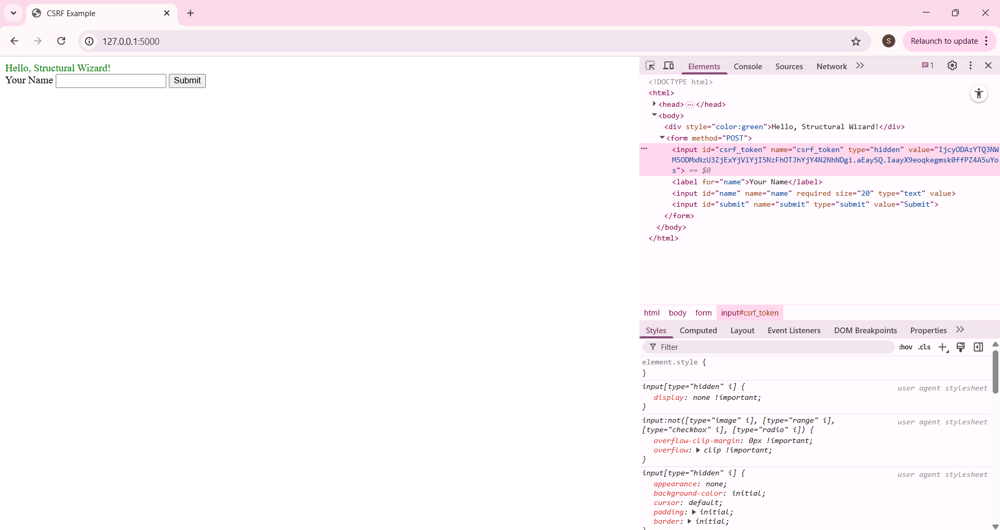


</details>


- **OAuth**: es un proceso de varios pasos que a menudo se realiza en una aplicación web. Se usa típicamente con servicios como Google, Facebook, aplicaciones de iOS. Veremos un ejemplo más práctico de esto más adelante.

<details markdown="block">
  <summary>
    haga clic para OAuth 2.0
  </summary>
El código de Python a continuación es solo para explicar el proceso. No se ejecutará. Por favor, vea y pruebe ejemplos reales en el siguiente punto.

```python
import requests
import webbrowser

# Paso 1: Redirigir al usuario a la URL de autorización
client_id = "SU_CLIENT_ID"
redirect_uri = "http://localhost:8080/callback"
auth_url = (
    f"https://auth.example.com/oauth/authorize?response_type=code"
    f"&client_id={client_id}&redirect_uri={redirect_uri}&scope=read"
)
webbrowser.open(auth_url)

# Paso 2: El usuario inicia sesión y es redirigido a una URL como:
# http://localhost:8080/callback?code=CODIGO_DE_AUTORIZACION
# Debe extraer manualmente este `código` para el siguiente paso.

# Paso 3: Intercambiar el código de autenticación por un token de acceso
auth_code = input("Pegue el código de autorización aquí: ")
token_url = "https://auth.example.com/oauth/token"
data = {
    "grant_type": "authorization_code",
    "code": auth_code,
    "redirect_uri": redirect_uri,
    "client_id": client_id,
    "client_secret": "SU_CLIENT_SECRET"
}

response = requests.post(token_url, data=data)
token_data = response.json()
access_token = token_data['access_token']

# Paso 4: Usar el token
headers = {"Authorization": f"Bearer {access_token}"}
protected_url = "https://api.example.com/userinfo"
user_data = requests.get(protected_url, headers=headers)
print(user_data.json())
```

</details>


### Variables de Entorno<a href="#top" class="back-to-top-link" aria-label="Back to Top">↑</a>
Las variables de entorno le permiten almacenar datos confidenciales (como claves de API, contraseñas, secretos) fuera de su código fuente.
En lugar de hacer esto ❌:

```python
API_KEY = "mi-clave-de-api-super-secreta-123"
```

Haces esto ✅:

```python
import os
API_KEY = os.getenv("API_KEY")
```

Luego establezca la clave en su entorno:

```bash
export API_KEY=mi-clave-de-api-super-secreta-123
```

| Beneficio                  | Por qué es importante                                                     |
| --------------------------- | --------------------------------------------------------------------- |
| **Seguridad**               | Mantiene los secretos fuera del código fuente (p. ej., repositorio de GitHub) |
| **Configurabilidad**        | Puede cambiar claves o configuraciones **sin cambiar el código**      |
| **Específico del entorno**  | Diferentes valores para desarrollo, ensayo y producción               |
| **Reutilización**           | Mismo código base, diferentes configuraciones según el entorno      |
| **Compatible con la nube**  | Todas las principales plataformas en la nube admiten la gestión de secretos a través de variables de entorno |

Para el desarrollo local, puede almacenar secretos en un archivo `.env`:
`.env`
```ini
API_KEY=abcdef123456
DB_PASSWORD=mi_contraseña_de_bd
```

Cárguelo en Python
```bash
pip install python-dotenv
```

```python
from dotenv import load_dotenv
import os

load_dotenv()  # carga desde el archivo .env
api_key = os.getenv("API_KEY")
```

{: .warning}
> NUNCA escriba secretos directamente en su código. Si confirma un secreto en GitHub:
> 🔓 Cualquiera puede verlo,
> 🤖 Los bots escanean constantemente los repositorios públicos en busca de secretos,
> 💣 Los proveedores de API pueden revocar o abusar de las claves y
> ☠️ Podría ser facturado o atacado (p. ej., si se filtran las claves de AWS)

{: .warning}
> Los agentes de codificación de IA 🕵️ tienen la tendencia a codificar claves de API. ¡SIEMPRE revise su código!

{: .warning}
> Asegúrese de que `.gitignore` excluya `.env` de ser subido a GitHub


---
### 🍏 1. Panel de Hábitos y Nutrición usando Hojas de Cálculo de Google y Nutritionix<a href="#top" class="back-to-top-link" aria-label="Back to Top">↑</a>

El objetivo de este ejercicio es crear una aplicación de texto para realizar un seguimiento de su ingesta diaria de alimentos y ejercicio. Usaremos las siguientes API:

- **Nutritionix**: Para analizar alimentos y elementos de ejercicio
- **Hojas de cálculo de Google (a través de Sheety)**: Almacenar datos


#### Nutritionix<a href="#top" class="back-to-top-link" aria-label="Back to Top">↑</a>

Tendremos que crear una cuenta gratuita en [Nutritionix](https://www.nutritionix.com/business/api), y luego crear una [clave de API](https://developer.nutritionix.com/admin/access_details) y guardarla en el archivo `.env`.

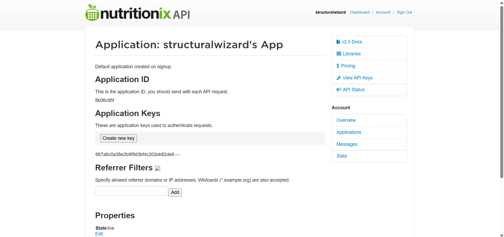

Archivo `.env`
```python
NUTRITIONIX_KEY="ec3***"
NUTRITIONIX_ID="8b***"
```

Luego podemos hacer algunas pruebas de PUNTO FINAL como se explica en su [documentación de inicio](https://docx.syndigo.com/developers/docs/get-started) para lo cual podemos usar postman para probar algunos [Puntos finales](https://docx.syndigo.com/developers/docs/natural-language-for-nutrients).

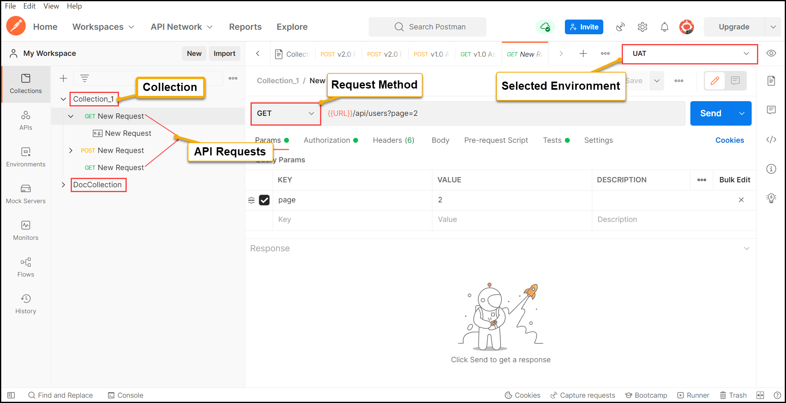

Una vez que entendemos los encabezados y la sintaxis de autenticación, lo pasamos al código de Python de la siguiente manera:

```python
import requests, os
import datetime
from dotenv import load_dotenv
import json

# Cargar variables de entorno desde el archivo .env
load_dotenv()

# Nutritionix
NUTRITIONIX_NLP_NUTRIENTS_URL_ENDPOINT = " https://trackapi.nutritionix.com/v2/natural/nutrients"
headers = {
    "Content-Type": 'application/json',
    "x-app-id": os.environ.get("NUTRITIONIX_ID"),
    "x-app-key": os.environ.get("NUTRITIONIX_KEY"),
}
print(headers)
query = input("¿Qué comiste? ")
data = {"query": query}
nutrition_response = requests.post(NUTRITIONIX_NLP_NUTRIENTS_URL_ENDPOINT, headers=headers,json=data )
calories = nutrition_response.json()["foods"][0]["nf_calories"]
print(f"Calorías consumidas en {query}: {calories}")


NUTRITIONIX_NLP_EXERCISE_URL_ENDPOINT = " https://trackapi.nutritionix.com/v2/natural/exercise"
exercise_config = {"query": input("¿Qué ejercicios hiciste (puedes incluir duración y/o distancia)?: "),}

exercise_response = requests.post(NUTRITIONIX_NLP_EXERCISE_URL_ENDPOINT, headers=headers, json=exercise_config)

user_input = exercise_response.json()["exercises"][0]["user_input"]
duration = exercise_response.json()["exercises"][0]["duration_min"]
calories = exercise_response.json()["exercises"][0]["nf_calories"]
print(f"Ejercicio: {user_input}, Duración: {duration}, Calorías: {calories}")

# Guardar respuesta en un archivo JSON
with open('nlp_food.json', 'w') as f:
    json.dump(nutrition_response.json(), f, indent=4)
with open('nlp_exercise.json', 'w') as f:
    json.dump(exercise_response.json(), f, indent=4)

```

#### Hojas de Cálculo de Google con SHEETY<a href="#top" class="back-to-top-link" aria-label="Back to Top">↑</a>

Para almacenar los datos usaremos Hojas de Cálculo de Google y la API de Sheety. Tendremos que registrarnos gratis en [Sheety](https://sheety.co/) y crear un proyecto.

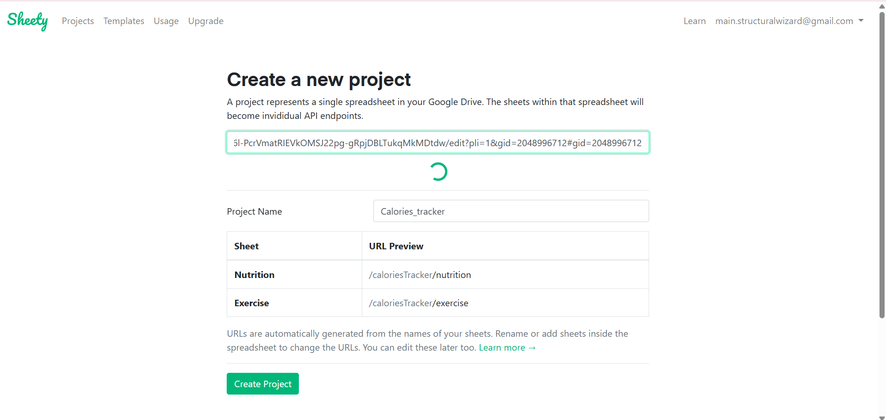

Que debe estar vinculado a una Hoja de Cálculo de Google. También crearemos las tablas que queremos rellenar.

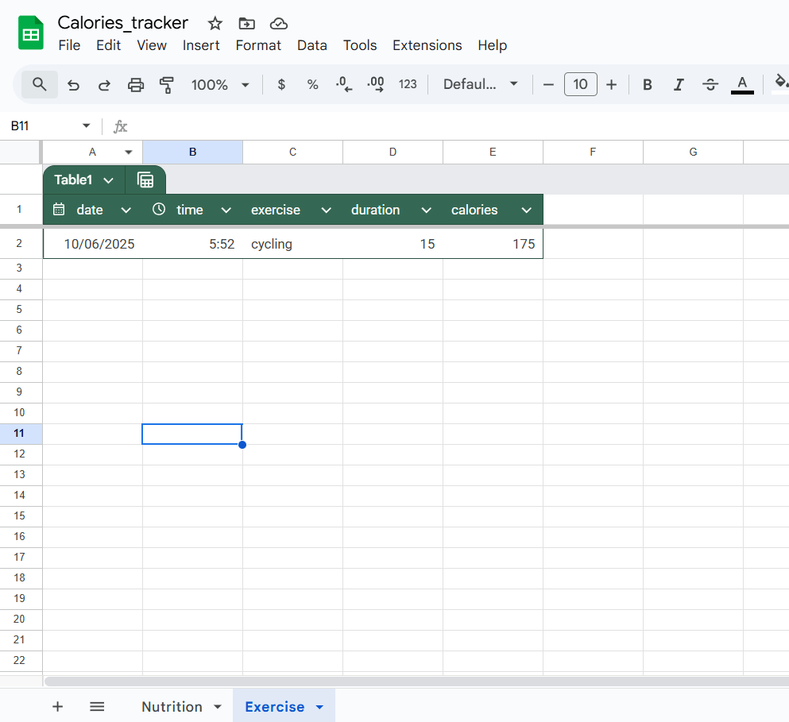

A continuación, tendremos que crear un código de autenticación en Sheety.

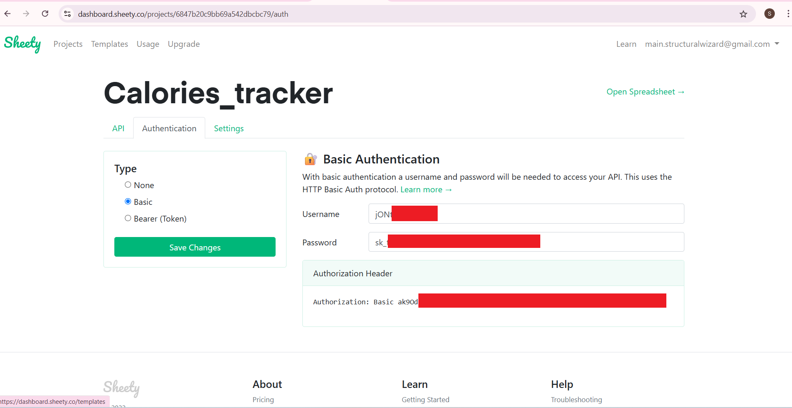

Y permitir solicitudes Post en él.

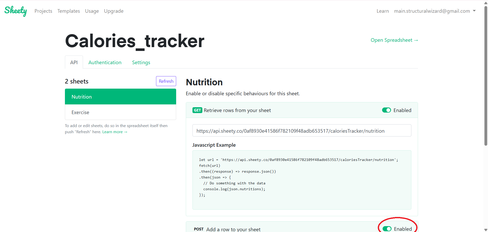

Luego ensamblamos los encabezados y la carga útil y escribimos las solicitudes post para rellenar la hoja de cálculo de Google.

```python
# Hojas de Cálculo de Google
SHEETY_AUTH_TOKEN = os.environ.get("SHEETY_AUTH_TOKEN")
SHEETY_NUTRITION_ENDPOINT_API = os.environ.get("SHEETY_NUTRITION_URL")
SHEETY_EXERCISE_ENDPOINT_API = os.environ.get("SHEETY_EXERCISE_URL")

headers = {
    "Authorization": SHEETY_AUTH_TOKEN,
}


# Registrar fecha y hora actuales
date = datetime.datetime.now()
formatted_date = date.strftime("%d/%m/%Y")
time = date.strftime("%H:%M:%S")

nutrition_data = {
    "nutrition": {
      "date": formatted_date,
      "time": time,
      "food": query,
      "calories": calories,
    }
  }

workout_data = {
    "exercise": {
      "date": formatted_date,
      "time": time,
      "exercise": user_input,
      "duration": duration,
      "calories": calories,
    }
  }


# Añadir nueva fila a la hoja de cálculo con los datos introducidos
#print(headers)
new_response = requests.post(url=SHEETY_NUTRITION_ENDPOINT_API, json=nutrition_data, headers=headers)
new_response = requests.post(url=SHEETY_EXERCISE_ENDPOINT_API, json=workout_data, headers=headers)
#print(new_response.text)

```


---


### 📈 2. Acciones y Noticias con Alertas de Whatsapp<a href="#top" class="back-to-top-link" aria-label="Back to Top">↑</a>

#### APIs Utilizadas<a href="#top" class="back-to-top-link" aria-label="Back to Top">↑</a>
- **Alpha Vantage**: Datos de acciones en tiempo real
- **API de Noticias FINNHUB**: Noticias financieras
- **API de Bot de Twilio**: Envío de mensajes

#### Precios de las acciones con Alpha Vantage<a href="#top" class="back-to-top-link" aria-label="Back to Top">↑</a>

La configuración de la API de alphavantage es relativamente sencilla. Simplemente complete el [Formulario](https://www.alphavantage.co/support/) para obtener la clave que debe ir en su archivo `.env`.

<details markdown="block">
  <summary>
    Formulario de clave de API de Alpha Vantage
  </summary>

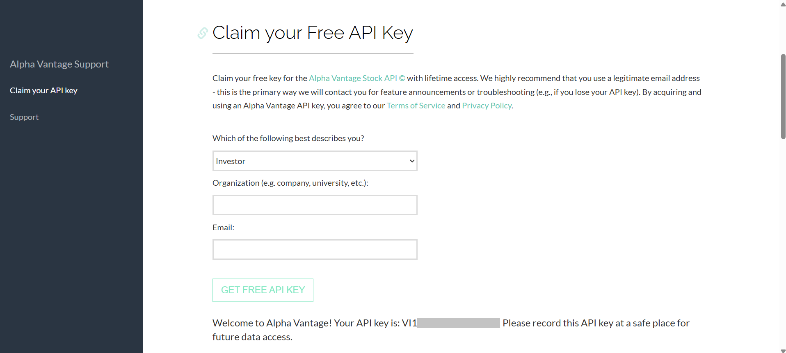

</details>


```python
from dotenv import load_dotenv
import requests, os

# Cargar variables de entorno desde el archivo .env
load_dotenv()

# Precio de las acciones
stock_params = {"symbol": "APPL", "apikey": os.getenv("ALPHA_API_KEY")}
stock_response = requests.get("https://www.alphavantage.co/query?function=TIME_SERIES_DAILY", params=stock_params)
data = stock_response.json()
yesterday = list(data["Time Series (Daily)"].keys())[0]
price = float(data["Time Series (Daily)"][yesterday]["4. close"])
print(f"Precio de cierre de APPL ayer {yesterday}: ${price}")
```
Archivo `.env`
```python
ALPHA_API_KEY="***"
TWILIO_ACCOUNT_SID="***"
TWILIO_AUTH_TOKEN="***"
FINNHUB_API_KEY="***"
```

#### Obtener noticias financieras<a href="#top" class="back-to-top-link" aria-label="Back to Top">↑</a>
En la segunda parte de este ejemplo, vamos a aprender a conectarnos a [Finhub](https://finnhub.io/dashboard), que proporciona noticias financieras con un nivel gratuito. Luego deberá crear una clave de API.

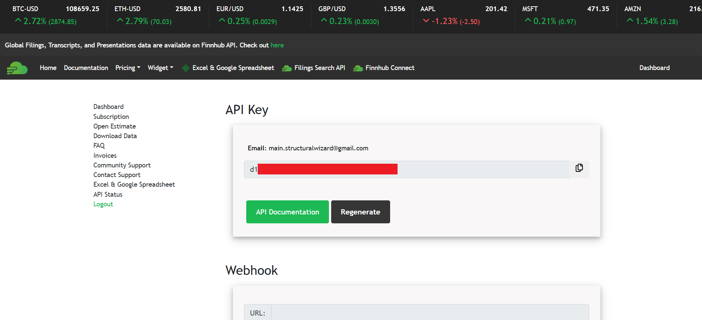

Esta vez vamos a usar su muy bien documentado [repositorio de Python](https://github.com/Finnhub-Stock-API/finnhub-python) instalándolo primero.

```bash
pip install finnhub-python
```
Y luego se utiliza uno de sus ejemplos de código.

```python
# API de Noticias
import finnhub
import datetime

# Obtener fechas
today = datetime.datetime.now().strftime('%Y-%m-%d')
yesterday = (datetime.datetime.now() - datetime.timedelta(days=1)).strftime('%Y-%m-%d')

# Configurar cliente
finnhub_client = finnhub.Client(api_key=os.environ.get("FINNHUB_API_KEY"))
# Noticias de la empresa
# Es necesario usar _from en lugar de from para evitar conflictos
latest_news = finnhub_client.company_news('AAPL', _from=yesterday, to=today)
print(f"Últimas noticias de AAPL desde {yesterday} hasta {today}:")

for news in latest_news[:5]:
    print(f"Título: {news['headline']}")
    print(f"Fuente: {news['source']}")
    print(f"Fecha: {news['datetime']}")
    print(f"Resumen: {news['summary']}")
    print("-" * 50)
```
Lo que resulta en


```
Últimas noticias de AAPL desde 2025-06-08 hasta 2025-06-09:
Título: El nuevo lenguaje de diseño de Apple
Fuente: Finnhub
Fecha: 1749486328
Resumen: Se espera que Apple muestre un nuevo rediseño de su software en todos sus productos en la WWDC de este año. Mark Gurman de Bloomberg lo explica....
--------------------------------------------------
Título: Construyendo una cartera de dividendos de 75.000 dólares: Mejorando SCHD con las mejores selecciones de alto rendimiento de junio
Fuente: SeekingAlpha
Fecha: 1749481200
Resumen: SCHD sigue siendo una opción de inversión particularmente atractiva para los inversores a largo plazo. Vea cómo construir una cartera de dividendos de 75.000 dólares con SCHD como núcleo.
```

#### Enviar correos electrónicos, Whatsapps, SMS, Video, Audio con Twilio<a href="#top" class="back-to-top-link" aria-label="Back to Top">↑</a>

Ahora vamos a intentar usar [Twilio](https://www.twilio.com/en-us), que tiene una API muy potente para enviar correos electrónicos, mensajes de Whatsapp, SMS y más.

La [primera vez](https://console.twilio.com/us1/develop/sms/try-it-out/whatsapp-learn?frameUrl=%2Fconsole%2Fsms%2Fwhatsapp%2Flearn%3Fx-target-region%3Dus1) que lo use, después de configurar las claves, tendrá que iniciar sesión con una cuenta de Whatsapp. Le pedirá que abra un código QR y lo guiará a través del proceso. También puede enviar un mensaje de texto `join finally-gold` a `+14155238886`<br>


Luego puede [probar solicitudes](https://console.twilio.com/us1/develop/sms/content-template-builder/template/HX38f4a38e390bfec8bfe8760c5d013619) en la web que puede aplicar directamente a su código.

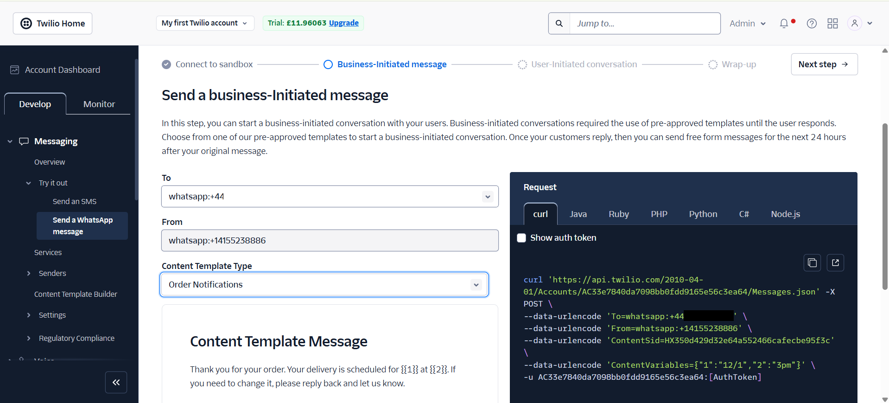


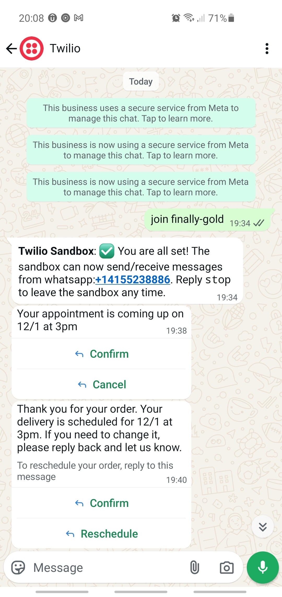

Twilio tiene una serie de plantillas para los mensajes y también le permite crear las suyas propias.

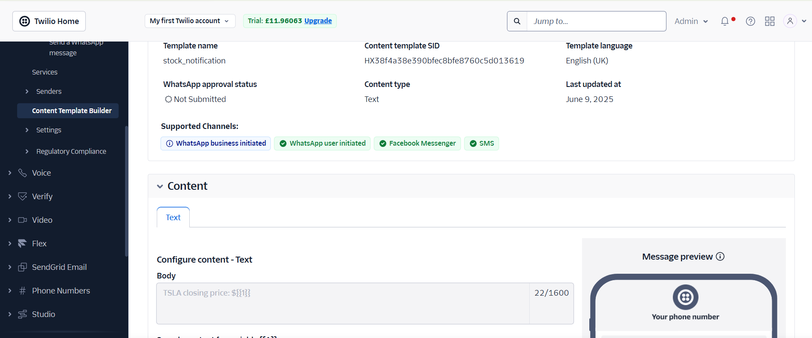

Si implementamos este código en nuestro script en lugar de usarlo directamente en el área de prueba del portal, se ve como el extracto a continuación:


```python
# Enviar mensaje a través de Twilio WhatsApp
from twilio.rest import Client

account_sid = os.environ.get('TWILIO_ACCOUNT_SID')
auth_token =  os.environ.get('TWILIO_AUTH_TOKEN')
print("SID de la cuenta de Twilio:", account_sid)
print("Token de autenticación de Twilio:", auth_token)
client = Client(account_sid, auth_token)

message = client.messages.create(
    from_='whatsapp:+14155238886',
    #content_sid='HXb5b62575e6e4ff6129ad7c8efe1f983e', # Su cita es el {1} a las {2}
    #content_variables='{"1":"12/1","2":"3pm"}',
    #content_sid='HX350d429d32e64a552466cafecbe95f3c', # Gracias por su pedido. Su entrega está programada para el {1} a las {2}
    #content_variables='{"1":"12/1","2":"3pm"}',
    #content_sid='HX229f5a04fd0510ce1b071852155d3e75', # {1} es su código de verificación. Por su seguridad, no comparta este código.
    #content_variables='{"1":"409173"}',    
    content_sid='HX38f4a38e390bfec8bfe8760c5d013619', # Precio de cierre de APPL: ${{1}}
    content_variables=f'{{"1":"{price}"}}',
    to='whatsapp:+44SU NÚMERO DE TELÉFONO VA AQUÍ'
)

print(message.sid)
```



---


### ✈️ 3. Buscador de Vuelos Baratos y Alertas por Correo Electrónico<a href="#top" class="back-to-top-link" aria-label="Back to Top">↑</a>

#### APIs Utilizadas y proceso de Desarrollo<a href="#top" class="back-to-top-link" aria-label="Back to Top">↑</a>
En este ejemplo crearemos una aplicación de texto que utiliza la API de Amadeus para la búsqueda de vuelos y envía alertas por correo electrónico utilizando la API de Gmail. Para llegar a ese punto, aprenderemos a navegar por la documentación de GitHub y a obtener soporte de LLMs y Agentes para cada uno de los pasos involucrados:
- Autenticarse en Amadeus
- Buscar vuelos haciendo una Solicitud y usando **datetime** para la gestión de fechas.
- Procesar la respuesta en un **archivo json**, un **archivo csv**
- Enviar una notificación por correo electrónico con **smtp**.

Lo primero sería pedir a un LLM (ya sea Claude, Gemini o Chat GPT) en la web o en GitHub Copilot dentro de VSCode. Le pediríamos que cree un script de Python para buscar vuelos en una fecha específica con el servicio de API que decidimos. Los que miré fueron [Tequila](https://tequila.kiwi.com/) que necesita registro manual por correo electrónico, [Skyscanner](https://www.partners.skyscanner.net/product/travel-api) que necesita una cuenta de empresa y [Amadeus](https://developers.amadeus.com/register) que actualmente (09/06/2025) es gratuito y fácil de [registrar](https://developers.amadeus.com/register). Seguimos los pasos en [Comenzar](https://developers.amadeus.com/get-started/get-started-with-self-service-apis-335) para obtener las claves.

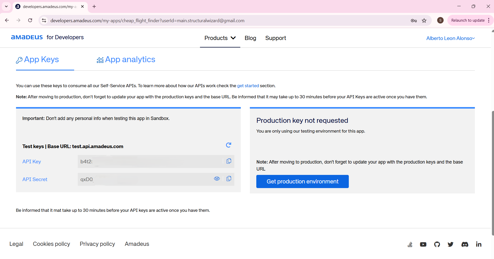

Luego las agregamos al archivo `.env` en el mismo directorio que el script de Python o en el `PATH`.

```python
AMADEUS_API_KEY="b4t2..."
AMADEUS_API_SECRET="qxD..."
EMAIL_ADDRESS="m...@gmail.com"
GMAIL_PASSWORD="cyjb ..."
OPENWEATHER_API_KEY="24a..."
```

El código que se generó en todos los intentos con los LLM y los agentes no funcionó, pero proporcionó cierta estructura y mencionó la biblioteca de GitHub [amadeus4dev](https://github.com/amadeus4dev/amadeus-python/tree/master) que contiene [manual](https://github.com/amadeus4dev/amadeus-python/tree/master) y [ejemplos](https://github.com/amadeus4dev/amadeus-code-examples) simples.

Lo instalamos ejecutando la siguiente línea en bash:
```python
pip install amadeus
```
#### Solicitud y archivo json<a href="#top" class="back-to-top-link" aria-label="Back to Top">↑</a>
Así que luego obtenemos el siguiente código que se conecta a Amadeus y exporta la respuesta a un archivo json.


```python
from amadeus import Client, ResponseError
import os, smtplib
from dotenv import load_dotenv
from datetime import datetime, timedelta
import json
import csv

# Cargar variables de entorno desde el archivo .env
load_dotenv()

amadeus = Client(
    client_id= os.getenv("AMADEUS_API_KEY"),
    client_secret= os.getenv("AMADEUS_API_SECRET")    
)


try:
    # -------------------------------------------------------------
    # Buscar vuelos
    response = amadeus.shopping.flight_offers_search.get(
        originLocationCode='LON',
        destinationLocationCode='SCQ',
        departureDate=(datetime.now() + timedelta(days=10)).strftime("%Y-%m-%d"),
        adults=1,
        currencyCode='GBP')
    
    # -------------------------------------------------------------
    # Guardar respuesta en un archivo JSON
    with open('flight_offers.json', 'w') as f:
        json.dump(response.data, f, indent=4)
```

<details markdown="block">
  <summary>
    Archivo de respuesta Json
  </summary>

```json
[
    {
        "type": "flight-offer",
        "id": "1",
        "source": "GDS",
        "instantTicketingRequired": false,
        "nonHomogeneous": false,
        "oneWay": false,
        "isUpsellOffer": false,
        "lastTicketingDate": "2025-06-10",
        "lastTicketingDateTime": "2025-06-10",
        "numberOfBookableSeats": 9,
        "itineraries": [
            {
                "duration": "PT2H10M",
                "segments": [
                    {
                        "departure": {
                            "iataCode": "LGW",
                            "terminal": "S",
                            "at": "2025-06-19T15:25:00"
                        },
                        "arrival": {
                            "iataCode": "SCQ",
                            "at": "2025-06-19T18:35:00"
                        },
                        "carrierCode": "VY",
                        "number": "7107",
                        "aircraft": {
                            "code": "320"
                        },
                        "operating": {
                            "carrierCode": "VY"
                        },
                        "duration": "PT2H10M",
                        "id": "9",
                        "numberOfStops": 0,
                        "blacklistedInEU": false
                    }
                ]
            }
        ],
        "price": {
            "currency": "GBP",
            "total": "106.38",
            "base": "73.00",
            "fees": [
                {
                    "amount": "0.00",
                    "type": "SUPPLIER"
                },
                {
                    "amount": "0.00",
                    "type": "TICKETING"
                }
            ],
            "grandTotal": "106.38"
        },
        "pricingOptions": {
            "fareType": [
                "PUBLISHED"
            ],
            "includedCheckedBagsOnly": true
        },
        "validatingAirlineCodes": [
            "VY"
        ],
        "travelerPricings": [
            {
                "travelerId": "1",
                "fareOption": "STANDARD",
                "travelerType": "ADULT",
                "price": {
                    "currency": "GBP",
                    "total": "106.38",
                    "base": "73.00"
                },
                "fareDetailsBySegment": [
                    {
                        "segmentId": "9",
                        "cabin": "ECONOMY",
                        "fareBasis": "OWFLX",
                        "class": "O",
                        "includedCheckedBags": {
                            "weight": 25,
                            "weightUnit": "KG"
                        },
                        "includedCabinBags": {
                            "quantity": 1
                        }
                    }
                ]
            }
        ]
    }
]
```
</details>

#### Exportar a un archivo csv<a href="#top" class="back-to-top-link" aria-label="Back to Top">↑</a>


Ahora le pedimos al agente de IA de LLM que cree una tabla en un archivo csv con los campos deseados y le damos tanto el archivo `.py` como el `.json` como contexto. Y obtuvimos el siguiente resultado.

```python
    # -------------------------------------------------------------
    # Extraer datos de vuelo para CSV
    csv_data = []
    for offer in response.data:
        price_grand_total = offer['price']['grandTotal']
        
        # Procesar cada itinerario
        for itinerary in offer['itineraries']:
            # Para cada segmento en el itinerario
            for segment in itinerary['segments']:
                # Obtener información básica del segmento
                dep_iata = segment['departure']['iataCode']
                dep_time = segment['departure']['at']
                arr_iata = segment['arrival']['iataCode']
                arr_time = segment['arrival']['at']
                carrier_code = segment['carrierCode']
                
                # Obtener información de equipaje del primer precio del viajero
                baggage_info = {}
                cabin_bags_qty = None
                checked_bags_weight = None
                checked_bags_weight_unit = None
                
                if 'travelerPricings' in offer:
                    for pricing in offer['travelerPricings']:
                        for fare_detail in pricing['fareDetailsBySegment']:
                            if fare_detail['segmentId'] == segment['id']:
                                if 'includedCheckedBags' in fare_detail:
                                    if 'weight' in fare_detail['includedCheckedBags']:
                                        checked_bags_weight = fare_detail['includedCheckedBags']['weight']
                                        checked_bags_weight_unit = fare_detail['includedCheckedBags'].get('weightUnit', 'N/A')
                                    elif 'quantity' in fare_detail['includedCheckedBags']:
                                        checked_bags_weight = fare_detail['includedCheckedBags']['quantity']
                                        checked_bags_weight_unit = 'PIECES'
                                
                                if 'includedCabinBags' in fare_detail and 'quantity' in fare_detail['includedCabinBags']:
                                    cabin_bags_qty = fare_detail['includedCabinBags']['quantity']
                
                # Añadir a los datos CSV
                csv_data.append({
                    'departure_iatacode': dep_iata,
                    'departure_at': dep_time,
                    'arrival_iatacode': arr_iata,
                    'arrival_at': arr_time,
                    'carriercode': carrier_code,
                    'price_grandtotal': price_grand_total,
                    'included_checkedbags_weight': checked_bags_weight,
                    'included_checkedbags_weightunit': checked_bags_weight_unit,
                    'included_cabinbags_quantity': cabin_bags_qty
                })
    
    # Escribir en CSV
    csv_fields = ['departure_iatacode', 'departure_at', 'arrival_iatacode', 'arrival_at', 
                 'carriercode', 'price_grandtotal', 'included_checkedbags_weight', 
                 'included_checkedbags_weightunit', 'included_cabinbags_quantity']
    with open('flight_data.csv', 'w', newline='') as csvfile:
        writer = csv.DictWriter(csvfile, fieldnames=csv_fields)
        writer.writeheader()
        writer.writerows(csv_data)
    
    print(f"Datos de vuelo extraídos y guardados en flight_data.csv")
```

#### Enviar alertas por correo electrónico<a href="#top" class="back-to-top-link" aria-label="Back to Top">↑</a>

Del mismo modo, le pedimos a Gemini que agregue una alerta por correo electrónico si el precio del vuelo es inferior a 150 gbp usando smtp y gmail. Se le ocurrió el código a continuación y solo tenemos que asegurarnos de que las contraseñas en el archivo `.env` sean las correctas.


```python
    # -------------------------------------------------------------
    # Comprobar si algún vuelo está por debajo del umbral de precio y enviar una notificación por correo electrónico
    for offer in response.data:
        price_grand_total = float(offer['price']['grandTotal'])
        if price_grand_total < 150:
            try:
                with smtplib.SMTP("smtp.gmail.com", 587) as connection:
                    connection.starttls()
                    connection.login(user=os.getenv("EMAIL_ADDRESS"), password=os.getenv("GMAIL_PASSWORD"))
                    connection.sendmail(
                        from_addr=os.getenv("EMAIL_ADDRESS"),
                        to_addrs="toemail@gmail.com",
                        msg=f"Subject:¡Alerta de vuelo barato!\n\n¡Solo {price_grand_total}GBP para volar a Santiago de Compostela!\n El {dep_time} con {offer['itineraries'][0]['segments'][0]['carrierCode']}.\n\n"
                    )
                print(f"Alerta por correo electrónico enviada para un vuelo con un precio de £{price_grand_total}")
            except Exception as e:
                print(f"No se pudo enviar la alerta por correo electrónico: {e}")
    
except ResponseError as error:
    print(error)
```

Cuando lo intentamos por primera vez con nuestra contraseña normal, recibimos un error del servidor

```bash
No se pudo enviar la alerta por correo electrónico: (534, b'5.7.9 Se requiere una contraseña específica de la aplicación. Para obtener más información, vaya a\n5.7.9  https://support.google.com/mail/?p=InvalidSecondFactor 5b1f17b1804b1-4526e0563cesm112983275e9.1 - gsmtp')
```

lo que nos llevó a un sitio web donde tenemos que configurar una contraseña para una aplicación de desarrollo.
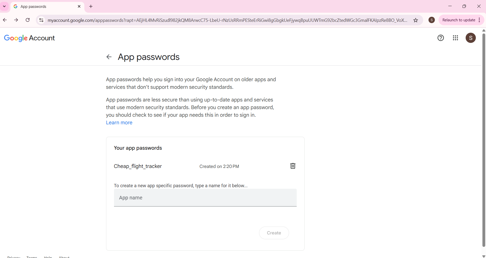


---

## ✅ Resumen<a href="#top" class="back-to-top-link" aria-label="Back to Top">↑</a>

| Concepto | Herramientas utilizadas |
|--------|-------------|
| Fundamentos de la API | `requests`, `json`, manejo de errores |
| Autenticación | Clave de API, Autenticación básica |
| JSON | `json.load`, `json.dump` |
| Almacenamiento de datos | `.env`, Hojas de cálculo de Google a través de Sheety, archivo csv |
| Comunicación | Correo electrónico (SMTP), Twilio |


> 🚀 Este tutorial une la teoría con la práctica utilizando aplicaciones emocionantes y con propósito. ¡Ahora tienes las herramientas para construir tus propios proyectos impulsados por API!