# Día 4. Fundamentos Web. 🕸️ HTML, CSS, Bootstrap y Diseño Web
{: .no_toc }

¡Bienvenido al Día 4! Hoy, construirás una base sólida en el desarrollo web aprendiendo cómo funciona Internet, los fundamentos de HTML y CSS, y cómo usar Bootstrap para un diseño web rápido y atractivo. También cubriremos los conceptos básicos de la teoría del diseño web para ayudarte a crear sitios web que a la gente le encantarán.

---

<details open markdown="block">
  <summary>
    Índice de contenidos
  </summary>
  {: .text-delta }
1. TOC
{:toc}
</details>

---

## 🌐 ¿Cómo funciona realmente Internet?<a href="#top" class="back-to-top-link" aria-label="Back to Top">↑</a>

Antes de construir sitios web, es importante entender cómo Internet conecta a los usuarios y los servidores.

- **Internet**: Una [red global de ordenadores](https://developer.mozilla.org/en-US/docs/Learn_web_development/Howto/Web_mechanics/How_does_the_Internet_work) que se comunican a través de protocolos (TCP/IP).
- **Sitios web**: Alojados en servidores, a los que acceden los clientes (navegadores) a través de [URLs](https://developer.mozilla.org/en-US/docs/Learn_web_development/Howto/Web_mechanics/What_is_a_URL) (Localizador Uniforme de Recursos).
- **HTTP/HTTPS**: Protocolos para transferir datos web.
- **DNS** ([Sistema de Nombres de Dominio](https://developer.mozilla.org/en-US/docs/Learn_web_development/Howto/Web_mechanics/What_is_a_domain_name)): Traduce nombres de dominio amigables para los humanos (como google.com) en direcciones IP.

**Cómo funcionan los sitios web:**
1. Escribes una URL en tu navegador.
2. El navegador solicita a un servidor DNS la dirección IP.
3. El navegador envía una solicitud HTTP al servidor.
4. El servidor responde con HTML (para elementos), CSS (formato), JS (acciones), imágenes, etc.
5. El navegador (Chrome, Firefox, Edge, Safari) renderiza la página.

Cuando despliegas un sitio web y asignas un dominio a una dirección IP en el servidor DNS. Los servidores DNS funcionan 24/7 pero actualizan los pares DNS-IP solo una o dos veces al día.

**Inspeccionando Sitios Web**

Los archivos que recibe el navegador se pueden revisar con las Herramientas de Desarrollo (F12) en Chrome para inspeccionar y modificar HTML y CSS en vivo. También puedes hacer clic con el botón derecho sobre un elemento y luego hacer clic en inspeccionar y te llevará a la parte del código que quieres revisar.

Para hacer una prueba, haz clic con el botón derecho en el título `Inspeccionando Sitios Web` y haz clic en inspeccionar.

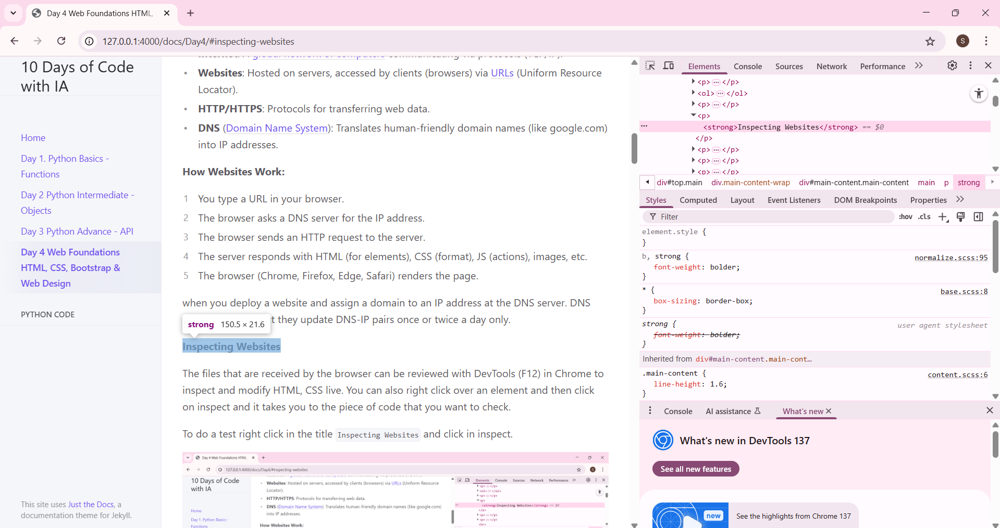

El navegador tiene un conjunto de herramientas para inspeccionar elementos (el código html), estilos (el código CSS), una terminal para ejecutar código directamente o ver en qué orden y cuánto tiempo tarda en descargar y ejecutar el código del servidor. También puedes grabar acciones o cargar extensiones. El navegador tiene muchas más posibilidades de las que parece a primera vista.

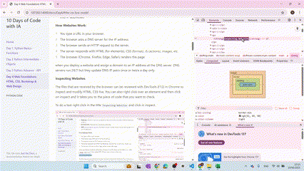

---


## 📝 HTML: La Estructura de la Web<a href="#top" class="back-to-top-link" aria-label="Back to Top">↑</a>

### ¿Qué es HTML?<a href="#top" class="back-to-top-link" aria-label="Back to Top">↑</a>

- **HTML (HyperText Markup Language)** es el lenguaje estándar para crear páginas web que pueden ser renderizadas por la mayoría de los navegadores. Estructura el contenido utilizando **elementos** (etiquetas) como `<title>Mi Primera Página Web</title>` de una manera estática y sin formato.
Generalmente las etiquetas tienen una etiqueta de apertura como `<details></details>`, pero algunas etiquetas no necesitan una etiqueta de cierre, p. ej. `` para imágenes, `<br>` para nueva línea, `<hr>` para una línea horizontal.

### Plantilla HTML<a href="#top" class="back-to-top-link" aria-label="Back to Top">↑</a>

Toda página HTML comienza con una estructura básica:

```html
<!DOCTYPE html>
<html lang="en">
<head>
  <meta charset="UTF-8">
  <title>Mi Primera Página Web</title>
</head>
<body>
  <!-- El contenido va aquí -->
   ¡Hola Mundo!
</body>
</html>
```

### Encabezados, Párrafos y Listas<a href="#top" class="back-to-top-link" aria-label="Back to Top">↑</a>
Los [elementos más básicos](https://developer.mozilla.org/en-US/docs/Learn_web_development/Howto/Solve_HTML_problems) son los encabezados o títulos (hay 7 de ellos), párrafos y listas. Puedes encontrar la lista completa de elementos en [W3Schools](https://www.w3schools.com/html/default.asp)

Prueba y juega con el código de abajo en la [prueba web de html de W3Schools](https://www.w3schools.com/html/tryit.asp?filename=tryhtml_basic)

```html
<!DOCTYPE html>
<html lang="en">
<head>
  <meta charset="UTF-8">
  <title>Mi Primera Página Web</title>
</head>
<body>
  <h1>Encabezado Principal</h1>
  <h2>Subencabezado</h2>
  <p>Este es un párrafo de texto.</p>

  <ul>
    <li>Elemento de lista no ordenada</li>
  </ul>
  <ol>
    <li>Elemento de lista ordenada</li>
  </ol>
</body>
</html>
```

### Elementos de Ancla e Imagen<a href="#top" class="back-to-top-link" aria-label="Back to Top">↑</a>
Los elementos de ancla se utilizan para crear enlaces. Las imágenes se incluyen con la etiqueta ``. Se recomienda incluir una descripción por accesibilidad.

```html
<a href="https://www.example.com">Visitar Ejemplo</a>

```

### Anidamiento e Indentación<a href="#top" class="back-to-top-link" aria-label="Back to Top">↑</a>

Los elementos HTML se pueden anidar. Se recomienda escribirlos con una indentación adecuada para mejorar la legibilidad.

```html
<ul>
  <li>
    <a href="#">Enlace Anidado</a>
  </li>
</ul>
```

### Formularios<a href="#top" class="back-to-top-link" aria-label="Back to Top">↑</a>

Los formularios se utilizan para recopilar la entrada del usuario en una página web. Cada formulario puede tener etiquetas, campos de entrada y marcadores de posición para guiar al usuario, así como botones para enviar la información.

Ejemplo:
```html
<form>
  <label for="name">Nombre:</label>
  <input type="text" id="name" name="name" placeholder="Introduce tu nombre">
  <button type="submit">Enviar</button>
</form>
```

### Estilos<a href="#top" class="back-to-top-link" aria-label="Back to Top">↑</a>

Puedes dar estilo a los elementos HTML en línea usando el atributo `style` directamente en la etiqueta. Esto se llama estilo en línea. Por ejemplo, puedes cambiar el tamaño de la fuente, la alineación del texto, el color y más.

Ejemplo:
```html
<p style="font-size:18px; text-align:center; color:blue; font-family:Arial;">Este es un párrafo con estilo.</p>
```

En lugar de asignar los estilos etiqueta por etiqueta, lo que sería desordenado y llevaría mucho tiempo, las etiquetas se asignan a clases y/o IDs y luego los estilos para las clases o IDs se especifican en un archivo CSS como se explica más adelante.


### Elementos HTML con IDs y Clases<a href="#top" class="back-to-top-link" aria-label="Back to Top">↑</a>

Tanto los IDs como las clases son atributos que se pueden agregar a los elementos HTML para que sean seleccionables para el estilo CSS o la manipulación de JavaScript. Las diferencias clave:

- **ID**: Debe ser único en la página (solo un elemento debe tener un ID específico)
- **Clase**: Se puede reutilizar en múltiples elementos

```html
<h2 id="welcome-title" class="section-title">Bienvenido a Mi Sitio Web</h2>
<p id="intro-text" class="content-paragraph">Este párrafo tiene tanto un ID como una clase.
El ID "intro-text" solo se puede usar una vez en esta página, mientras que la clase "content-paragraph"
se puede aplicar a múltiples elementos de párrafo.</p>
```

En CSS, seleccionarías estos elementos usando:
```css
/* Seleccionar por ID (usa el símbolo #) */
#welcome-title {
  color: navy;
  font-size: 28px;
}

#intro-text {
  font-style: italic;
}

/* Seleccionar por clase (usa el símbolo .) */
.section-title {
  border-bottom: 2px solid #ccc;
  padding-bottom: 10px;
}

.content-paragraph {
  line-height: 1.6;
  margin-bottom: 20px;
}
```


### Divs<a href="#top" class="back-to-top-link" aria-label="Back to Top">↑</a>
El elemento HTML `<div>` es un contenedor genérico para contenido de flujo. Es una "división" o "sección" de una página web. Se utilizan para agrupar otros elementos HTML.

### Plantilla HTML completa<a href="#top" class="back-to-top-link" aria-label="Back to Top">↑</a>

<details markdown="block">
  <summary>
    Para una vista de exhibición completa de todos los tipos de elementos HTML, vea el código a continuación.
  </summary>

Esto se puede visualizar en [Prueba web de html de W3Schools](https://www.w3schools.com/html/tryit.asp?filename=tryhtml_basic)


```html
<!DOCTYPE html>
<html lang="es">
<head>
    <meta charset="UTF-8">
    <meta name="viewport" content="width=device-width, initial-scale=1.0">
    <title>Demostración de Elementos HTML</title>
    <!-- Tailwind CSS CDN for styling -->
    <script src="https://cdn.tailwindcss.com"></script>
    <!-- Google Fonts - Inter -->
    <link href="https://fonts.googleapis.com/css2?family=Inter:wght@400;600;700&display=swap" rel="stylesheet">
    <style>
        body {
            font-family: 'Inter', sans-serif;
            background-color: #f3f4f6; /* Fondo gris claro */
            color: #374151; /* Texto gris oscuro */
        }
    </style>
</head>
<body class="p-4 sm:p-8 md:p-12 lg:p-16">
    <div class="max-w-4xl mx-auto bg-white shadow-xl rounded-xl p-6 sm:p-8 md:p-10 lg:p-12">

        <!-- Sección de Encabezado -->
        <header class="mb-12 text-center">
            <h1 class="text-4xl sm:text-5xl font-extrabold text-blue-600 mb-4 rounded-lg p-2">Demostración de Elementos HTML</h1>
            <p class="text-lg sm:text-xl text-gray-700">Una plantilla integral que muestra elementos HTML comunes con Tailwind CSS.</p>
        </header>

        <!-- Sección de Navegación -->
        <nav class="mb-12">
            <h2 class="text-3xl font-semibold text-gray-800 mb-4 pb-2 border-b-2 border-blue-300 rounded-lg">Navegación</h2>
            <ul class="flex flex-wrap gap-4 justify-center">
                <li><a href="#typography" class="text-blue-600 hover:text-blue-800 text-lg font-medium p-2 rounded-md hover:bg-blue-50 transition-colors duration-200">Tipografía</a></li>
                <li><a href="#links-images" class="text-blue-600 hover:text-blue-800 text-lg font-medium p-2 rounded-md hover:bg-blue-50 transition-colors duration-200">Enlaces e Imágenes</a></li>
                <li><a href="#lists" class="text-blue-600 hover:text-blue-800 text-lg font-medium p-2 rounded-md hover:bg-blue-50 transition-colors duration-200">Listas</a></li>
                <li><a href="#tables" class="text-blue-600 hover:text-blue-800 text-lg font-medium p-2 rounded-md hover:bg-blue-50 transition-colors duration-200">Tablas</a></li>
                <li><a href="#forms" class="text-blue-600 hover:text-blue-800 text-lg font-medium p-2 rounded-md hover:bg-blue-50 transition-colors duration-200">Formularios</a></li>
                <li><a href="#media" class="text-blue-600 hover:text-blue-800 text-lg font-medium p-2 rounded-md hover:bg-blue-50 transition-colors duration-200">Multimedia</a></li>
                <li><a href="#interactive" class="text-blue-600 hover:text-blue-800 text-lg font-medium p-2 rounded-md hover:bg-blue-50 transition-colors duration-200">Interactivo</a></li>
            </ul>
        </nav>

        <!-- Área de Contenido Principal -->
        <main>
            <!-- Sección de Tipografía -->
            <section id="typography" class="mb-12 p-6 bg-gray-50 rounded-lg shadow-md">
                <h2 class="text-3xl font-semibold text-gray-800 mb-4 pb-2 border-b-2 border-blue-300 rounded-lg">Tipografía</h2>

                <!-- Encabezados -->
                <h3 class="text-2xl font-bold text-gray-700 mb-3">Encabezados</h3>
                <p class="mb-4">HTML proporciona seis niveles de encabezados, desde `h1` (más importante) hasta `h6` (menos importante).</p>
                <h1 class="text-4xl font-extrabold text-blue-700 mb-2">Encabezado 1 (h1) - Título Principal</h1>
                <h2 class="text-3xl font-bold text-blue-600 mb-2">Encabezado 2 (h2) - Título de Sección</h2>
                <h3 class="text-2xl font-semibold text-blue-500 mb-2">Encabezado 3 (h3) - Sub-sección</h3>
                <h4 class="text-xl font-medium text-blue-400 mb-2">Encabezado 4 (h4) - Encabezado Menor</h4>
                <h5 class="text-lg font-normal text-blue-300 mb-2">Encabezado 5 (h5) - Encabezado Más Pequeño</h5>
                <h6 class="text-base font-light text-blue-200 mb-6">Encabezado 6 (h6) - Menos Importante</h6>

                <!-- Párrafos -->
                <h3 class="text-2xl font-bold text-gray-700 mb-3">Párrafos</h3>
                <p class="mb-4 text-gray-600 leading-relaxed">
                    Este es un párrafo estándar (`&lt;p&gt;`) de texto. Se utiliza para bloques de contenido.
                    Podemos añadir algo de <strong class="font-bold text-gray-800">texto en negrita</strong> y
                    <em>texto enfatizado (cursiva)</em> usando las etiquetas `&lt;strong&gt;` y `&lt;em&gt;`.
                </p>
                <p class="mb-6 text-gray-600 leading-relaxed">
                    Aquí hay otro párrafo que muestra varias opciones de formato de texto en línea.
                    Puedes <mark class="bg-yellow-200 px-1 rounded">resaltar texto</mark> usando `&lt;mark&gt;`.
                    <del class="line-through text-red-500">Texto eliminado</del> (`&lt;del&gt;`) y
                    <ins class="underline text-green-600">texto insertado</ins> (`&lt;ins&gt;`) también son posibles.
                    Para notación científica, puedes usar H<sub class="align-sub">2</sub>O (`&lt;sub&gt;`) o
                    E=mc<sup class="align-super">2</sup> (`&lt;sup&gt;`).
                </p>
            </section>

            <!-- Sección de Enlaces e Imágenes -->
            <section id="links-images" class="mb-12 p-6 bg-gray-50 rounded-lg shadow-md">
                <h2 class="text-3xl font-semibold text-gray-800 mb-4 pb-2 border-b-2 border-blue-300 rounded-lg">Enlaces e Imágenes</h2>

                <!-- Enlaces -->
                <h3 class="text-2xl font-bold text-gray-700 mb-3">Enlaces</h3>
                <p class="mb-4">
                    Este es un enlace externo:
                    <a href="https://www.google.com" target="_blank" rel="noopener noreferrer"
                       class="text-blue-600 hover:text-blue-800 underline font-medium transition-colors duration-200">
                        Visitar Google
                    </a>.
                    Los enlaces (`&lt;a&gt;`) son cruciales para la navegación. El atributo `target="_blank"` abre el enlace en una nueva pestaña, y `rel="noopener noreferrer"` es una buena práctica de seguridad para enlaces externos.
                </p>

                <!-- Imágenes -->
                <h3 class="text-2xl font-bold text-gray-700 mb-3">Imágenes</h3>
                <p class="mb-4">
                    Una imagen (`&lt;img&gt;`) se muestra a continuación. El atributo `alt` es importante para la accesibilidad.
                    El atributo `onerror` proporciona una alternativa en caso de que la imagen no se cargue.
                </p>
                <div class="flex justify-center mb-6">
                    
                </div>
            </section>

            <!-- Sección de Listas -->
            <section id="lists" class="mb-12 p-6 bg-gray-50 rounded-lg shadow-md">
                <h2 class="text-3xl font-semibold text-gray-800 mb-4 pb-2 border-b-2 border-blue-300 rounded-lg">Listas</h2>

                <!-- Lista Desordenada -->
                <h3 class="text-2xl font-bold text-gray-700 mb-3">Lista Desordenada (`&lt;ul&gt;`)</h3>
                <p class="mb-2">Los elementos en una lista desordenada suelen estar marcados con viñetas.</p>
                <ul class="list-disc list-inside mb-6 pl-4 text-gray-700">
                    <li class="mb-1">Elemento Uno</li>
                    <li class="mb-1">Elemento Dos
                        <ul class="list-circle list-inside mt-1 pl-4">
                            <li class="mb-1">Elemento Anidado A</li>
                            <li class="mb-1">Elemento Anidado B</li>
                        </ul>
                    </li>
                    <li class="mb-1">Elemento Tres</li>
                </ul>

                <!-- Lista Ordenada -->
                <h3 class="text-2xl font-bold text-gray-700 mb-3">Lista Ordenada (`&lt;ol&gt;`)</h3>
                <p class="mb-2">Los elementos en una lista ordenada suelen estar numerados.</p>
                <ol class="list-decimal list-inside mb-6 pl-4 text-gray-700">
                    <li class="mb-1">Primer paso</li>
                    <li class="mb-1">Segundo paso</li>
                    <li class="mb-1">Tercer paso</li>
                </ol>

                <!-- Lista de Descripción -->
                <h3 class="text-2xl font-bold text-gray-700 mb-3">Lista de Descripción (`&lt;dl&gt;`)</h3>
                <p class="mb-2">Una lista de términos y sus descripciones.</p>
                <dl class="mb-6 text-gray-700">
                    <dt class="font-semibold text-gray-800 mt-2">HTML</dt>
                    <dd class="ml-6 mb-1">Lenguaje de Marcado de Hipertexto: El lenguaje estándar para crear páginas web.</dd>
                    <dt class="font-semibold text-gray-800 mt-2">CSS</dt>
                    <dd class="ml-6 mb-1">Hojas de Estilo en Cascada: Un lenguaje de estilos usado para describir la presentación de un documento HTML.</dd>
                    <dt class="font-semibold text-gray-800 mt-2">JavaScript</dt>
                    <dd class="ml-6 mb-1">Un lenguaje de programación que permite páginas web interactivas.</dd>
                </dl>
            </section>

            <!-- Sección de Tablas -->
            <section id="tables" class="mb-12 p-6 bg-gray-50 rounded-lg shadow-md overflow-x-auto">
                <h2 class="text-3xl font-semibold text-gray-800 mb-4 pb-2 border-b-2 border-blue-300 rounded-lg">Tablas</h2>
                <p class="mb-4">Las tablas (`&lt;table&gt;`) se utilizan para mostrar datos tabulares.</p>
                <table class="w-full border-collapse text-left rounded-lg overflow-hidden shadow-md">
                    <thead class="bg-blue-600">
                        <tr>
                            <th class="py-3 px-4 border-b border-blue-700">Nombre</th>
                            <th class="py-3 px-4 border-b border-blue-700">Edad</th>
                            <th class="py-3 px-4 border-b border-blue-700">Ciudad</th>
                        </tr>
                    </thead>
                    <tbody class="bg-white">
                        <tr>
                            <td class="py-2 px-4 border-b border-gray-200">Juan Pérez</td>
                            <td class="py-2 px-4 border-b border-gray-200">30</td>
                            <td class="py-2 px-4 border-b border-gray-200">Nueva York</td>
                        </tr>
                        <tr>
                            <td class="py-2 px-4 border-b border-gray-200">Ana García</td>
                            <td class="py-2 px-4 border-b border-gray-200">24</td>
                            <td class="py-2 px-4 border-b border-gray-200">Los Ángeles</td>
                        </tr>
                        <tr>
                            <td class="py-2 px-4 border-b border-gray-200">Pedro López</td>
                            <td class="py-2 px-4 border-b border-gray-200">45</td>
                            <td class="py-2 px-4 border-b border-gray-200">Chicago</td>
                        </tr>
                    </tbody>
                </table>
            </section>

            <!-- Sección de Formularios -->
            <section id="forms" class="mb-12 p-6 bg-gray-50 rounded-lg shadow-md">
                <h2 class="text-3xl font-semibold text-gray-800 mb-4 pb-2 border-b-2 border-blue-300 rounded-lg">Formularios</h2>
                <p class="mb-4">Los formularios (`&lt;form&gt;`) se utilizan para recopilar información del usuario.</p>

                <form class="space-y-6">
                    <!-- Entrada de Texto -->
                    <div>
                        <label for="username" class="block text-sm font-medium text-gray-700 mb-1">Usuario:</label>
                        <input type="text" id="username" name="username" placeholder="Introduce tu usuario"
                               class="mt-1 block w-full px-3 py-2 border border-gray-300 rounded-md shadow-sm focus:ring-blue-500 focus:border-blue-500 sm:text-sm"
                               required>
                    </div>

                    <!-- Entrada de Correo Electrónico -->
                    <div>
                        <label for="email" class="block text-sm font-medium text-gray-700 mb-1">Correo electrónico:</label>
                        <input type="email" id="email" name="email" placeholder="tucorreo@ejemplo.com"
                               class="mt-1 block w-full px-3 py-2 border border-gray-300 rounded-md shadow-sm focus:ring-blue-500 focus:border-blue-500 sm:text-sm">
                    </div>

                    <!-- Entrada de Contraseña -->
                    <div>
                        <label for="password" class="block text-sm font-medium text-gray-700 mb-1">Contraseña:</label>
                        <input type="password" id="password" name="password" placeholder="••••••••"
                               class="mt-1 block w-full px-3 py-2 border border-gray-300 rounded-md shadow-sm focus:ring-blue-500 focus:border-blue-500 sm:text-sm"
                               minlength="8">
                    </div>

                    <!-- Entrada Numérica -->
                    <div>
                        <label for="quantity" class="block text-sm font-medium text-gray-700 mb-1">Cantidad:</label>
                        <input type="number" id="quantity" name="quantity" value="1" min="1" max="10"
                               class="mt-1 block w-full px-3 py-2 border border-gray-300 rounded-md shadow-sm focus:ring-blue-500 focus:border-blue-500 sm:text-sm">
                    </div>

                    <!-- Área de Texto -->
                    <div>
                        <label for="message" class="block text-sm font-medium text-gray-700 mb-1">Mensaje:</label>
                        <textarea id="message" name="message" rows="4" placeholder="Tu mensaje aquí..."
                                  class="mt-1 block w-full px-3 py-2 border border-gray-300 rounded-md shadow-sm focus:ring-blue-500 focus:border-blue-500 sm:text-sm"></textarea>
                    </div>

                    <!-- Selección (Desplegable) -->
                    <div>
                        <label for="country" class="block text-sm font-medium text-gray-700 mb-1">País:</label>
                        <select id="country" name="country"
                                class="mt-1 block w-full px-3 py-2 border border-gray-300 rounded-md shadow-sm focus:ring-blue-500 focus:border-blue-500 sm:text-sm bg-white">
                            <option value="">--Por favor, elige una opción--</option>
                            <option value="usa">Estados Unidos</option>
                            <option value="can">Canadá</option>
                            <option value="mex">México</option>
                        </select>
                    </div>

                    <!-- Casilla de Verificación -->
                    <div class="flex items-center">
                        <input type="checkbox" id="newsletter" name="newsletter"
                               class="h-4 w-4 text-blue-600 border-gray-300 rounded focus:ring-blue-500">
                        <label for="newsletter" class="ml-2 block text-sm text-gray-900">Suscribirse al boletín</label>
                    </div>

                    <!-- Botones de Opción (Agrupados en Fieldset) -->
                    <fieldset class="border border-gray-300 p-4 rounded-md">
                        <legend class="text-base font-medium text-gray-900">Color favorito:</legend>
                        <div class="mt-2 space-y-2">
                            <div class="flex items-center">
                                <input type="radio" id="color_red" name="fav_color" value="red"
                                       class="focus:ring-blue-500 h-4 w-4 text-blue-600 border-gray-300">
                                <label for="color_red" class="ml-2 block text-sm text-gray-900">Rojo</label>
                            </div>
                            <div class="flex items-center">
                                <input type="radio" id="color_blue" name="fav_color" value="blue" checked
                                       class="focus:ring-blue-500 h-4 w-4 text-blue-600 border-gray-300">
                                <label for="color_blue" class="ml-2 block text-sm text-gray-900">Azul</label>
                            </div>
                            <div class="flex items-center">
                                <input type="radio" id="color_green" name="fav_color" value="green"
                                       class="focus:ring-blue-500 h-4 w-4 text-blue-600 border-gray-300">
                                <label for="color_green" class="ml-2 block text-sm text-gray-900">Verde</label>
                            </div>
                        </div>
                    </fieldset>

                    <!-- Entrada de Archivo -->
                    <div>
                        <label for="profile_pic" class="block text-sm font-medium text-gray-700 mb-1">Subir foto de perfil:</label>
                        <input type="file" id="profile_pic" name="profile_pic" accept="image/*"
                               class="mt-1 block w-full text-sm text-gray-500 file:mr-4 file:py-2 file:px-4 file:rounded-full file:border-0 file:text-sm file:font-semibold file:bg-blue-50 file:text-blue-700 hover:file:bg-blue-100">
                    </div>

                    <!-- Entrada de Rango -->
                    <div>
                        <label for="volume" class="block text-sm font-medium text-gray-700 mb-1">Volumen:</label>
                        <input type="range" id="volume" name="volume" min="0" max="100" value="50"
                               class="mt-1 block w-full h-2 bg-gray-200 rounded-lg appearance-none cursor-pointer range-lg">
                    </div>

                    <!-- Entrada de Fecha -->
                    <div>
                        <label for="event_date" class="block text-sm font-medium text-gray-700 mb-1">Fecha del evento:</label>
                        <input type="date" id="event_date" name="event_date"
                               class="mt-1 block w-full px-3 py-2 border border-gray-300 rounded-md shadow-sm focus:ring-blue-500 focus:border-blue-500 sm:text-sm">
                    </div>

                    <!-- Entrada de Color -->
                    <div>
                        <label for="fav_color_picker" class="block text-sm font-medium text-gray-700 mb-1">Elige tu color favorito:</label>
                        <input type="color" id="fav_color_picker" name="fav_color_picker" value="#4A90E2"
                               class="mt-1 block w-24 h-10 border border-gray-300 rounded-md cursor-pointer">
                    </div>

                    <!-- Botón de Envío -->
                    <div>
                        <button type="submit"
                                class="w-full flex justify-center py-2 px-4 border border-transparent rounded-md shadow-sm text-sm font-medium text-white bg-blue-600 hover:bg-blue-700 focus:outline-none focus:ring-2 focus:ring-offset-2 focus:ring-blue-500 transition-colors duration-200">
                            Enviar formulario
                        </button>
                    </div>
                </form>
            </section>

            <!-- Sección de Multimedia -->
            <section id="media" class="mb-12 p-6 bg-gray-50 rounded-lg shadow-md">
                <h2 class="text-3xl font-semibold text-gray-800 mb-4 pb-2 border-b-2 border-blue-300 rounded-lg">Multimedia</h2>

                <!-- Audio -->
                <h3 class="text-2xl font-bold text-gray-700 mb-3">Audio (`&lt;audio&gt;`)</h3>
                <p class="mb-4">Incrusta contenido de audio. Nota: Aquí se necesitaría una URL real de archivo de audio.</p>
                <div class="flex justify-center mb-6">
                    <audio controls class="w-full max-w-lg rounded-lg shadow-md bg-gray-200 p-2">
                        <!-- Reemplazar con una fuente de audio válida -->
                        <source src="https://www.soundhelix.com/examples/mp3/SoundHelix-Song-1.mp3" type="audio/mpeg">
                        Tu navegador no soporta el elemento de audio.
                    </audio>
                </div>

                <!-- Video -->
                <h3 class="text-2xl font-bold text-gray-700 mb-3">Video (`&lt;video&gt;`)</h3>
                <p class="mb-4">Incrusta contenido de video. Nota: Aquí se necesitaría una URL real de archivo de video.</p>
                <div class="flex justify-center mb-6">
                    <video controls width="640" height="360" poster="https://placehold.co/640x360/A0A0A0/FFFFFF?text=Video+Placeholder"
                           class="max-w-full h-auto rounded-lg shadow-md border-2 border-gray-200">
                        <!-- Reemplazar con una fuente de video válida -->
                        <source src="http://commondatastorage.googleapis.com/gtv-videos-bucket/sample/BigBuckBunny.mp4" type="video/mp4">
                        Tu navegador no soporta la etiqueta de video.
                    </video>
                </div>
            </section>

            <!-- Sección de Elementos Interactivos -->
            <section id="interactive" class="mb-12 p-6 bg-gray-50 rounded-lg shadow-md">
                <h2 class="text-3xl font-semibold text-gray-800 mb-4 pb-2 border-b-2 border-blue-300 rounded-lg">Elementos Interactivos</h2>

                <!-- Detalles y Resumen -->
                <h3 class="text-2xl font-bold text-gray-700 mb-3">Detalles y Resumen (`&lt;details&gt;`, `&lt;summary&gt;`)</h3>
                <p class="mb-4">Proporciona un widget de divulgación bajo demanda que el usuario puede abrir y cerrar.</p>
                <details class="bg-white border border-gray-300 rounded-md p-4 shadow-sm cursor-pointer hover:bg-gray-100 transition-colors duration-200">
                    <summary class="font-semibold text-lg text-blue-700">Haz clic para revelar más información</summary>
                    <div class="mt-3 text-gray-700 leading-relaxed">
                        <p>Este contenido está oculto por defecto y se revela cuando se hace clic en el resumen.</p>
                        <p>Es útil para preguntas frecuentes, acordeones o para ocultar detalles menos importantes.</p>
                    </div>
                </details>
            </section>
        </main>

        <!-- Sección Aside (para contenido tangencial) -->
        <aside class="mb-12 p-6 bg-blue-50 rounded-lg shadow-md border-l-4 border-blue-300">
            <h2 class="text-3xl font-semibold text-gray-800 mb-4 pb-2 border-b-2 border-blue-300 rounded-lg">Sobre esta plantilla</h2>
            <p class="text-gray-700 leading-relaxed">
                Esta plantilla sirve como referencia rápida para los elementos HTML más comunes. Cada sección demuestra una categoría diferente de etiquetas y cómo pueden ser estilizadas usando clases utilitarias de <a href="https://tailwindcss.com/" target="_blank" rel="noopener noreferrer" class="text-blue-600 hover:text-blue-800 underline font-medium">Tailwind CSS</a>.
            </p>
            <p class="mt-3 text-gray-700 leading-relaxed">
                Recuerda aplicar HTML semántico para una mejor accesibilidad y SEO.
            </p>
        </aside>

        <!-- Sección de Pie de Página -->
        <footer class="text-center text-gray-600 mt-12 pt-6 border-t-2 border-gray-200">
            <p>&copy; 2025 Demostración de Elementos HTML. Todos los derechos reservados.</p>
            <p class="text-sm mt-2">
                Creado con amor usando HTML y Tailwind CSS.
            </p>
        </footer>

    </div>

    <!-- Ejemplo de JavaScript (Opcional) -->
    <script>
        // Un ejemplo simple de JavaScript mostrando un mensaje en consola
        // Este script se ejecuta después de que el documento HTML se ha cargado.
        console.log("¡Demostración de Elementos HTML cargada!");

        // Ejemplo de añadir un event listener a un botón (si existiera uno)
        document.addEventListener('DOMContentLoaded', () => {
            const submitButton = document.querySelector('button[type="submit"]');
            if (submitButton) {
                submitButton.addEventListener('click', (event) => {
                    // Prevenir el envío del formulario por defecto para demostración
                    event.preventDefault();
                    console.log('¡Intento de envío de formulario!');
                    // En una aplicación real, aquí se manejarían los datos del formulario,
                    // por ejemplo, enviándolos a un servidor usando fetch API.
                    // Por ahora, solo mostramos un mensaje simple en la consola.
                });
            }
        });
    </script>
</body>
</html>
```


</details>

<details>
  <summary>
    Presentación completa de elementos mostrada a continuación.
  </summary>
Puede utilizar F12 o hacer clic derecho en inspeccionar para ver el código html de cada elemento.


```
<html lang="es">
<head>
    <meta charset="UTF-8">
    <meta name="viewport" content="width=device-width, initial-scale=1.0">
    <title>Demostración de Elementos HTML</title>
    <!-- Tailwind CSS CDN for styling -->
    <script src="https://cdn.tailwindcss.com"></script>
    <!-- Google Fonts - Inter -->
    <link href="https://fonts.googleapis.com/css2?family=Inter:wght@400;600;700&display=swap" rel="stylesheet">
    <style>
        body {
            font-family: 'Inter', sans-serif;
            background-color: #f3f4f6; /* Fondo gris claro */
            color: #374151; /* Texto gris oscuro */
        }
    </style>
</head>
<body class="p-4 sm:p-8 md:p-12 lg:p-16">
    <div class="max-w-4xl mx-auto bg-white shadow-xl rounded-xl p-6 sm:p-8 md:p-10 lg:p-12">

        <!-- Sección de Encabezado -->
        <header class="mb-12 text-center">
            <h1 class="text-4xl sm:text-5xl font-extrabold text-blue-600 mb-4 rounded-lg p-2">Demostración de Elementos HTML</h1>
            <p class="text-lg sm:text-xl text-gray-700">Una plantilla integral que muestra elementos HTML comunes con Tailwind CSS.</p>
        </header>

        <!-- Sección de Navegación -->
        <nav class="mb-12">
            <h2 class="text-3xl font-semibold text-gray-800 mb-4 pb-2 border-b-2 border-blue-300 rounded-lg">Navegación</h2>
            <ul class="flex flex-wrap gap-4 justify-center">
                <li><a href="#typography" class="text-blue-600 hover:text-blue-800 text-lg font-medium p-2 rounded-md hover:bg-blue-50 transition-colors duration-200">Tipografía</a></li>
                <li><a href="#links-images" class="text-blue-600 hover:text-blue-800 text-lg font-medium p-2 rounded-md hover:bg-blue-50 transition-colors duration-200">Enlaces e Imágenes</a></li>
                <li><a href="#lists" class="text-blue-600 hover:text-blue-800 text-lg font-medium p-2 rounded-md hover:bg-blue-50 transition-colors duration-200">Listas</a></li>
                <li><a href="#tables" class="text-blue-600 hover:text-blue-800 text-lg font-medium p-2 rounded-md hover:bg-blue-50 transition-colors duration-200">Tablas</a></li>
                <li><a href="#forms" class="text-blue-600 hover:text-blue-800 text-lg font-medium p-2 rounded-md hover:bg-blue-50 transition-colors duration-200">Formularios</a></li>
                <li><a href="#media" class="text-blue-600 hover:text-blue-800 text-lg font-medium p-2 rounded-md hover:bg-blue-50 transition-colors duration-200">Multimedia</a></li>
                <li><a href="#interactive" class="text-blue-600 hover:text-blue-800 text-lg font-medium p-2 rounded-md hover:bg-blue-50 transition-colors duration-200">Interactivo</a></li>
            </ul>
        </nav>

        <!-- Área de Contenido Principal -->
        <main>
            <!-- Sección de Tipografía -->
            <section id="typography" class="mb-12 p-6 bg-gray-50 rounded-lg shadow-md">
                <h2 class="text-3xl font-semibold text-gray-800 mb-4 pb-2 border-b-2 border-blue-300 rounded-lg">Tipografía</h2>

                <!-- Encabezados -->
                <h3 class="text-2xl font-bold text-gray-700 mb-3">Encabezados</h3>
                <p class="mb-4">HTML proporciona seis niveles de encabezados, desde `h1` (más importante) hasta `h6` (menos importante).</p>
                <h1 class="text-4xl font-extrabold text-blue-700 mb-2">Encabezado 1 (h1) - Título Principal</h1>
                <h2 class="text-3xl font-bold text-blue-600 mb-2">Encabezado 2 (h2) - Título de Sección</h2>
                <h3 class="text-2xl font-semibold text-blue-500 mb-2">Encabezado 3 (h3) - Sub-sección</h3>
                <h4 class="text-xl font-medium text-blue-400 mb-2">Encabezado 4 (h4) - Encabezado Menor</h4>
                <h5 class="text-lg font-normal text-blue-300 mb-2">Encabezado 5 (h5) - Encabezado Más Pequeño</h5>
                <h6 class="text-base font-light text-blue-200 mb-6">Encabezado 6 (h6) - Menos Importante</h6>

                <!-- Párrafos -->
                <h3 class="text-2xl font-bold text-gray-700 mb-3">Párrafos</h3>
                <p class="mb-4 text-gray-600 leading-relaxed">
                    Este es un párrafo estándar (`&lt;p&gt;`) de texto. Se utiliza para bloques de contenido.
                    Podemos añadir algo de <strong class="font-bold text-gray-800">texto en negrita</strong> y
                    <em>texto enfatizado (cursiva)</em> usando las etiquetas `&lt;strong&gt;` y `&lt;em&gt;`.
                </p>
                <p class="mb-6 text-gray-600 leading-relaxed">
                    Aquí hay otro párrafo que muestra varias opciones de formato de texto en línea.
                    Puedes <mark class="bg-yellow-200 px-1 rounded">resaltar texto</mark> usando `&lt;mark&gt;`.
                    <del class="line-through text-red-500">Texto eliminado</del> (`&lt;del&gt;`) y
                    <ins class="underline text-green-600">texto insertado</ins> (`&lt;ins&gt;`) también son posibles.
                    Para notación científica, puedes usar H<sub class="align-sub">2</sub>O (`&lt;sub&gt;`) o
                    E=mc<sup class="align-super">2</sup> (`&lt;sup&gt;`).
                </p>
            </section>

            <!-- Sección de Enlaces e Imágenes -->
            <section id="links-images" class="mb-12 p-6 bg-gray-50 rounded-lg shadow-md">
                <h2 class="text-3xl font-semibold text-gray-800 mb-4 pb-2 border-b-2 border-blue-300 rounded-lg">Enlaces e Imágenes</h2>

                <!-- Enlaces -->
                <h3 class="text-2xl font-bold text-gray-700 mb-3">Enlaces</h3>
                <p class="mb-4">
                    Este es un enlace externo:
                    <a href="https://www.google.com" target="_blank" rel="noopener noreferrer"
                       class="text-blue-600 hover:text-blue-800 underline font-medium transition-colors duration-200">
                        Visitar Google
                    </a>.
                    Los enlaces (`&lt;a&gt;`) son cruciales para la navegación. El atributo `target="_blank"` abre el enlace en una nueva pestaña, y `rel="noopener noreferrer"` es una buena práctica de seguridad para enlaces externos.
                </p>

                <!-- Imágenes -->
                <h3 class="text-2xl font-bold text-gray-700 mb-3">Imágenes</h3>
                <p class="mb-4">
                    Una imagen (`&lt;img&gt;`) se muestra a continuación. El atributo `alt` es importante para la accesibilidad.
                    El atributo `onerror` proporciona una alternativa en caso de que la imagen no se cargue.
                </p>
                <div class="flex justify-center mb-6">
                    
                </div>
            </section>

            <!-- Sección de Listas -->
            <section id="lists" class="mb-12 p-6 bg-gray-50 rounded-lg shadow-md">
                <h2 class="text-3xl font-semibold text-gray-800 mb-4 pb-2 border-b-2 border-blue-300 rounded-lg">Listas</h2>

                <!-- Lista Desordenada -->
                <h3 class="text-2xl font-bold text-gray-700 mb-3">Lista Desordenada (`&lt;ul&gt;`)</h3>
                <p class="mb-2">Los elementos en una lista desordenada suelen estar marcados con viñetas.</p>
                <ul class="list-disc list-inside mb-6 pl-4 text-gray-700">
                    <li class="mb-1">Elemento Uno</li>
                    <li class="mb-1">Elemento Dos
                        <ul class="list-circle list-inside mt-1 pl-4">
                            <li class="mb-1">Elemento Anidado A</li>
                            <li class="mb-1">Elemento Anidado B</li>
                        </ul>
                    </li>
                    <li class="mb-1">Elemento Tres</li>
                </ul>

                <!-- Lista Ordenada -->
                <h3 class="text-2xl font-bold text-gray-700 mb-3">Lista Ordenada (`&lt;ol&gt;`)</h3>
                <p class="mb-2">Los elementos en una lista ordenada suelen estar numerados.</p>
                <ol class="list-decimal list-inside mb-6 pl-4 text-gray-700">
                    <li class="mb-1">Primer paso</li>
                    <li class="mb-1">Segundo paso</li>
                    <li class="mb-1">Tercer paso</li>
                </ol>

                <!-- Lista de Descripción -->
                <h3 class="text-2xl font-bold text-gray-700 mb-3">Lista de Descripción (`&lt;dl&gt;`)</h3>
                <p class="mb-2">Una lista de términos y sus descripciones.</p>
                <dl class="mb-6 text-gray-700">
                    <dt class="font-semibold text-gray-800 mt-2">HTML</dt>
                    <dd class="ml-6 mb-1">Lenguaje de Marcado de Hipertexto: El lenguaje estándar para crear páginas web.</dd>
                    <dt class="font-semibold text-gray-800 mt-2">CSS</dt>
                    <dd class="ml-6 mb-1">Hojas de Estilo en Cascada: Un lenguaje de estilos usado para describir la presentación de un documento HTML.</dd>
                    <dt class="font-semibold text-gray-800 mt-2">JavaScript</dt>
                    <dd class="ml-6 mb-1">Un lenguaje de programación que permite páginas web interactivas.</dd>
                </dl>
            </section>

            <!-- Sección de Tablas -->
            <section id="tables" class="mb-12 p-6 bg-gray-50 rounded-lg shadow-md overflow-x-auto">
                <h2 class="text-3xl font-semibold text-gray-800 mb-4 pb-2 border-b-2 border-blue-300 rounded-lg">Tablas</h2>
                <p class="mb-4">Las tablas (`&lt;table&gt;`) se utilizan para mostrar datos tabulares.</p>
                <table class="w-full border-collapse text-left rounded-lg overflow-hidden shadow-md">
                    <thead class="bg-blue-600">
                        <tr>
                            <th class="py-3 px-4 border-b border-blue-700">Nombre</th>
                            <th class="py-3 px-4 border-b border-blue-700">Edad</th>
                            <th class="py-3 px-4 border-b border-blue-700">Ciudad</th>
                        </tr>
                    </thead>
                    <tbody class="bg-white">
                        <tr>
                            <td class="py-2 px-4 border-b border-gray-200">Juan Pérez</td>
                            <td class="py-2 px-4 border-b border-gray-200">30</td>
                            <td class="py-2 px-4 border-b border-gray-200">Nueva York</td>
                        </tr>
                        <tr>
                            <td class="py-2 px-4 border-b border-gray-200">Ana García</td>
                            <td class="py-2 px-4 border-b border-gray-200">24</td>
                            <td class="py-2 px-4 border-b border-gray-200">Los Ángeles</td>
                        </tr>
                        <tr>
                            <td class="py-2 px-4 border-b border-gray-200">Pedro López</td>
                            <td class="py-2 px-4 border-b border-gray-200">45</td>
                            <td class="py-2 px-4 border-b border-gray-200">Chicago</td>
                        </tr>
                    </tbody>
                </table>
            </section>

            <!-- Sección de Formularios -->
            <section id="forms" class="mb-12 p-6 bg-gray-50 rounded-lg shadow-md">
                <h2 class="text-3xl font-semibold text-gray-800 mb-4 pb-2 border-b-2 border-blue-300 rounded-lg">Formularios</h2>
                <p class="mb-4">Los formularios (`&lt;form&gt;`) se utilizan para recopilar información del usuario.</p>

                <form class="space-y-6">
                    <!-- Entrada de Texto -->
                    <div>
                        <label for="username" class="block text-sm font-medium text-gray-700 mb-1">Usuario:</label>
                        <input type="text" id="username" name="username" placeholder="Introduce tu usuario"
                               class="mt-1 block w-full px-3 py-2 border border-gray-300 rounded-md shadow-sm focus:ring-blue-500 focus:border-blue-500 sm:text-sm"
                               required>
                    </div>

                    <!-- Entrada de Correo Electrónico -->
                    <div>
                        <label for="email" class="block text-sm font-medium text-gray-700 mb-1">Correo electrónico:</label>
                        <input type="email" id="email" name="email" placeholder="tucorreo@ejemplo.com"
                               class="mt-1 block w-full px-3 py-2 border border-gray-300 rounded-md shadow-sm focus:ring-blue-500 focus:border-blue-500 sm:text-sm">
                    </div>

                    <!-- Entrada de Contraseña -->
                    <div>
                        <label for="password" class="block text-sm font-medium text-gray-700 mb-1">Contraseña:</label>
                        <input type="password" id="password" name="password" placeholder="••••••••"
                               class="mt-1 block w-full px-3 py-2 border border-gray-300 rounded-md shadow-sm focus:ring-blue-500 focus:border-blue-500 sm:text-sm"
                               minlength="8">
                    </div>

                    <!-- Entrada Numérica -->
                    <div>
                        <label for="quantity" class="block text-sm font-medium text-gray-700 mb-1">Cantidad:</label>
                        <input type="number" id="quantity" name="quantity" value="1" min="1" max="10"
                               class="mt-1 block w-full px-3 py-2 border border-gray-300 rounded-md shadow-sm focus:ring-blue-500 focus:border-blue-500 sm:text-sm">
                    </div>

                    <!-- Área de Texto -->
                    <div>
                        <label for="message" class="block text-sm font-medium text-gray-700 mb-1">Mensaje:</label>
                        <textarea id="message" name="message" rows="4" placeholder="Tu mensaje aquí..."
                                  class="mt-1 block w-full px-3 py-2 border border-gray-300 rounded-md shadow-sm focus:ring-blue-500 focus:border-blue-500 sm:text-sm"></textarea>
                    </div>

                    <!-- Selección (Desplegable) -->
                    <div>
                        <label for="country" class="block text-sm font-medium text-gray-700 mb-1">País:</label>
                        <select id="country" name="country"
                                class="mt-1 block w-full px-3 py-2 border border-gray-300 rounded-md shadow-sm focus:ring-blue-500 focus:border-blue-500 sm:text-sm bg-white">
                            <option value="">--Por favor, elige una opción--</option>
                            <option value="usa">Estados Unidos</option>
                            <option value="can">Canadá</option>
                            <option value="mex">México</option>
                        </select>
                    </div>

                    <!-- Casilla de Verificación -->
                    <div class="flex items-center">
                        <input type="checkbox" id="newsletter" name="newsletter"
                               class="h-4 w-4 text-blue-600 border-gray-300 rounded focus:ring-blue-500">
                        <label for="newsletter" class="ml-2 block text-sm text-gray-900">Suscribirse al boletín</label>
                    </div>

                    <!-- Botones de Opción (Agrupados en Fieldset) -->
                    <fieldset class="border border-gray-300 p-4 rounded-md">
                        <legend class="text-base font-medium text-gray-900">Color favorito:</legend>
                        <div class="mt-2 space-y-2">
                            <div class="flex items-center">
                                <input type="radio" id="color_red" name="fav_color" value="red"
                                       class="focus:ring-blue-500 h-4 w-4 text-blue-600 border-gray-300">
                                <label for="color_red" class="ml-2 block text-sm text-gray-900">Rojo</label>
                            </div>
                            <div class="flex items-center">
                                <input type="radio" id="color_blue" name="fav_color" value="blue" checked
                                       class="focus:ring-blue-500 h-4 w-4 text-blue-600 border-gray-300">
                                <label for="color_blue" class="ml-2 block text-sm text-gray-900">Azul</label>
                            </div>
                            <div class="flex items-center">
                                <input type="radio" id="color_green" name="fav_color" value="green"
                                       class="focus:ring-blue-500 h-4 w-4 text-blue-600 border-gray-300">
                                <label for="color_green" class="ml-2 block text-sm text-gray-900">Verde</label>
                            </div>
                        </div>
                    </fieldset>

                    <!-- Entrada de Archivo -->
                    <div>
                        <label for="profile_pic" class="block text-sm font-medium text-gray-700 mb-1">Subir foto de perfil:</label>
                        <input type="file" id="profile_pic" name="profile_pic" accept="image/*"
                               class="mt-1 block w-full text-sm text-gray-500 file:mr-4 file:py-2 file:px-4 file:rounded-full file:border-0 file:text-sm file:font-semibold file:bg-blue-50 file:text-blue-700 hover:file:bg-blue-100">
                    </div>

                    <!-- Entrada de Rango -->
                    <div>
                        <label for="volume" class="block text-sm font-medium text-gray-700 mb-1">Volumen:</label>
                        <input type="range" id="volume" name="volume" min="0" max="100" value="50"
                               class="mt-1 block w-full h-2 bg-gray-200 rounded-lg appearance-none cursor-pointer range-lg">
                    </div>

                    <!-- Entrada de Fecha -->
                    <div>
                        <label for="event_date" class="block text-sm font-medium text-gray-700 mb-1">Fecha del evento:</label>
                        <input type="date" id="event_date" name="event_date"
                               class="mt-1 block w-full px-3 py-2 border border-gray-300 rounded-md shadow-sm focus:ring-blue-500 focus:border-blue-500 sm:text-sm">
                    </div>

                    <!-- Entrada de Color -->
                    <div>
                        <label for="fav_color_picker" class="block text-sm font-medium text-gray-700 mb-1">Elige tu color favorito:</label>
                        <input type="color" id="fav_color_picker" name="fav_color_picker" value="#4A90E2"
                               class="mt-1 block w-24 h-10 border border-gray-300 rounded-md cursor-pointer">
                    </div>

                    <!-- Botón de Envío -->
                    <div>
                        <button type="submit"
                                class="w-full flex justify-center py-2 px-4 border border-transparent rounded-md shadow-sm text-sm font-medium text-white bg-blue-600 hover:bg-blue-700 focus:outline-none focus:ring-2 focus:ring-offset-2 focus:ring-blue-500 transition-colors duration-200">
                            Enviar formulario
                        </button>
                    </div>
                </form>
            </section>

            <!-- Sección de Multimedia -->
            <section id="media" class="mb-12 p-6 bg-gray-50 rounded-lg shadow-md">
                <h2 class="text-3xl font-semibold text-gray-800 mb-4 pb-2 border-b-2 border-blue-300 rounded-lg">Multimedia</h2>

                <!-- Audio -->
                <h3 class="text-2xl font-bold text-gray-700 mb-3">Audio (`&lt;audio&gt;`)</h3>
                <p class="mb-4">Incrusta contenido de audio. Nota: Aquí se necesitaría una URL real de archivo de audio.</p>
                <div class="flex justify-center mb-6">
                    <audio controls class="w-full max-w-lg rounded-lg shadow-md bg-gray-200 p-2">
                        <!-- Reemplazar con una fuente de audio válida -->
                        <source src="https://www.soundhelix.com/examples/mp3/SoundHelix-Song-1.mp3" type="audio/mpeg">
                        Tu navegador no soporta el elemento de audio.
                    </audio>
                </div>

                <!-- Video -->
                <h3 class="text-2xl font-bold text-gray-700 mb-3">Video (`&lt;video&gt;`)</h3>
                <p class="mb-4">Incrusta contenido de video. Nota: Aquí se necesitaría una URL real de archivo de video.</p>
                <div class="flex justify-center mb-6">
                    <video controls width="640" height="360" poster="https://placehold.co/640x360/A0A0A0/FFFFFF?text=Video+Placeholder"
                           class="max-w-full h-auto rounded-lg shadow-md border-2 border-gray-200">
                        <!-- Reemplazar con una fuente de video válida -->
                        <source src="http://commondatastorage.googleapis.com/gtv-videos-bucket/sample/BigBuckBunny.mp4" type="video/mp4">
                        Tu navegador no soporta la etiqueta de video.
                    </video>
                </div>
            </section>

            <!-- Sección de Elementos Interactivos -->
            <section id="interactive" class="mb-12 p-6 bg-gray-50 rounded-lg shadow-md">
                <h2 class="text-3xl font-semibold text-gray-800 mb-4 pb-2 border-b-2 border-blue-300 rounded-lg">Elementos Interactivos</h2>

                <!-- Detalles y Resumen -->
                <h3 class="text-2xl font-bold text-gray-700 mb-3">Detalles y Resumen (`&lt;details&gt;`, `&lt;summary&gt;`)</h3>
                <p class="mb-4">Proporciona un widget de divulgación bajo demanda que el usuario puede abrir y cerrar.</p>
                <details class="bg-white border border-gray-300 rounded-md p-4 shadow-sm cursor-pointer hover:bg-gray-100 transition-colors duration-200">
                    <summary class="font-semibold text-lg text-blue-700">Haz clic para revelar más información</summary>
                    <div class="mt-3 text-gray-700 leading-relaxed">
                        <p>Este contenido está oculto por defecto y se revela cuando se hace clic en el resumen.</p>
                        <p>Es útil para preguntas frecuentes, acordeones o para ocultar detalles menos importantes.</p>
                    </div>
                </details>
            </section>
        </main>

        <!-- Sección Aside (para contenido tangencial) -->
        <aside class="mb-12 p-6 bg-blue-50 rounded-lg shadow-md border-l-4 border-blue-300">
            <h2 class="text-3xl font-semibold text-gray-800 mb-4 pb-2 border-b-2 border-blue-300 rounded-lg">Sobre esta plantilla</h2>
            <p class="text-gray-700 leading-relaxed">
                Esta plantilla sirve como referencia rápida para los elementos HTML más comunes. Cada sección demuestra una categoría diferente de etiquetas y cómo pueden ser estilizadas usando clases utilitarias de <a href="https://tailwindcss.com/" target="_blank" rel="noopener noreferrer" class="text-blue-600 hover:text-blue-800 underline font-medium">Tailwind CSS</a>.
            </p>
            <p class="mt-3 text-gray-700 leading-relaxed">
                Recuerda aplicar HTML semántico para una mejor accesibilidad y SEO.
            </p>
        </aside>

        <!-- Sección de Pie de Página -->
        <footer class="text-center text-gray-600 mt-12 pt-6 border-t-2 border-gray-200">
            <p>&copy; 2025 Demostración de Elementos HTML. Todos los derechos reservados.</p>
            <p class="text-sm mt-2">
                Creado con amor usando HTML y Tailwind CSS.
            </p>
        </footer>

    </div>

    <!-- Ejemplo de JavaScript (Opcional) -->
    <script>
        // Un ejemplo simple de JavaScript mostrando un mensaje en consola
        // Este script se ejecuta después de que el documento HTML se ha cargado.
        console.log("¡Demostración de Elementos HTML cargada!");

        // Ejemplo de añadir un event listener a un botón (si existiera uno)
        document.addEventListener('DOMContentLoaded', () => {
            const submitButton = document.querySelector('button[type="submit"]');
            if (submitButton) {
                submitButton.addEventListener('click', (event) => {
                    // Prevenir el envío del formulario por defecto para demostración
                    event.preventDefault();
                    console.log('¡Intento de envío de formulario!');
                    // En una aplicación real, aquí se manejarían los datos del formulario,
                    // por ejemplo, enviándolos a un servidor usando fetch API.
                    // Por ahora, solo mostramos un mensaje simple en la consola.
                });
            }
        });
    </script>
</body>
</html>
```

</details>

---

## 🎨 CSS: Estilizando la Web<a href="#top" class="back-to-top-link" aria-label="Back to Top">↑</a>

### ¿Por qué necesitamos CSS?<a href="#top" class="back-to-top-link" aria-label="Back to Top">↑</a>
CSS (Hojas de Estilo en Cascada) controla la apariencia de los elementos HTML. Separa el contenido (HTML) de la presentación (CSS).

### Añadiendo CSS<a href="#top" class="back-to-top-link" aria-label="Back to Top">↑</a>

**En línea:**
```html
<p style="color: red;">Texto rojo</p>
```

**Interno:**
Cuando configuras una lista de estilos en el archivo HTML para aplicarlos a todos los elementos.
```html
<head>
  <style>
    p { color: blue; } // Aplica a todos los párrafos
  </style>
</head>
```

**Externo:**
En un archivo CSS que se enlaza en el HTML como se muestra a continuación.
```html
<link rel="stylesheet" href="styles.css">
```

### Selectores y Propiedades de CSS<a href="#top" class="back-to-top-link" aria-label="Back to Top">↑</a>

Los selectores te permiten dirigirte a elementos específicos, grupos de elementos o elementos basados en sus atributos, estados o relaciones con otros elementos.

#### Selectores Simples<a href="#top" class="back-to-top-link" aria-label="Back to Top">↑</a>


<details markdown="block">
  <summary>
    Selector Universal (*)
  </summary>
Selecta todos los elementos de la página.

```css
* {
  box-sizing: border-box;
}
```

</details>

<details markdown="block">
  <summary>
    Selector de Elemento
  </summary>
Selecta todos los elementos HTML de un tipo específico (nombre de etiqueta).

```css
p {
  font-size: 16px;
}
```

</details>

<details markdown="block">
  <summary>
    Selector de Clase (.nombre_clase)
  </summary>
Selecta todos los elementos con un atributo de clase específico.

```css
.my-class {
  color: blue;
}
```

</details>

<details markdown="block">
  <summary>
    Selector de ID (#nombre_id)
  </summary>
Selecta un solo elemento con un atributo id específico. Los IDs deben ser únicos dentro de una página.

```css
#header {
  background-color: gray;
}
```
</details>

#### Selectores de Combinación<a href="#top" class="back-to-top-link" aria-label="Back to Top">↑</a>
Los combinadores te permiten seleccionar elementos en función de su relación con otros elementos en el árbol del documento.

<details markdown="block">
  <summary>
    Selector de Descendiente
  </summary>

```css
div p {
  margin-bottom: 10px;
} /* Selecciona todos los párrafos dentro de cualquier div */
```

</details>

<details markdown="block">
  <summary>
    Selector de Hijo
  </summary>

```css
ul > li {
  list-style-type: none;
} /* Selecciona todos los elementos li que son hijos directos de un ul */
```
</details>

#### Selectores de Atributo<a href="#top" class="back-to-top-link" aria-label="Back to Top">↑</a>
Ellos seleccionan elementos en función de sus atributos.

<details markdown="block">
  <summary>
    Selector de Presencia ([atributo])
  </summary>

Selecta elementos que tienen el atributo especificado.

```css
[data-tooltip] {
  position: relative;
}
```
</details>

<details markdown="block">
  <summary>
    Selector de Valor de Atributo ([atributo="valor"])
  </summary>

Selecta elementos donde el valor del atributo es exactamente igual a "valor".

```css
input[type="text"] {
  border: 1px solid #ccc;
}
```

</details>

#### Pseudo-clases<a href="#top" class="back-to-top-link" aria-label="Back to Top">↑</a>
Selecciona elementos en base a un estado, condición o posición específica.


<details markdown="block">
  <summary>
    Pseudo-clases de acción del usuario
  </summary>

`:hover:` Cuando el puntero está sobre un elemento.

`:active:` Cuando un elemento se activa (por ejemplo, al hacer clic).

`:focus:` Cuando un elemento tiene el foco.

`:visited:` Para enlaces ya visitados.

`:link:` Para enlaces no visitados.

</details>

<details markdown="block">
  <summary>
    Pseudo-clases estructurales
  </summary>

`:first-child:` Selecciona el primer hijo de su elemento padre.

`:last-child:` Selecciona el último hijo de su elemento padre.

`:nth-child(n):` Selecciona el enésimo hijo (se puede usar even, odd o fórmulas como 2n+1).

`:first-of-type:` Selecciona el primer elemento de su tipo entre sus hermanos.

`:last-of-type:` Selecciona el último elemento de su tipo.

`:nth-of-type(n):` Selecciona el enésimo elemento de su tipo.

`:only-child:` Selecciona un elemento que es el único hijo.

`:only-of-type:` Selecciona un elemento que es el único de su tipo.

`:empty:` Selecciona elementos sin hijos (incluyendo nodos de texto).

`:root:` Selecciona el elemento raíz (normalmente <html>).

</details>


<details markdown="block">
  <summary>
    Pseudo-clases de formularios
  </summary>

`:checked:` Para botones de opción o casillas marcadas.

`:disabled:` Para elementos de entrada deshabilitados.

`:enabled:` Para elementos de entrada habilitados.

`:required:` Para campos requeridos.

`:optional:` Para campos sin el atributo requerido.

`:valid:` Para campos con valores válidos.

`:invalid:` Para campos con valores inválidos.

</details>

<details markdown="block">
  <summary>
    Otras pseudo-clases
  </summary>

`:not(selector):` Selecciona elementos que NO coinciden con el selector dado.

`:has(selector):` Selecciona elementos que contienen al menos un elemento que coincide (experimental).

`:is(selector-list):` Coincide con cualquier elemento de una lista separada por comas.

`:where(selector-list):` Similar a :is() pero sin aumentar la especificidad.

</details>

#### Pseudo-elementos<a href="#top" class="back-to-top-link" aria-label="Back to Top">↑</a>
Para partes específicas de un elemento, se utilizan con doble dos puntos (::).


<details markdown="block">
  <summary>
    Otros pseudo-elementos
  </summary>

`::before:` Inserta contenido antes del elemento.

`::after:` Inserta contenido después del elemento.

`::first-letter:` Selecciona la primera letra de un bloque.

`::first-line:` Selecciona la primera línea de un bloque.

`::selection:` Selecciona la parte resaltada.

`::marker:` Selecciona el marcador de un elemento de lista.

`::placeholder:` Selecciona el texto del placeholder en un campo de entrada.

</details>


### Colores en CSS<a href="#top" class="back-to-top-link" aria-label="Back to Top">↑</a>
Los colores se pueden expresar de varias formas:

- Colores por nombre (por ejemplo, "red", "blue")
- Hexadecimal (por ejemplo, "#ff5733")
- RGB (por ejemplo, "rgb(255, 87, 51)")

### Propiedades de Fuente<a href="#top" class="back-to-top-link" aria-label="Back to Top">↑</a>
Existen dos tipos principales de fuentes en CSS:
- Fuentes del sistema (o seguras para la web)
- Fuentes web (o personalizadas)

Ejemplo:
```css
body {
  font-family: 'Roboto', sans-serif;
  font-size: 16px;
  font-weight: 400;
}
```

### El Modelo de Caja de CSS<a href="#top" class="back-to-top-link" aria-label="Back to Top">↑</a>
Cada elemento es representado como una caja rectangular. El modelo describe:

- Contenido: El contenido real.
- Relleno: Espacio entre el contenido y el borde.
- Borde: La línea que envuelve al contenido y relleno.
- Margen: Espacio fuera del borde.

Visualmente:
```
|  Margen  |
| [Borde   |
| | Relleno|
| | Contenido|
```
Ejemplo:
```css
div {
  margin: 20px;      /* Espacio fuera del borde */
  padding: 10px;     /* Espacio dentro del borde */
  border: 2px solid #333; /* Borde alrededor del elemento */
}
```


---

## 🚀 Introducción a JavaScript<a href="#top" class="back-to-top-link" aria-label="Back to Top">↑</a>

JavaScript es el lenguaje de programación que da vida a las páginas web. Mientras HTML proporciona la estructura y CSS se encarga de la apariencia, JavaScript permite la interactividad, contenido dinámico y lógica en el lado del cliente. Tiene una lista extensa de comandos, módulos y frameworks que no se explican aquí. Se puede usar tanto en el Frontend como en el Backend; cubriremos algunos conceptos básicos para identificarlo al inspeccionar sitios web.

### ¿Qué puede hacer JavaScript?<a href="#top" class="back-to-top-link" aria-label="Back to Top">↑</a>
- Responder a las acciones del usuario (clics, escritura, movimiento del ratón)
- Cambiar el contenido o estilo de una página sin recargarla
- Validar formularios antes de enviarlos
- Crear elementos interactivos como sliders, modales y pestañas
- Obtener datos de servidores y actualizar la página (AJAX, APIs)
- Crear juegos, animaciones ¡y mucho más!

### Cómo utilizar JavaScript<a href="#top" class="back-to-top-link" aria-label="Back to Top">↑</a>
Puedes añadir JavaScript de tres formas:
- **En línea:** Directamente en el atributo de un elemento HTML (no recomendado para código complejo)
- **Interno:** Dentro de una etiqueta <script> en el archivo HTML
- **Externo:** En un archivo .js separado enlazado al HTML

Ejemplo (en línea):
```html
<button onclick="alert('¡Hola!')">Haz clic</button>
```

Ejemplo (interno):
```html
<script>
  function saludar() {
    alert('¡Hola desde JavaScript!');
  }
</script>
<button onclick="saludar()">Saludar</button>
```

Ejemplo (externo):
```html
<script src="script.js"></script>
```

### Pruébalo tú mismo<a href="#top" class="back-to-top-link" aria-label="Back to Top">↑</a>
Abre las Herramientas de Desarrollo de tu navegador (F12), ve a la pestaña Consola y escribe:
```js
console.log('¡Hola, mundo!');
```

---

## 💡 Bootstrap: Diseño Web Rápido<a href="#top" class="back-to-top-link" aria-label="Back to Top">↑</a>

#### ¿Qué es Bootstrap?<a href="#top" class="back-to-top-link" aria-label="Back to Top">↑</a>

Es un popular framework CSS para construir sitios web diligentes (responsive) y mobile-first de forma rápida. Incluye componentes predefinidos (botones, barras de navegación, tarjetas) y un sistema de grillas.

#### Diseño con Bootstrap<a href="#top" class="back-to-top-link" aria-label="Back to Top">↑</a>
Los estilos de Bootstrap se incluyen como referencia en tu archivo HTML. Puedes enlazar directamente al repositorio en la nube o descargar una copia y guardarla junto al resto de tus archivos.
```html
<link rel="stylesheet" href="https://cdn.jsdelivr.net/npm/bootstrap/dist/css/bootstrap.min.css">
<div class="container">
  <div class="row">
    <div class="col-md-6">Columna 1</div>
    <div class="col-md-6">Columna 2</div>
  </div>
</div>
```

#### Componentes de Bootstrap<a href="#top" class="back-to-top-link" aria-label="Back to Top">↑</a>
Bootstrap incluye:
- Botones: `<button class="btn btn-primary">Clic</button>`
- Alertas: `<div class="alert alert-success">¡Éxito!</div>`
- Barras de navegación, tarjetas, formularios y más.

<details markdown="block">
  <summary>
    Código de plantilla Bootstrap
  </summary>

Esta plantilla fue generada con Gemini con el prompt: `can you write an html code with all types of HTML/css elements in a template fashion to showcase what can be done in Bootstrap?`

Puedes visualizar este código en [Prueba web de html de W3Schools](https://www.w3schools.com/html/tryit.asp?filename=tryhtml_basic)<br>


```html
<!DOCTYPE html>
<html lang="es">
<head>
    <meta charset="UTF-8">
    <meta name="viewport" content="width=device-width, initial-scale=1.0">
    <title>Demostración de Bootstrap & Tailwind CSS</title>
    <!-- Fuente Inter de Google Fonts -->
    <link href="https://fonts.googleapis.com/css2?family=Inter:wght@300;400;500;600;700&display=swap" rel="stylesheet">
    <!-- CSS de Bootstrap -->
    <link href="https://cdn.jsdelivr.net/npm/bootstrap@5.3.3/dist/css/bootstrap.min.css" rel="stylesheet" xintegrity="sha384-QWTKZyjpPEjISv5WaRU9OFeRpok6YctnYmDr5pNlyT2bRjXh0JMhjY6hW+ALEwIH" crossorigin="anonymous">
    <!-- CDN de Tailwind CSS -->
    <script src="https://cdn.tailwindcss.com"></script>
    <style>
        body {
            font-family: 'Inter', sans-serif;
            background-color: #f8f9fa; /* Fondo gris claro */
        }
        .section-header {
            border-bottom: 2px solid #e0e0e0;
            padding-bottom: 1rem;
            margin-bottom: 2rem;
            font-weight: 600;
            color: #343a40;
        }
        .card {
            box-shadow: 0 4px 8px rgba(0,0,0,0.1);
            border-radius: 0.75rem; /* Esquinas más redondeadas */
            overflow: hidden;
            transition: transform 0.2s ease-in-out;
        }
        .card:hover {
            transform: translateY(-5px);
        }
        .btn-custom {
            background-image: linear-gradient(to right, #6a11cb 0%, #2575fc 100%);
            border: none;
            color: white;
            padding: 0.75rem 1.5rem;
            border-radius: 0.5rem;
            transition: all 0.3s ease;
        }
        .btn-custom:hover {
            transform: translateY(-2px);
            box-shadow: 0 5px 15px rgba(0, 0, 0, 0.2);
            color: white; /* Asegura que el texto permanezca blanco al pasar el ratón */
        }
        /* Estilos personalizados para mejor espaciado y estética */
        .container-fluid {
            padding-left: 1rem;
            padding-right: 1rem;
        }
        .container {
            padding-top: 3rem;
            padding-bottom: 3rem;
        }
    </style>
</head>
<body>

    <!-- Sección de la barra de navegación -->
    <nav class="navbar navbar-expand-lg bg-white shadow-sm py-3 px-4">
        <div class="container-fluid">
            <a class="navbar-brand text-lg font-bold text-gray-800" href="#">Demostración de Bootstrap</a>
            <button class="navbar-toggler" type="button" data-bs-toggle="collapse" data-bs-target="#navbarNav" aria-controls="navbarNav" aria-expanded="false" aria-label="Toggle navigation">
                <span class="navbar-toggler-icon"></span>
            </button>
            <div class="collapse navbar-collapse" id="navbarNav">
                <ul class="navbar-nav ms-auto space-x-4">
                    <li class="nav-item">
                        <a class="nav-link text-gray-700 hover:text-blue-600 font-medium" aria-current="page" href="#layout">Diseño</a>
                    </li>
                    <li class="nav-item">
                        <a class="nav-link text-gray-700 hover:text-blue-600 font-medium" href="#components">Componentes</a>
                    </li>
                    <li class="nav-item">
                        <a class="nav-link text-gray-700 hover:text-blue-600 font-medium" href="#forms">Formularios</a>
                    </li>
                    <li class="nav-item">
                        <a class="nav-link text-gray-700 hover:text-blue-600 font-medium" href="#utilities">Utilidades</a>
                    </li>
                </ul>
            </div>
        </div>
    </nav>

    <!-- Sección principal (Hero) -->
    <div class="bg-gradient-to-r from-blue-600 to-purple-700 text-white py-20 px-4 text-center rounded-b-lg shadow-lg">
        <div class="container mx-auto">
            <h1 class="text-5xl font-extrabold mb-4">Explora el poder de Bootstrap</h1>
            <p class="text-xl mb-8 opacity-90">Una plantilla integral que muestra las funciones esenciales de Bootstrap y el diseño responsivo.</p>
            <button class="btn btn-lg btn-custom shadow-md hover:shadow-xl">Comenzar</button>
        </div>
    </div>

    <main class="container mx-auto mt-12 px-4 md:px-0">

        <!-- Sección de Diseño -->
        <section id="layout" class="mb-12 bg-white p-6 rounded-lg shadow-md">
            <h2 class="text-3xl section-header mb-8">1. Sistema de Diseño y Cuadrícula</h2>
            <div class="row g-4">
                <div class="col-md-6 col-lg-4">
                    <div class="p-4 bg-blue-100 border border-blue-300 rounded-md text-blue-800 h-full flex items-center justify-center">
                        <p class="text-lg font-medium">Columna 1 (col-md-6 col-lg-4)</p>
                    </div>
                </div>
                <div class="col-md-6 col-lg-4">
                    <div class="p-4 bg-green-100 border border-green-300 rounded-md text-green-800 h-full flex items-center justify-center">
                        <p class="text-lg font-medium">Columna 2 (col-md-6 col-lg-4)</p>
                    </div>
                </div>
                <div class="col-md-6 col-lg-4">
                    <div class="p-4 bg-yellow-100 border border-yellow-300 rounded-md text-yellow-800 h-full flex items-center justify-center">
                        <p class="text-lg font-medium">Columna 3 (col-md-6 col-lg-4)</p>
                    </div>
                </div>
                <div class="col-md-12">
                    <div class="p-4 bg-purple-100 border border-purple-300 rounded-md text-purple-800 h-full flex items-center justify-center">
                        <p class="text-lg font-medium">Columna de ancho completo (col-md-12)</p>
                    </div>
                </div>
            </div>
            <p class="mt-6 text-gray-700">Demuestra el sistema de cuadrícula responsiva de Bootstrap, adaptando columnas para diferentes tamaños de pantalla.</p>
        </section>

        <!-- Sección de Componentes -->
        <section id="components" class="mb-12 bg-white p-6 rounded-lg shadow-md">
            <h2 class="text-3xl section-header mb-8">2. Componentes Principales</h2>

            <!-- Tarjetas -->
            <h3 class="text-2xl font-semibold mb-4 text-gray-800">2.1 Tarjetas</h3>
            <div class="row g-4 mb-8">
                <div class="col-md-6 col-lg-4">
                    <div class="card h-full">
                        
                        <div class="card-body">
                            <h5 class="card-title text-xl font-semibold mb-2">Título de la Tarjeta Uno</h5>
                            <p class="card-text text-gray-700">Un texto de ejemplo rápido para construir sobre el título de la tarjeta y formar el contenido principal.</p>
                            <a href="#" class="btn btn-primary bg-blue-500 hover:bg-blue-600 border-none rounded-md px-4 py-2">Ir a algún lugar</a>
                        </div>
                    </div>
                </div>
                <div class="col-md-6 col-lg-4">
                    <div class="card h-full">
                        
                        <div class="card-body">
                            <h5 class="card-title text-xl font-semibold mb-2">Título de la Tarjeta Dos</h5>
                            <p class="card-text text-gray-700">Otra tarjeta de ejemplo con un contenido un poco más largo para mostrar la consistencia de altura.</p>
                            <a href="#" class="btn btn-success bg-green-500 hover:bg-green-600 border-none rounded-md px-4 py-2">Aprender más</a>
                        </div>
                    </div>
                </div>
                <div class="col-md-6 col-lg-4">
                    <div class="card h-full">
                        
                        <div class="card-body">
                            <h5 class="card-title text-xl font-semibold mb-2">Título de la Tarjeta Tres</h5>
                            <p class="card-text text-gray-700">Esta tarjeta muestra una imagen en la parte superior y contenido estándar en el cuerpo.</p>
                            <a href="#" class="btn btn-warning bg-yellow-500 hover:bg-yellow-600 border-none rounded-md px-4 py-2">Ver detalles</a>
                        </div>
                    </div>
                </div>
            </div>

            <!-- Botones -->
            <h3 class="text-2xl font-semibold mb-4 text-gray-800">2.2 Botones</h3>
            <div class="flex flex-wrap gap-3 mb-8 items-center">
                <button type="button" class="btn btn-primary rounded-lg px-4 py-2 shadow-md">Primario</button>
                <button type="button" class="btn btn-secondary rounded-lg px-4 py-2 shadow-md">Secundario</button>
                <button type="button" class="btn btn-success rounded-lg px-4 py-2 shadow-md">Éxito</button>
                <button type="button" class="btn btn-danger rounded-lg px-4 py-2 shadow-md">Peligro</button>
                <button type="button" class="btn btn-warning rounded-lg px-4 py-2 shadow-md">Advertencia</button>
                <button type="button" class="btn btn-info rounded-lg px-4 py-2 shadow-md">Información</button>
                <button type="button" class="btn btn-light rounded-lg px-4 py-2 shadow-md">Claro</button>
                <button type="button" class="btn btn-dark rounded-lg px-4 py-2 shadow-md">Oscuro</button>
                <button type="button" class="btn btn-link rounded-lg px-4 py-2">Enlace</button>
                <button type="button" class="btn btn-outline-primary rounded-lg px-4 py-2">Primario de Borde</button>
                <button type="button" class="btn btn-custom rounded-lg px-4 py-2">Gradiente Personalizado</button>
            </div>

            <!-- Alertas -->
            <h3 class="text-2xl font-semibold mb-4 text-gray-800">2.3 Alertas</h3>
            <div class="mb-8 space-y-3">
                <div class="alert alert-primary rounded-lg p-3" role="alert">
                    Una alerta primaria simple—¡échale un vistazo!
                </div>
                <div class="alert alert-secondary rounded-lg p-3" role="alert">
                    Una alerta secundaria simple—¡échale un vistazo!
                </div>
                <div class="alert alert-success rounded-lg p-3" role="alert">
                    Una alerta de éxito simple—¡échale un vistazo!
                </div>
                <div class="alert alert-danger rounded-lg p-3" role="alert">
                    Una alerta de peligro simple—¡échale un vistazo!
                </div>
                <div class="alert alert-warning rounded-lg p-3" role="alert">
                    Una alerta de advertencia simple—¡échale un vistazo!
                </div>
                <div class="alert alert-info rounded-lg p-3" role="alert">
                    Una alerta de información simple—¡échale un vistazo!
                </div>
            </div>

            <!-- Modales -->
            <h3 class="text-2xl font-semibold mb-4 text-gray-800">2.4 Modales</h3>
            <button type="button" class="btn btn-primary rounded-lg px-4 py-2 shadow-md" data-bs-toggle="modal" data-bs-target="#exampleModal">
                Lanzar modal de demostración
            </button>

            <!-- Estructura del Modal -->
            <div class="modal fade" id="exampleModal" tabindex="-1" aria-labelledby="exampleModalLabel" aria-hidden="true">
                <div class="modal-dialog rounded-lg">
                    <div class="modal-content rounded-lg shadow-lg">
                        <div class="modal-header border-b border-gray-200">
                            <h5 class="modal-title text-xl font-semibold" id="exampleModalLabel">Título del Modal</h5>
                            <button type="button" class="btn-close" data-bs-dismiss="modal" aria-label="Cerrar"></button>
                        </div>
                        <div class="modal-body text-gray-700">
                            Este es un contenido de modal de ejemplo. Puedes poner cualquier contenido HTML aquí, como formularios, imágenes o texto.
                        </div>
                        <div class="modal-footer border-t border-gray-200">
                            <button type="button" class="btn btn-secondary rounded-lg px-4 py-2" data-bs-dismiss="modal">Cerrar</button>
                            <button type="button" class="btn btn-primary rounded-lg px-4 py-2">Guardar cambios</button>
                        </div>
                    </div>
                </div>
            </div>
        </section>

        <!-- Sección de Formularios -->
        <section id="forms" class="mb-12 bg-white p-6 rounded-lg shadow-md">
            <h2 class="text-3xl section-header mb-8">3. Formularios</h2>
            <form>
                <div class="mb-4">
                    <label for="exampleInputEmail1" class="form-label text-gray-700 font-medium">Correo electrónico</label>
                    <input type="email" class="form-control rounded-md p-2 border border-gray-300 focus:ring focus:ring-blue-200" id="exampleInputEmail1" aria-describedby="emailHelp">
                    <div id="emailHelp" class="form-text text-sm text-gray-500 mt-1">Nunca compartiremos tu correo con nadie más.</div>
                </div>
                <div class="mb-4">
                    <label for="exampleInputPassword1" class="form-label text-gray-700 font-medium">Contraseña</label>
                    <input type="password" class="form-control rounded-md p-2 border border-gray-300 focus:ring focus:ring-blue-200" id="exampleInputPassword1">
                </div>
                <div class="mb-4 form-check">
                    <input type="checkbox" class="form-check-input rounded-sm" id="exampleCheck1">
                    <label class="form-check-label text-gray-700" for="exampleCheck1">Recuérdame</label>
                </div>
                <div class="mb-4">
                    <label for="formControlTextarea1" class="form-label text-gray-700 font-medium">Ejemplo de área de texto</label>
                    <textarea class="form-control rounded-md p-2 border border-gray-300 focus:ring focus:ring-blue-200" id="formControlTextarea1" rows="3"></textarea>
                </div>
                <div class="mb-4">
                    <label for="formFile" class="form-label text-gray-700 font-medium">Ejemplo de carga de archivo</label>
                    <input class="form-control rounded-md p-2 border border-gray-300 focus:ring focus:ring-blue-200" type="file" id="formFile">
                </div>
                <div class="mb-4">
                    <label for="formSelect" class="form-label text-gray-700 font-medium">Selecciona una opción</label>
                    <select class="form-select rounded-md p-2 border border-gray-300 focus:ring focus:ring-blue-200" aria-label="Default select example" id="formSelect">
                        <option selected>Abre este menú de selección</option>
                        <option value="1">Uno</option>
                        <option value="2">Dos</option>
                        <option value="3">Tres</option>
                    </select>
                </div>
                <button type="submit" class="btn btn-primary rounded-lg px-4 py-2 shadow-md">Enviar</button>
            </form>
        </section>

        <!-- Sección de Utilidades -->
        <section id="utilities" class="mb-12 bg-white p-6 rounded-lg shadow-md">
            <h2 class="text-3xl section-header mb-8">4. Clases Utilitarias</h2>

            <!-- Tipografía -->
            <h3 class="text-2xl font-semibold mb-4 text-gray-800">4.1 Tipografía</h3>
            <p class="h1 text-blue-700 mb-2">h1. Encabezado de Bootstrap</p>
            <p class="h2 text-green-700 mb-2">h2. Encabezado de Bootstrap</p>
            <p class="h3 text-purple-700 mb-2">h3. Encabezado de Bootstrap</p>
            <p class="lead text-lg text-gray-700 mb-2">Este es un párrafo destacado, indicando un elemento de texto más prominente.</p>
            <p class="text-muted text-gray-500 mb-2">Este texto está atenuado.</p>
            <p class="font-bold mb-2">Este texto está en negrita usando font-bold de Tailwind.</p>
            <p class="text-decoration-underline mb-8">Este texto está subrayado.</p>

            <!-- Espaciado (Margen y Relleno) -->
            <h3 class="text-2xl font-semibold mb-4 text-gray-800">4.2 Espaciado</h3>
            <div class="bg-blue-100 p-4 mb-4 rounded-md">
                <div class="bg-blue-300 p-2 m-4 rounded-md">
                    <p class="text-blue-900">Este div tiene margen `m-4` de Tailwind.</p>
                </div>
            </div>
            <div class="bg-green-100 p-4 mb-8 rounded-md">
                <div class="bg-green-300 py-3 px-5 rounded-md">
                    <p class="text-green-900">Este div tiene relleno `py-3 px-5` de Tailwind.</p>
                </div>
            </div>

            <!-- Colores -->
            <h3 class="text-2xl font-semibold mb-4 text-gray-800">4.3 Colores</h3>
            <div class="flex flex-wrap gap-4 mb-8">
                <div class="p-4 rounded-md text-white bg-primary shadow-md">Color Primario</div>
                <div class="p-4 rounded-md text-white bg-secondary shadow-md">Color Secundario</div>
                <div class="p-4 rounded-md text-white bg-success shadow-md">Color Éxito</div>
                <div class="p-4 rounded-md text-white bg-danger shadow-md">Color Peligro</div>
                <div class="p-4 rounded-md text-dark bg-warning shadow-md">Color Advertencia</div>
                <div class="p-4 rounded-md text-white bg-info shadow-md">Color Información</div>
                <div class="p-4 rounded-md text-dark bg-light shadow-md border">Color Claro</div>
                <div class="p-4 rounded-md text-white bg-dark shadow-md">Color Oscuro</div>
                <div class="p-4 rounded-md text-white bg-gradient-to-r from-pink-500 to-red-500 shadow-md">Gradiente Personalizado</div>
            </div>

            <!-- Sombras -->
            <h3 class="text-2xl font-semibold mb-4 text-gray-800">4.4 Sombras</h3>
            <div class="flex flex-wrap gap-6 mb-8">
                <div class="p-6 bg-white rounded-lg shadow-sm">Sombra Pequeña</div>
                <div class="p-6 bg-white rounded-lg shadow-md">Sombra Mediana</div>
                <div class="p-6 bg-white rounded-lg shadow-lg">Sombra Grande</div>
                <div class="p-6 bg-white rounded-lg shadow-xl">Sombra Extra Grande</div>
                <div class="p-6 bg-white rounded-lg shadow-2xl">Sombra 2XL</div>
            </div>
        </section>

    </main>

    <!-- Pie de página -->
    <footer class="bg-gray-800 text-white text-center py-8 mt-12 rounded-t-lg shadow-inner">
        <p class="text-sm">&copy; 2024 Demostración de Bootstrap. Todos los derechos reservados.</p>
        <p class="text-xs opacity-75 mt-2">Construido con Bootstrap y Tailwind CSS</p>
    </footer>

    <!-- Paquete JavaScript de Bootstrap -->
    <script src="https://cdn.jsdelivr.net/npm/bootstrap@5.3.3/dist/js/bootstrap.bundle.min.js" xintegrity="sha384-YvpcrYf0tY3lHB60NNkmXc5s9fDVZLESaAA55NDzOxhy9GkcIdslK1eN7N6jIeHz" crossorigin="anonymous"></script>
</body>
</html>
```


</details>

<details>
  <summary>
    Plantilla Bootstrap Renderizada
  </summary>

```
<html lang="es">
<head>
    <meta charset="UTF-8">
    <meta name="viewport" content="width=device-width, initial-scale=1.0">
    <title>Demostración de Bootstrap & Tailwind CSS</title>
    <!-- Fuente Inter de Google Fonts -->
    <link href="https://fonts.googleapis.com/css2?family=Inter:wght@300;400;500;600;700&display=swap" rel="stylesheet">
    <!-- CSS de Bootstrap -->
    <link href="https://cdn.jsdelivr.net/npm/bootstrap@5.3.3/dist/css/bootstrap.min.css" rel="stylesheet" xintegrity="sha384-QWTKZyjpPEjISv5WaRU9OFeRpok6YctnYmDr5pNlyT2bRjXh0JMhjY6hW+ALEwIH" crossorigin="anonymous">
    <!-- CDN de Tailwind CSS -->
    <script src="https://cdn.tailwindcss.com"></script>
    <style>
        body {
            font-family: 'Inter', sans-serif;
            background-color: #f8f9fa; /* Fondo gris claro */
        }
        .section-header {
            border-bottom: 2px solid #e0e0e0;
            padding-bottom: 1rem;
            margin-bottom: 2rem;
            font-weight: 600;
            color: #343a40;
        }
        .card {
            box-shadow: 0 4px 8px rgba(0,0,0,0.1);
            border-radius: 0.75rem; /* Esquinas más redondeadas */
            overflow: hidden;
            transition: transform 0.2s ease-in-out;
        }
        .card:hover {
            transform: translateY(-5px);
        }
        .btn-custom {
            background-image: linear-gradient(to right, #6a11cb 0%, #2575fc 100%);
            border: none;
            color: white;
            padding: 0.75rem 1.5rem;
            border-radius: 0.5rem;
            transition: all 0.3s ease;
        }
        .btn-custom:hover {
            transform: translateY(-2px);
            box-shadow: 0 5px 15px rgba(0, 0, 0, 0.2);
            color: white; /* Asegura que el texto permanezca blanco al pasar el ratón */
        }
        /* Estilos personalizados para mejor espaciado y estética */
        .container-fluid {
            padding-left: 1rem;
            padding-right: 1rem;
        }
        .container {
            padding-top: 3rem;
            padding-bottom: 3rem;
        }
    </style>
</head>
<body>

    <!-- Sección de la barra de navegación -->
    <nav class="navbar navbar-expand-lg bg-white shadow-sm py-3 px-4">
        <div class="container-fluid">
            <a class="navbar-brand text-lg font-bold text-gray-800" href="#">Demostración de Bootstrap</a>
            <button class="navbar-toggler" type="button" data-bs-toggle="collapse" data-bs-target="#navbarNav" aria-controls="navbarNav" aria-expanded="false" aria-label="Toggle navigation">
                <span class="navbar-toggler-icon"></span>
            </button>
            <div class="collapse navbar-collapse" id="navbarNav">
                <ul class="navbar-nav ms-auto space-x-4">
                    <li class="nav-item">
                        <a class="nav-link text-gray-700 hover:text-blue-600 font-medium" aria-current="page" href="#layout">Diseño</a>
                    </li>
                    <li class="nav-item">
                        <a class="nav-link text-gray-700 hover:text-blue-600 font-medium" href="#components">Componentes</a>
                    </li>
                    <li class="nav-item">
                        <a class="nav-link text-gray-700 hover:text-blue-600 font-medium" href="#forms">Formularios</a>
                    </li>
                    <li class="nav-item">
                        <a class="nav-link text-gray-700 hover:text-blue-600 font-medium" href="#utilities">Utilidades</a>
                    </li>
                </ul>
            </div>
        </div>
    </nav>

    <!-- Sección principal (Hero) -->
    <div class="bg-gradient-to-r from-blue-600 to-purple-700 text-white py-20 px-4 text-center rounded-b-lg shadow-lg">
        <div class="container mx-auto">
            <h1 class="text-5xl font-extrabold mb-4">Explora el poder de Bootstrap</h1>
            <p class="text-xl mb-8 opacity-90">Una plantilla integral que muestra las funciones esenciales de Bootstrap y el diseño responsivo.</p>
            <button class="btn btn-lg btn-custom shadow-md hover:shadow-xl">Comenzar</button>
        </div>
    </div>

    <main class="container mx-auto mt-12 px-4 md:px-0">

        <!-- Sección de Diseño -->
        <section id="layout" class="mb-12 bg-white p-6 rounded-lg shadow-md">
            <h2 class="text-3xl section-header mb-8">1. Sistema de Diseño y Cuadrícula</h2>
            <div class="row g-4">
                <div class="col-md-6 col-lg-4">
                    <div class="p-4 bg-blue-100 border border-blue-300 rounded-md text-blue-800 h-full flex items-center justify-center">
                        <p class="text-lg font-medium">Columna 1 (col-md-6 col-lg-4)</p>
                    </div>
                </div>
                <div class="col-md-6 col-lg-4">
                    <div class="p-4 bg-green-100 border border-green-300 rounded-md text-green-800 h-full flex items-center justify-center">
                        <p class="text-lg font-medium">Columna 2 (col-md-6 col-lg-4)</p>
                    </div>
                </div>
                <div class="col-md-6 col-lg-4">
                    <div class="p-4 bg-yellow-100 border border-yellow-300 rounded-md text-yellow-800 h-full flex items-center justify-center">
                        <p class="text-lg font-medium">Columna 3 (col-md-6 col-lg-4)</p>
                    </div>
                </div>
                <div class="col-md-12">
                    <div class="p-4 bg-purple-100 border border-purple-300 rounded-md text-purple-800 h-full flex items-center justify-center">
                        <p class="text-lg font-medium">Columna de ancho completo (col-md-12)</p>
                    </div>
                </div>
            </div>
            <p class="mt-6 text-gray-700">Demuestra el sistema de cuadrícula responsiva de Bootstrap, adaptando columnas para diferentes tamaños de pantalla.</p>
        </section>

        <!-- Sección de Componentes -->
        <section id="components" class="mb-12 bg-white p-6 rounded-lg shadow-md">
            <h2 class="text-3xl section-header mb-8">2. Componentes Principales</h2>

            <!-- Tarjetas -->
            <h3 class="text-2xl font-semibold mb-4 text-gray-800">2.1 Tarjetas</h3>
            <div class="row g-4 mb-8">
                <div class="col-md-6 col-lg-4">
                    <div class="card h-full">
                        
                        <div class="card-body">
                            <h5 class="card-title text-xl font-semibold mb-2">Título de la Tarjeta Uno</h5>
                            <p class="card-text text-gray-700">Un texto de ejemplo rápido para construir sobre el título de la tarjeta y formar el contenido principal.</p>
                            <a href="#" class="btn btn-primary bg-blue-500 hover:bg-blue-600 border-none rounded-md px-4 py-2">Ir a algún lugar</a>
                        </div>
                    </div>
                </div>
                <div class="col-md-6 col-lg-4">
                    <div class="card h-full">
                        
                        <div class="card-body">
                            <h5 class="card-title text-xl font-semibold mb-2">Título de la Tarjeta Dos</h5>
                            <p class="card-text text-gray-700">Otra tarjeta de ejemplo con un contenido un poco más largo para mostrar la consistencia de altura.</p>
                            <a href="#" class="btn btn-success bg-green-500 hover:bg-green-600 border-none rounded-md px-4 py-2">Aprender más</a>
                        </div>
                    </div>
                </div>
                <div class="col-md-6 col-lg-4">
                    <div class="card h-full">
                        
                        <div class="card-body">
                            <h5 class="card-title text-xl font-semibold mb-2">Título de la Tarjeta Tres</h5>
                            <p class="card-text text-gray-700">Esta tarjeta muestra una imagen en la parte superior y contenido estándar en el cuerpo.</p>
                            <a href="#" class="btn btn-warning bg-yellow-500 hover:bg-yellow-600 border-none rounded-md px-4 py-2">Ver detalles</a>
                        </div>
                    </div>
                </div>
            </div>

            <!-- Botones -->
            <h3 class="text-2xl font-semibold mb-4 text-gray-800">2.2 Botones</h3>
            <div class="flex flex-wrap gap-3 mb-8 items-center">
                <button type="button" class="btn btn-primary rounded-lg px-4 py-2 shadow-md">Primario</button>
                <button type="button" class="btn btn-secondary rounded-lg px-4 py-2 shadow-md">Secundario</button>
                <button type="button" class="btn btn-success rounded-lg px-4 py-2 shadow-md">Éxito</button>
                <button type="button" class="btn btn-danger rounded-lg px-4 py-2 shadow-md">Peligro</button>
                <button type="button" class="btn btn-warning rounded-lg px-4 py-2 shadow-md">Advertencia</button>
                <button type="button" class="btn btn-info rounded-lg px-4 py-2 shadow-md">Información</button>
                <button type="button" class="btn btn-light rounded-lg px-4 py-2 shadow-md">Claro</button>
                <button type="button" class="btn btn-dark rounded-lg px-4 py-2 shadow-md">Oscuro</button>
                <button type="button" class="btn btn-link rounded-lg px-4 py-2">Enlace</button>
                <button type="button" class="btn btn-outline-primary rounded-lg px-4 py-2">Primario de Borde</button>
                <button type="button" class="btn btn-custom rounded-lg px-4 py-2">Gradiente Personalizado</button>
            </div>

            <!-- Alertas -->
            <h3 class="text-2xl font-semibold mb-4 text-gray-800">2.3 Alertas</h3>
            <div class="mb-8 space-y-3">
                <div class="alert alert-primary rounded-lg p-3" role="alert">
                    Una alerta primaria simple—¡échale un vistazo!
                </div>
                <div class="alert alert-secondary rounded-lg p-3" role="alert">
                    Una alerta secundaria simple—¡échale un vistazo!
                </div>
                <div class="alert alert-success rounded-lg p-3" role="alert">
                    Una alerta de éxito simple—¡échale un vistazo!
                </div>
                <div class="alert alert-danger rounded-lg p-3" role="alert">
                    Una alerta de peligro simple—¡échale un vistazo!
                </div>
                <div class="alert alert-warning rounded-lg p-3" role="alert">
                    Una alerta de advertencia simple—¡échale un vistazo!
                </div>
                <div class="alert alert-info rounded-lg p-3" role="alert">
                    Una alerta de información simple—¡échale un vistazo!
                </div>
            </div>

            <!-- Modales -->
            <h3 class="text-2xl font-semibold mb-4 text-gray-800">2.4 Modales</h3>
            <button type="button" class="btn btn-primary rounded-lg px-4 py-2 shadow-md" data-bs-toggle="modal" data-bs-target="#exampleModal">
                Lanzar modal de demostración
            </button>

            <!-- Estructura del Modal -->
            <div class="modal fade" id="exampleModal" tabindex="-1" aria-labelledby="exampleModalLabel" aria-hidden="true">
                <div class="modal-dialog rounded-lg">
                    <div class="modal-content rounded-lg shadow-lg">
                        <div class="modal-header border-b border-gray-200">
                            <h5 class="modal-title text-xl font-semibold" id="exampleModalLabel">Título del Modal</h5>
                            <button type="button" class="btn-close" data-bs-dismiss="modal" aria-label="Cerrar"></button>
                        </div>
                        <div class="modal-body text-gray-700">
                            Este es un contenido de modal de ejemplo. Puedes poner cualquier contenido HTML aquí, como formularios, imágenes o texto.
                        </div>
                        <div class="modal-footer border-t border-gray-200">
                            <button type="button" class="btn btn-secondary rounded-lg px-4 py-2" data-bs-dismiss="modal">Cerrar</button>
                            <button type="button" class="btn btn-primary rounded-lg px-4 py-2">Guardar cambios</button>
                        </div>
                    </div>
                </div>
            </div>
        </section>

        <!-- Sección de Formularios -->
        <section id="forms" class="mb-12 bg-white p-6 rounded-lg shadow-md">
            <h2 class="text-3xl section-header mb-8">3. Formularios</h2>
            <form>
                <div class="mb-4">
                    <label for="exampleInputEmail1" class="form-label text-gray-700 font-medium">Correo electrónico</label>
                    <input type="email" class="form-control rounded-md p-2 border border-gray-300 focus:ring focus:ring-blue-200" id="exampleInputEmail1" aria-describedby="emailHelp">
                    <div id="emailHelp" class="form-text text-sm text-gray-500 mt-1">Nunca compartiremos tu correo con nadie más.</div>
                </div>
                <div class="mb-4">
                    <label for="exampleInputPassword1" class="form-label text-gray-700 font-medium">Contraseña</label>
                    <input type="password" class="form-control rounded-md p-2 border border-gray-300 focus:ring focus:ring-blue-200" id="exampleInputPassword1">
                </div>
                <div class="mb-4 form-check">
                    <input type="checkbox" class="form-check-input rounded-sm" id="exampleCheck1">
                    <label class="form-check-label text-gray-700" for="exampleCheck1">Recuérdame</label>
                </div>
                <div class="mb-4">
                    <label for="formControlTextarea1" class="form-label text-gray-700 font-medium">Ejemplo de área de texto</label>
                    <textarea class="form-control rounded-md p-2 border border-gray-300 focus:ring focus:ring-blue-200" id="formControlTextarea1" rows="3"></textarea>
                </div>
                <div class="mb-4">
                    <label for="formFile" class="form-label text-gray-700 font-medium">Ejemplo de carga de archivo</label>
                    <input class="form-control rounded-md p-2 border border-gray-300 focus:ring focus:ring-blue-200" type="file" id="formFile">
                </div>
                <div class="mb-4">
                    <label for="formSelect" class="form-label text-gray-700 font-medium">Selecciona una opción</label>
                    <select class="form-select rounded-md p-2 border border-gray-300 focus:ring focus:ring-blue-200" aria-label="Default select example" id="formSelect">
                        <option selected>Abre este menú de selección</option>
                        <option value="1">Uno</option>
                        <option value="2">Dos</option>
                        <option value="3">Tres</option>
                    </select>
                </div>
                <button type="submit" class="btn btn-primary rounded-lg px-4 py-2 shadow-md">Enviar</button>
            </form>
        </section>

        <!-- Sección de Utilidades -->
        <section id="utilities" class="mb-12 bg-white p-6 rounded-lg shadow-md">
            <h2 class="text-3xl section-header mb-8">4. Clases Utilitarias</h2>

            <!-- Tipografía -->
            <h3 class="text-2xl font-semibold mb-4 text-gray-800">4.1 Tipografía</h3>
            <p class="h1 text-blue-700 mb-2">h1. Encabezado de Bootstrap</p>
            <p class="h2 text-green-700 mb-2">h2. Encabezado de Bootstrap</p>
            <p class="h3 text-purple-700 mb-2">h3. Encabezado de Bootstrap</p>
            <p class="lead text-lg text-gray-700 mb-2">Este es un párrafo destacado, indicando un elemento de texto más prominente.</p>
            <p class="text-muted text-gray-500 mb-2">Este texto está atenuado.</p>
            <p class="font-bold mb-2">Este texto está en negrita usando font-bold de Tailwind.</p>
            <p class="text-decoration-underline mb-8">Este texto está subrayado.</p>

            <!-- Espaciado (Margen y Relleno) -->
            <h3 class="text-2xl font-semibold mb-4 text-gray-800">4.2 Espaciado</h3>
            <div class="bg-blue-100 p-4 mb-4 rounded-md">
                <div class="bg-blue-300 p-2 m-4 rounded-md">
                    <p class="text-blue-900">Este div tiene margen `m-4` de Tailwind.</p>
                </div>
            </div>
            <div class="bg-green-100 p-4 mb-8 rounded-md">
                <div class="bg-green-300 py-3 px-5 rounded-md">
                    <p class="text-green-900">Este div tiene relleno `py-3 px-5` de Tailwind.</p>
                </div>
            </div>

            <!-- Colores -->
            <h3 class="text-2xl font-semibold mb-4 text-gray-800">4.3 Colores</h3>
            <div class="flex flex-wrap gap-4 mb-8">
                <div class="p-4 rounded-md text-white bg-primary shadow-md">Color Primario</div>
                <div class="p-4 rounded-md text-white bg-secondary shadow-md">Color Secundario</div>
                <div class="p-4 rounded-md text-white bg-success shadow-md">Color Éxito</div>
                <div class="p-4 rounded-md text-white bg-danger shadow-md">Color Peligro</div>
                <div class="p-4 rounded-md text-dark bg-warning shadow-md">Color Advertencia</div>
                <div class="p-4 rounded-md text-white bg-info shadow-md">Color Información</div>
                <div class="p-4 rounded-md text-dark bg-light shadow-md border">Color Claro</div>
                <div class="p-4 rounded-md text-white bg-dark shadow-md">Color Oscuro</div>
                <div class="p-4 rounded-md text-white bg-gradient-to-r from-pink-500 to-red-500 shadow-md">Gradiente Personalizado</div>
            </div>

            <!-- Sombras -->
            <h3 class="text-2xl font-semibold mb-4 text-gray-800">4.4 Sombras</h3>
            <div class="flex flex-wrap gap-6 mb-8">
                <div class="p-6 bg-white rounded-lg shadow-sm">Sombra Pequeña</div>
                <div class="p-6 bg-white rounded-lg shadow-md">Sombra Mediana</div>
                <div class="p-6 bg-white rounded-lg shadow-lg">Sombra Grande</div>
                <div class="p-6 bg-white rounded-lg shadow-xl">Sombra Extra Grande</div>
                <div class="p-6 bg-white rounded-lg shadow-2xl">Sombra 2XL</div>
            </div>
        </section>

    </main>

    <!-- Pie de página -->
    <footer class="bg-gray-800 text-white text-center py-8 mt-12 rounded-t-lg shadow-inner">
        <p class="text-sm">&copy; 2024 Demostración de Bootstrap. Todos los derechos reservados.</p>
        <p class="text-xs opacity-75 mt-2">Construido con Bootstrap y Tailwind CSS</p>
    </footer>

    <!-- Paquete JavaScript de Bootstrap -->
    <script src="https://cdn.jsdelivr.net/npm/bootstrap@5.3.3/dist/js/bootstrap.bundle.min.js" xintegrity="sha384-YvpcrYf0tY3lHB60NNkmXc5s9fDVZLESaAA55NDzOxhy9GkcIdslK1eN7N6jIeHz" crossorigin="anonymous"></script>
</body>
</html>
```

</details>


## 📝Markdown, 👻Jekyll y 💎Ruby<a href="#top" class="back-to-top-link" aria-label="Back to Top">↑</a>

### ¿Qué es Markdown?

Markdown es un lenguaje de marcado ligero para dar formato a texto usando una sintaxis de texto plano. Está diseñado para ser fácil de leer y escribir, y se utiliza ampliamente para documentación, archivos README y generadores de sitios estáticos.

**Sintaxis básica de Markdown:**
- Encabezados: `# Encabezado 1`, `## Encabezado 2`, ..., hasta `###### Encabezado 6`
- Negrita: `**texto en negrita**` o `__texto en negrita__`
- Cursiva: `*texto en cursiva*` o `_texto en cursiva_`
- Listas:  
  - No ordenadas: `- elemento` o `* elemento`
  - Ordenadas: `1. elemento`
- Enlaces: `[texto del enlace](https://ejemplo.com)`
- Imágenes: ``
- Código:  
  - En línea: `` `código` ``
  - Bloque:  
    ```
    bloque de código
    ```
- Cita: `> texto citado`

**Diferencias con HTML:**
- Markdown es más simple y legible en su forma original.
- HTML es más potente y flexible, pero más extenso.
- Markdown puede convertirse a HTML, pero no todas las características de HTML están disponibles en Markdown.

Para una referencia completa, consulta la [Guía de Markdown](https://www.markdownguide.org/basic-syntax/).

### Jekyll y Ruby

[Jekyll](https://jekyllrb.com/) es un generador de sitios estáticos que convierte archivos Markdown en sitios web HTML. Es el motor detrás de GitHub Pages, lo que te permite publicar documentación o blogs directamente desde un repositorio de GitHub de forma gratuita. Jekyll está escrito en el lenguaje de programación Ruby.

### Este sitio web

Este sitio web está construido usando el tema [just-the-docs](https://just-the-docs.github.io/), que es un tema basado en Jekyll diseñado para sitios de documentación.


---

## 🎨 Escuela de Diseño Web: Cómo Crear un Sitio Web que la Gente Ame<a href="#top" class="back-to-top-link" aria-label="Back to Top">↑</a>

### Introducción al Diseño Web<a href="#top" class="back-to-top-link" aria-label="Back to Top">↑</a>

El diseño web es mucho más que escribir código limpio: se trata de crear una experiencia visual y emocional que conecte con tus usuarios. Un diseño exitoso invita a las personas, cuenta una historia y las guía sin esfuerzo hacia un objetivo. En esta guía, exploramos los cuatro pilares del diseño web efectivo: **Teoría del Color, Tipografía, Interfaz de Usuario (UI) y Experiencia de Usuario (UX)**. Una vez que domines estos, estarás listo para crear sitios web hermosos y centrados en las personas.

---

### 🎨 Entendiendo la Teoría del Color<a href="#top" class="back-to-top-link" aria-label="Back to Top">↑</a>

El color no es solo decoración: transmite significado, influye en el estado de ánimo e incluso puede afectar el comportamiento. Aquí tienes principios clave:

- **La consistencia es clave**: Evita colores que choquen. En su lugar, elige paletas que se alineen con tu marca y mensaje.
- **Cuenta una historia con el color**:
  - 🔴**Rojo**: pasión, energía, urgencia—ideal para marcas orientadas a la acción.
> *Ejemplo:* <a href="https://www.coca-cola.com/" target="_blank">Coca-Cola</a>
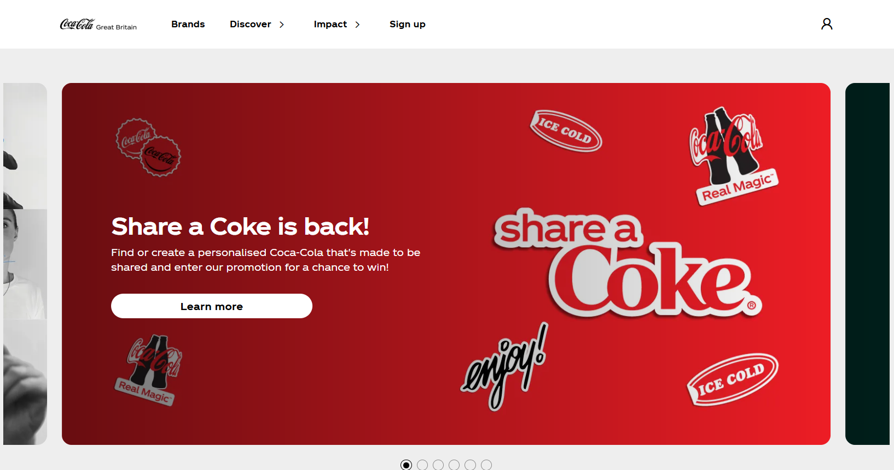
> *Por qué funciona:* La marca Coca-Cola trata sobre emoción, diversión y frescura. El rojo intenso transmite energía y urgencia, haciéndola sentir dinámica e icónica.
  - 🟡**Amarillo**: optimismo, intelecto, atención—eficaz para captar interés pero evita usarlo en grandes fondos.
> *Ejemplo:* <a href="https://www.mcdonalds.com/" target="_blank">McDonald’s</a>
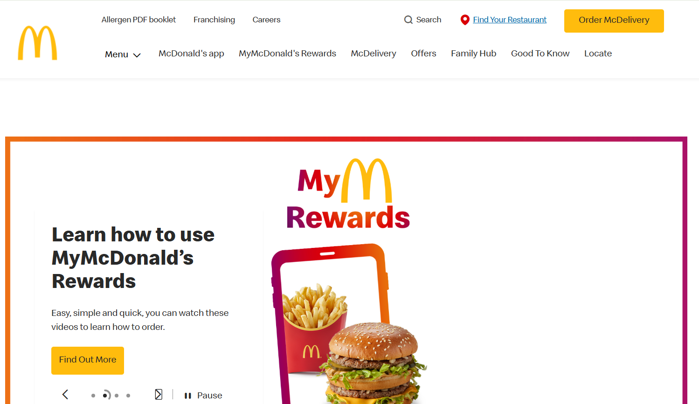  
> *Por qué funciona:* McDonald's usa el amarillo para captar la atención y transmitir felicidad y amabilidad. Es especialmente efectivo en logotipos y acentos, sin saturar el fondo.
  - 🟢 **Verde**: frescura, seguridad—ideal para negocios ecológicos o relacionados con alimentos.
> *Ejemplo:* <a href="https://www.wholefoodsmarket.com/" target="_blank">Whole Foods Market</a> 
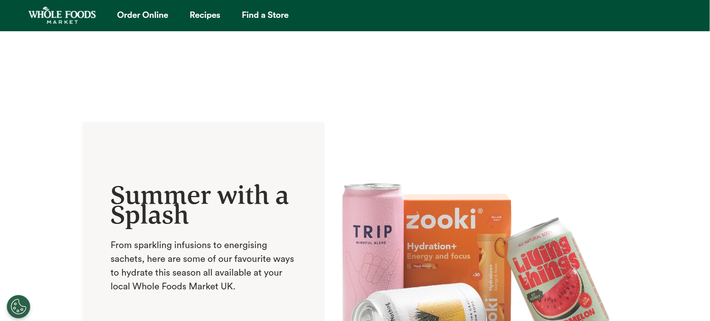  
> *Por qué funciona:* Whole Foods enfatiza la salud, la naturaleza y la sostenibilidad. El verde refuerza su compromiso con alimentos frescos, orgánicos y prácticas conscientes con el medio ambiente.
  - 🔵 **Azul**: confianza, calma—popular en empresas financieras y tecnológicas.
> *Ejemplo:* <a href="https://www.paypal.com/" target="_blank">PayPal</a>   
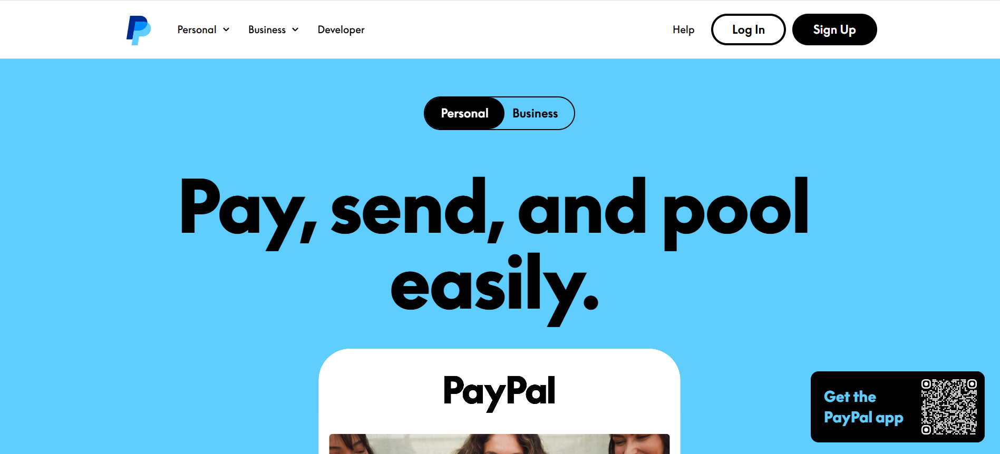 
> *Por qué funciona:* El azul es el color dominante en el diseño de PayPal, evocando confianza, seguridad y profesionalismo—crítico para un proveedor de servicios financieros. 
  - 🟣 **Púrpura**: realeza, feminidad—usado a menudo en productos de lujo y belleza.
> *Ejemplo:* <a href="https://www.cadbury.co.uk/" target="_blank">Cadbury</a>  
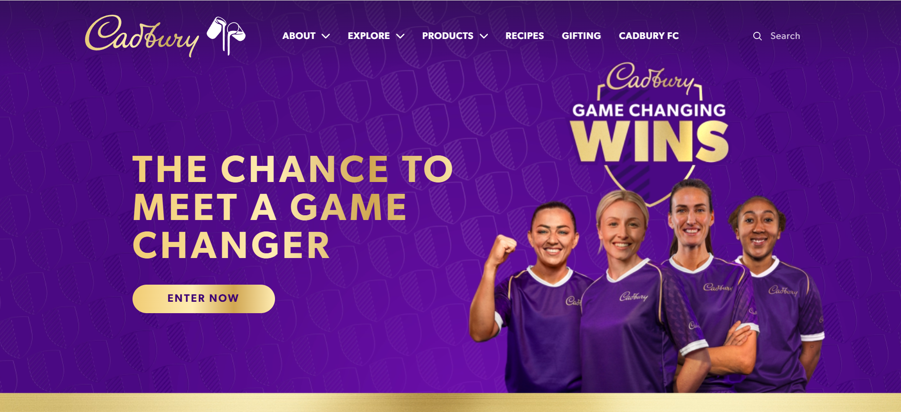  
> *Por qué funciona:* Cadbury utiliza un púrpura intenso para reflejar lujo e indulgencia. El color también ayuda a distinguir sus productos y añade una sensación de calidad premium.

- **Usa paletas científicas**:
  - **Análogas**: armoniosas, colores contiguos en la rueda de color.
  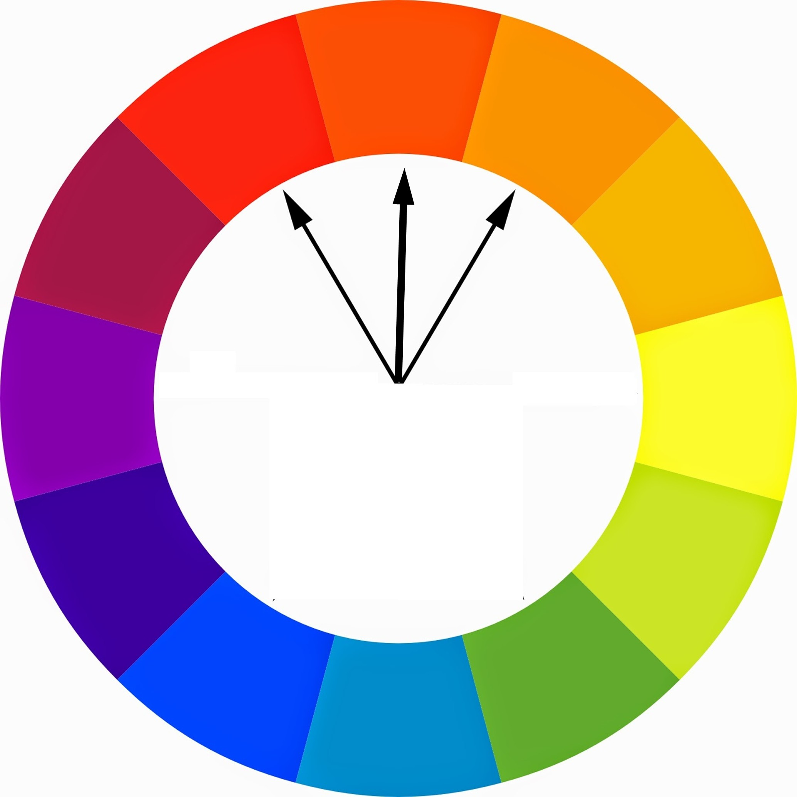  
  - **Complementarias**: opuestas en la rueda—llamativas, pero mejor para acentos, no para texto.
  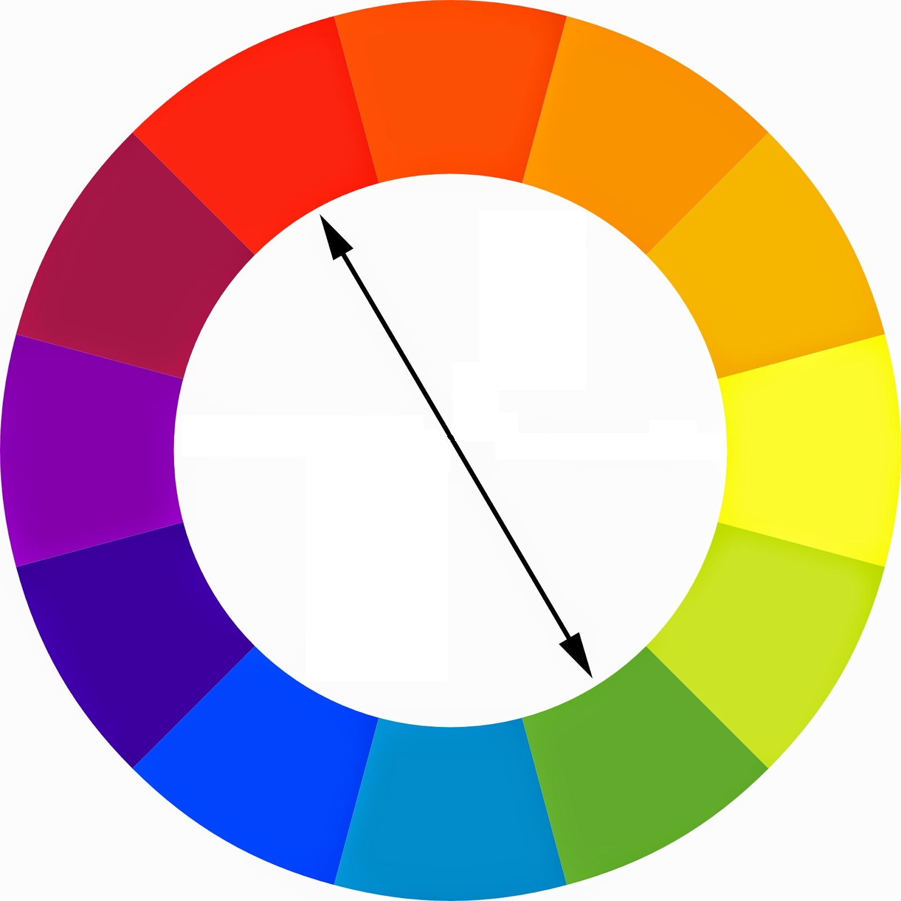   
  - **Paletas triádicas y cuadradas**: bien equilibradas y vibrantes.
    <div style="display: flex; justify-content: center; gap: 20px;">
      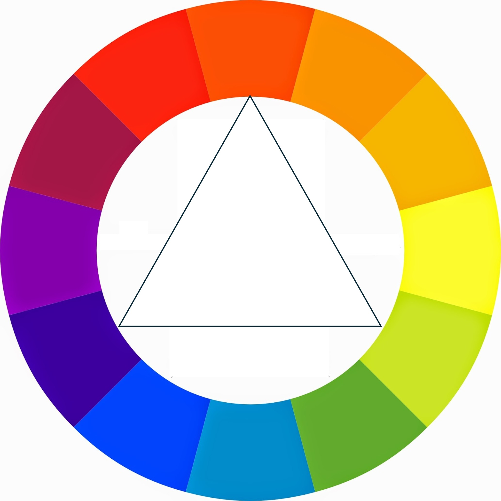
      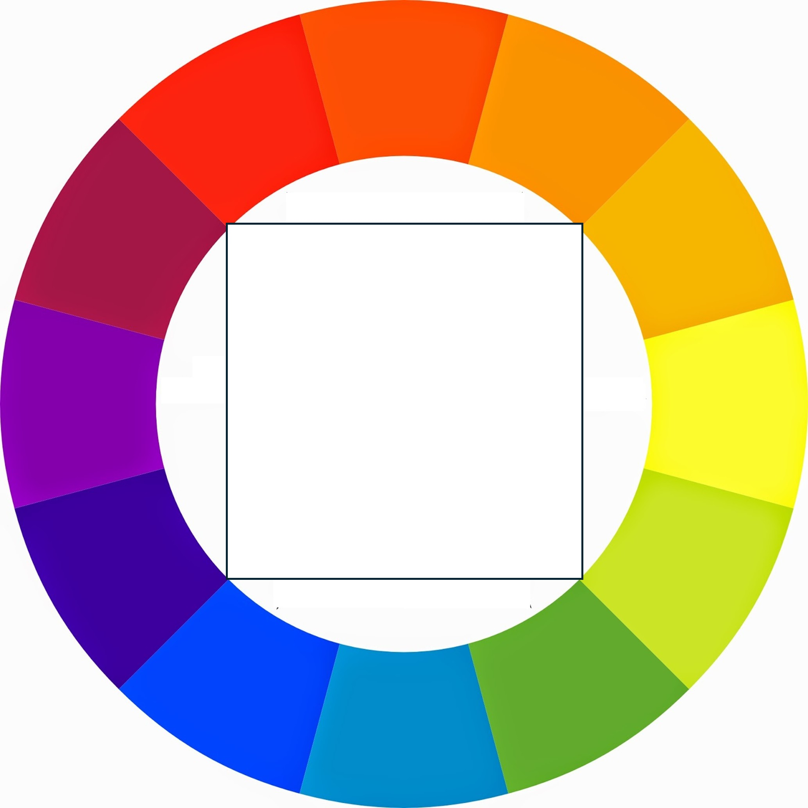
    </div>

- **Utiliza herramientas profesionales**:
  - <a href="https://color.adobe.com/" target="_blank">Adobe Color</a>: para crear temas de color y transferirlos a tu contenido
  - <a href="https://coolors.co/" target="_blank">Coolors</a>: paletas de colores predefinidas
  - <a href="https://colorhunt.co" target="_blank">Color Hunt</a>: paletas de colores predefinidas

Elige combinaciones de colores que reflejen el propósito de tu sitio web. Una buena paleta hace que tu diseño se sienta intencionado, coherente y memorable.

---

### ✍️ Entendiendo la Tipografía<a href="#top" class="back-to-top-link" aria-label="Back to Top">↑</a>

La tipografía guía el recorrido del lector. Una gran tipografía aporta claridad y estado de ánimo a tu contenido.

- **Elige fuentes legibles**: Prioriza la legibilidad en todos los tamaños de pantalla.
- **Limita a 2–3 familias tipográficas**: Demasiadas pueden abrumar y distraer. 
  - <strong>Fuentes serif</strong> (como <span style="font-family: 'Georgia', serif;">Georgia</span> o <span style="font-family: 'Times New Roman', serif;">Times New Roman</span>) tienen pequeños adornos decorativos, o "pies", al final de sus letras, dando una sensación tradicional y elegante, usada a menudo en impresión.<br>
  - <strong>Fuentes sans-serif</strong> (como Arial) carecen de estos adornos, ofreciendo un aspecto limpio, moderno y minimalista que es muy legible, especialmente en pantallas digitales.<br>
  - La elección entre ellas depende a menudo del medio (impresión vs. digital) y del estado de ánimo deseado (clásico vs. moderno).
- **Establece jerarquía**:
  - Usa tamaño, peso (negrita vs. regular) y espaciado para indicar importancia.
  - Combina fuentes serif (<span style="font-family: 'Georgia', serif;">clásicas, establecidas</span>) con sans-serif (modernas, limpias) para contraste.
- **Considera el tono de tu marca**: Una <span style="font-family: 'Times New Roman', serif;">fuente serif</span> transmite tradición, mientras que una sans-serif en negrita se siente tecnológica. Usa script para algo más <span style="font-family: 'Dancing Script', cursive;">personal</span> o <span style="font-family: 'Great Vibes', cursive;">elegante</span>. 

El diseño es comunicación: tus elecciones tipográficas deben ayudar a los usuarios a absorber tu mensaje, no luchar contra él.

---

### 👁️ Gestionando la Atención con el Diseño UI<a href="#top" class="back-to-top-link" aria-label="Back to Top">↑</a>

Tus usuarios no leen, escanean. El diseño UI consiste en guiar su atención hacia lo que más importa.

#### ✅ Jerarquía
- Los elementos más grandes y en negrita se notan primero.
- Usa **contraste de color** y **<span style="font-size: larger;">tamaño</span>** para destacar lo importante—como un botón verde "Comprar ahora" en un diseño en escala de grises.

#### 🧱 Maquetación
- Divide bloques de texto con imágenes y espacios en blanco.
- Longitud ideal de línea: **40–60 caracteres** para facilitar la lectura.
- Evita muros de texto abrumadores como los de Wikipedia.

#### 📐 Alineación
- Alinea los elementos para crear estructura.
- Reduce la cantidad de puntos de alineación—la uniformidad hace que tu diseño se vea más profesional.

#### 🌌 Espacio en Blanco
- El vacío añade elegancia. Los diseños de alta gama (piensa en Apple) usan el espacio en blanco para sugerir valor y claridad.
- No satures tu contenido—deja que cada elemento respire.

#### 🧑‍🎨 Diseña para tu Audiencia
- Un sitio para niños debe verse diferente a uno financiero.
- Ajusta color, maquetación y fuente a las expectativas y deseos de tu usuario.

Cuando el UI está bien hecho, los usuarios ni lo notan—simplemente navegan felices por tu sitio.

---

### 💡 Diseño de Experiencia de Usuario (UX)<a href="#top" class="back-to-top-link" aria-label="Back to Top">↑</a>

UX trata sobre la **empatía**—diseñar pensando en el recorrido de tu usuario. Pregúntate: ¿Pueden los usuarios encontrar lo que necesitan fácilmente? ¿Pueden interactuar cómodamente en todos los dispositivos?

- **Haz la navegación intuitiva**: Usa patrones familiares como barras de navegación superiores o menús tipo hamburguesa.
- **Diseño diligente (responsive)**: Tu sitio debe verse bien en móviles, tabletas y ordenadores.
- **Prueba temprano y seguido**: Obtén retroalimentación de usuarios reales. Observa cómo interactúan y mejora en base a su comportamiento—no a tus suposiciones.

Piensa en UX como un andamiaje invisible—no es glamuroso, pero sostiene todo tu diseño.


---

## 🏁 Resumen<a href="#top" class="back-to-top-link" aria-label="Back to Top">↑</a>

Hoy aprendiste:
- Cómo funciona Internet y los sitios web
- Estructura y elementos de HTML
- Estilizado con CSS y el modelo de caja
- Cómo usar Bootstrap para un diseño rápido y diligente
- Principios clave de diseño web para sitios hermosos y fáciles de usar

**Próximos pasos:** ¡Intenta construir una página web simple usando HTML, dale estilo con CSS y experimenta con componentes de Bootstrap! Puedes acelerar tu diseño usando <a href="https://www.canva.com/" target="_blank">Canva</a>, que te permite diseñar un sitio web en tu navegador, publicarlo y luego ver su código.
