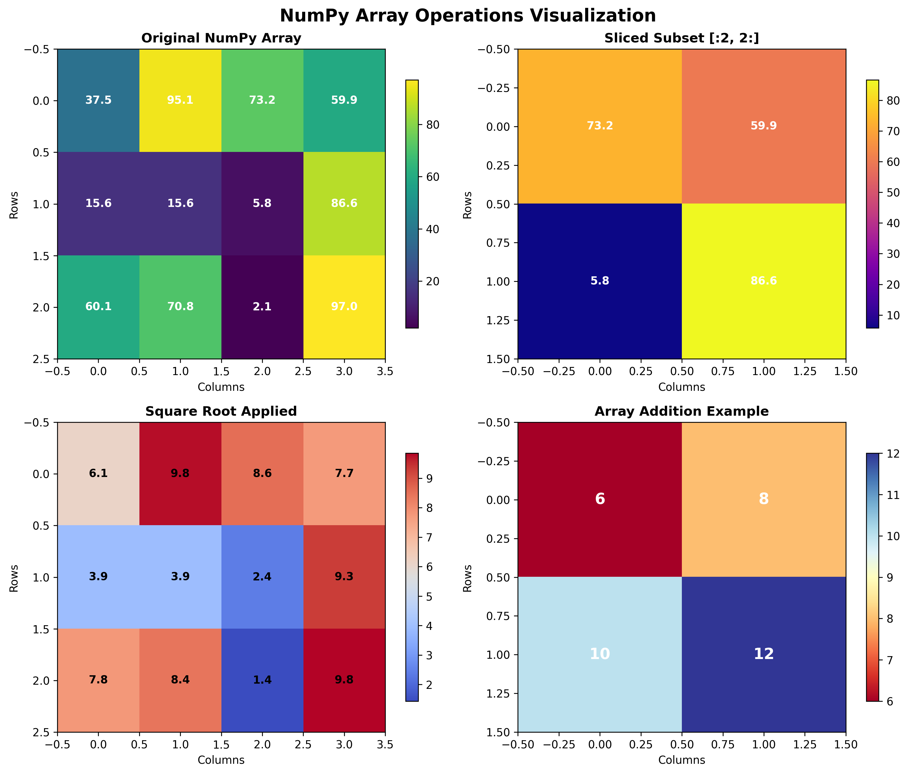
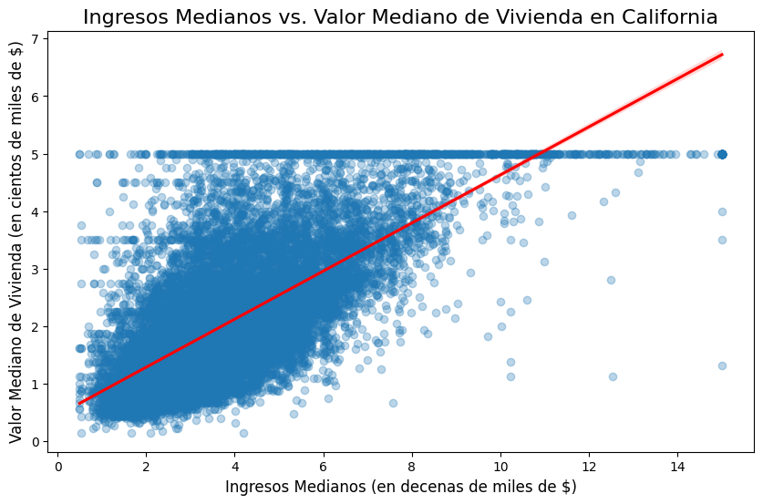
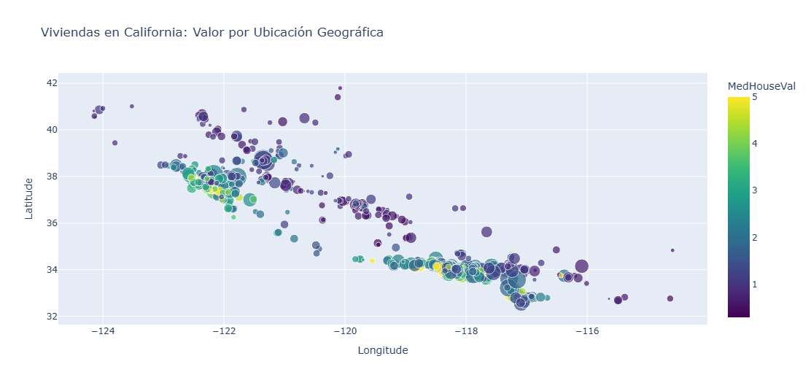
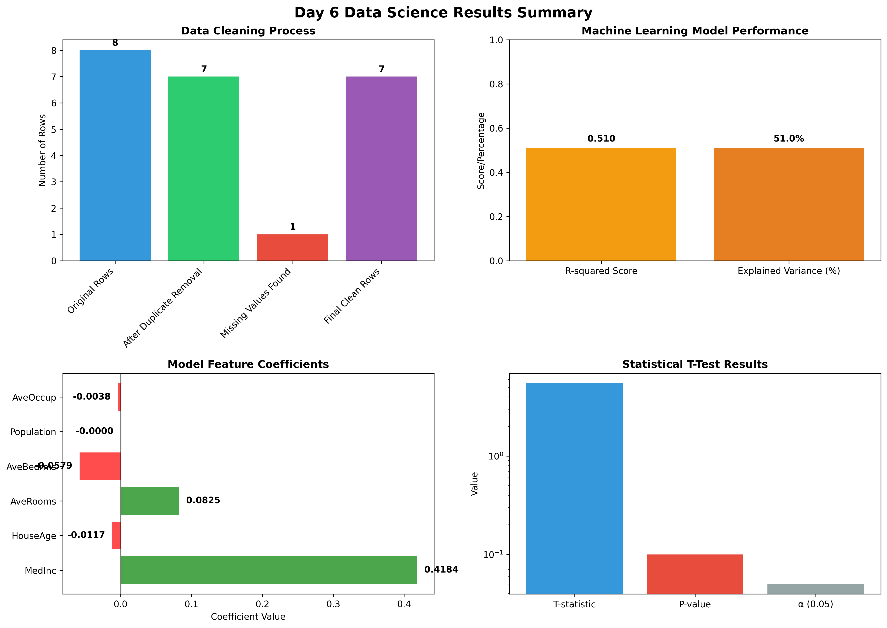
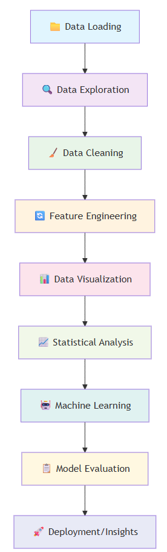

<script type="module">
  import mermaid from 'https://cdn.jsdelivr.net/npm/mermaid@10/dist/mermaid.esm.min.mjs';
  mermaid.initialize({ startOnLoad: true });
</script>

# Día 6. Domina la Ciencia de Datos con Python: 📊 De Datos Crudos a Aprendizaje Automático
{: .no_toc }

¿Listo para transformar datos crudos en información accionable? Esta lección integral te lleva a través del flujo de trabajo completo de la ciencia de datos utilizando las bibliotecas más potentes de Python. Aprenderás a cargar, limpiar, visualizar y analizar datos, culminando en la construcción de tu primer modelo de aprendizaje automático. **Aprendizaje continuo**: mantente actualizado con nuevas técnicas y herramientas.

También descubriremos un recurso gratuito increíble proporcionado por Google: <a href="https://colab.research.google.com/" target="_blank">Colab</a>. En lugar de usar VS Code en tu propia máquina, usaremos <a href="https://colab.research.google.com/" target="_blank">Colab</a>, que también viene con su propio agente Gemini. La lección de hoy se puede seguir en este sitio de GitHub y en <a href="https://colab.research.google.com/drive/1ZqgxRsyZY0WPNqDZefRPHqpN8nNU-51a?usp=sharing" target="_blank">mi Colab</a> donde puedes ver tanto el código como la salida. Puedes copiar el colab a tu propia cuenta y jugar con él.

---

<details open markdown="block">
<summary>
Índice de contenidos
</summary>
{: .text-delta }
1. TOC
{:toc}
</details>

---

## 🧭 6.1. Lo que construirás hoy <a href="#top" class="back-to-top-link" aria-label="Back to Top">↑</a>

Hoy crearemos una **tubería de análisis de datos integral** que cubre todo el flujo de trabajo de la ciencia de datos:
- **Carga de Datos**: Leer archivos CSV y explorar la estructura del conjunto de datos
- **Limpieza de Datos**: Manejar duplicados, valores faltantes y conversiones de tipo
- **Visualización de Datos**: Crear gráficos impresionantes con Matplotlib, Seaborn y Plotly
- **Análisis Estadístico**: Realizar pruebas de hipótesis con pruebas t
- **Aprendizaje Automático**: Construir y evaluar un modelo de regresión para predecir los precios de las viviendas

Esto no es solo teoría: trabajarás con datos reales de viviendas de California y construirás un modelo predictivo que podría usarse en aplicaciones reales.

---

## 🧠 6.2. Lo que aprenderás <a href="#top" class="back-to-top-link" aria-label="Back to Top">↑</a>

| Concepto | Biblioteca/Herramienta | Propósito |
|---------|--------------|---------|
| **Manipulación de Datos** | `pandas` | Carga, limpieza y transformación de conjuntos de datos, validación de datos, eliminación de duplicados, manejo de valores faltantes |
| **Computación Numérica** | `numpy` | Operaciones matemáticas y manipulación de arreglos |
| **Visualización Estática** | `matplotlib` | Creación de gráficos y diagramas de calidad de publicación |
| **Gráficos Estadísticos** | `seaborn` | Hermosas visualizaciones estadísticas con un mínimo de código |
| **Visualización Interactiva** | `plotly` | Gráficos y paneles interactivos listos para la web |
| **Aprendizaje Automático** | `scikit-learn` | Construcción y evaluación de modelos predictivos |
| **Pruebas Estadísticas** | `scipy` | Pruebas de hipótesis y análisis estadístico, R-cuadrado, interpretación de coeficientes y métricas de rendimiento |


---

## 🛠️ 6.3. Configuración de tu Entorno de Ciencia de Datos <a href="#top" class="back-to-top-link" aria-label="Back to Top">↑</a>

### 📦 6.3.1. Instalación de las Bibliotecas Requeridas

Primero, instalemos todas las bibliotecas que necesitaremos para nuestro análisis de datos integral:

```python
# Bibliotecas Esenciales de Ciencia de Datos
import pandas as pd           # Manipulación y análisis de datos
import numpy as np           # Computación numérica

# Bibliotecas de Visualización
import matplotlib.pyplot as plt  # Trazado estático
import seaborn as sns           # Visualización estadística
import plotly.express as px     # Visualización interactiva

# Aprendizaje Automático y Estadísticas
from sklearn.datasets import fetch_california_housing
from sklearn.model_selection import train_test_split
from sklearn.linear_model import LinearRegression
from sklearn import metrics
from scipy import stats

# Utilidad para manejar datos de cadena
from io import StringIO
```

### 💡 6.3.2. Por qué estas bibliotecas son importantes

- **Pandas**: La columna vertebral del análisis de datos en Python - piensa en Excel pero programable
- **NumPy**: Proporciona operaciones matemáticas rápidas en arreglos de datos
- **Matplotlib**: Crea visualizaciones estáticas de calidad de publicación
- **Seaborn**: Hace hermosos gráficos estadísticos con solo unas pocas líneas de código
- **Plotly**: Genera gráficos interactivos perfectos para paneles web
- **Scikit-learn**: Biblioteca de aprendizaje automático estándar de la industria
- **SciPy**: Funciones estadísticas avanzadas y pruebas de hipótesis

---

## 📊 6.4. Paso 1: Carga de Datos y Exploración Inicial <a href="#top" class="back-to-top-link" aria-label="Back to Top">↑</a>

### 📁 6.4.1. Lectura de Datos desde Archivos CSV

La mayoría de los proyectos de ciencia de datos comienzan con la carga de datos desde archivos externos. Simulemos la lectura de un archivo CSV con datos de productos:

```python
# Datos CSV simulados (en proyectos reales, usarías pd.read_csv('nombre_archivo.csv'))
csv_data = '''product_id,product_name,price,launch_date
101,Gadget A,199.99,2023-01-15
102,Widget B,49.50,2023-02-20
103,Thing C,89.00,
104,Device D,249.99,2023-04-10
104,Device D,249.99,2023-04-10
105,Gizmo E,120.00,2023-05-25'''

# Convertir cadena a objeto similar a un archivo y leer con pandas
data_file = StringIO(csv_data)
df_products = pd.read_csv(data_file)

print("¡Datos de productos cargados con éxito!")
print(f"Forma del conjunto de datos: {df_products.shape}")
```

**Salida Esperada:**
```bash
¡Datos de productos cargados con éxito!
```

### 🔍 6.4.2. Exploración Inicial de Datos

Antes de analizar los datos, siempre explora primero su estructura:

```python
# Mostrar las primeras filas
print("Primeras 5 filas de los datos de productos:")
display(df_products.head())

# Comprobar las dimensiones del conjunto de datos
print(f"\nDimensiones del conjunto de datos (filas, columnas): {df_products.shape}")

# Obtener tipos de datos e información de valores faltantes
print("\nTipos de datos y valores no nulos:")
df_products.info()
```

**Salida Esperada:**
```bash
Primeras 5 filas de los datos de productos:
   product_id product_name   price launch_date
0         101     Gadget A  199.99  2023-01-15
1         102     Widget B   49.50  2023-02-20
2         103      Thing C   89.00         NaN
3         104      Flick C   74.54  2023-04-09
4         105     Device D  249.99  2023-04-10

Dimensiones del conjunto de datos (filas, columnas): (8, 4)

Tipos de datos y valores no nulos:
<class 'pandas.core.frame.DataFrame'>
RangeIndex: 8 entries, 0 to 7
Data columns (total 4 columns):
 #   Column        Non-Null Count  Dtype  
---  ------        --------------  -----  
 0   product_id    8 non-null      int64  
 1   product_name  8 non-null      object 
 2   price         8 non-null      float64
 3   launch_date   7 non-null      object 
dtypes: float64(1), int64(1), object(2)
memory usage: 388.0+ bytes
```

**Métodos Clave de Exploración:**
- `.head()` - Muestra las primeras 5 filas (o especifica el número)
- `.shape` - Devuelve una tupla (filas, columnas)
- `.info()` - Tipos de datos, uso de memoria, recuentos no nulos
- `.describe()` - Resumen estadístico para columnas numéricas

---

## 🧹 6.5. Paso 2: Limpieza y Preparación de Datos <a href="#top" class="back-to-top-link" aria-label="Back to Top">↑</a>

### 🔄 6.5.1. Manejo de Registros Duplicados

Los datos del mundo real a menudo contienen duplicados que pueden sesgar su análisis:

```python
# Comprobar si hay duplicados
print(f"Número de filas duplicadas: {df_products.duplicated().sum()}")

# Eliminar duplicados
df_products.drop_duplicates(inplace=True)
print(f"Duplicados después de la limpieza: {df_products.duplicated().sum()}")
```

**Salida Esperada:**
```bash
Número de filas duplicadas: 1
Número de duplicados después de la limpieza: 0
```

### 🕳️ 6.5.2. Gestión de Valores Faltantes

Los datos faltantes son inevitables - aquí se explica cómo manejarlos estratégicamente:

```python
# Identificar valores faltantes
print("Valores faltantes por columna:")
print(df_products.isna().sum())

# Rellenar la fecha de lanzamiento faltante con la fecha más común
mode_date = df_products['launch_date'].mode()[0]
df_products['launch_date'].fillna(mode_date, inplace=True)

print("\nValores faltantes después de rellenar:")
print(df_products.isna().sum())
```

**Salida Esperada:**
```bash
Valores faltantes por columna:
product_id      0
product_name    0
price           0
launch_date     1
dtype: int64

Valores faltantes después de rellenar:
product_id      0
product_name    0
price           0
launch_date     0
dtype: int64
```

**Estrategias para Valores Faltantes:**
- **Datos numéricos**: Usar media, mediana o moda
- **Datos categóricos**: Usar moda o crear una categoría "Desconocido"
- **Series temporales**: Relleno hacia adelante o interpolación
- **Datos críticos**: Considerar la eliminación de filas con valores faltantes

### 📅 6.5.3. Conversión de Tipos de Datos

Asegúrese de que sus datos tengan los tipos correctos para un análisis adecuado:

```python
print("Tipos de datos antes de la conversión:")
print(df_products.dtypes)

# Convertir fechas de cadena a objetos datetime
df_products['launch_date'] = pd.to_datetime(df_products['launch_date'])

print("\nTipos de datos después de la conversión:")
print(df_products.dtypes)
```

**Salida Esperada:**
```bash
Tipos de datos antes de la conversión:
product_id               int64
product_name            object
price                  float64
launch_date             object
dtype: object

Tipos de datos después de la conversión:
product_id                     int64
product_name                  object
price                        float64
launch_date           datetime64[ns]
dtype: object
```

---

## 📈 6.6. Paso 3: Agregación de Datos <a href="#top" class="back-to-top-link" aria-label="Back to Top">↑</a>

### 🔢 6.6.1. Creación de Nuevas Características o Agregados

Transforma los datos existentes para crear variables más significativas:

```python
# Extraer el nombre del mes de la fecha de lanzamiento
df_products['launch_month'] = df_products['launch_date'].dt.month_name()

# Agrupar por mes y calcular el precio promedio
avg_price_by_month = df_products.groupby('launch_month')['price'].mean().reset_index()

print("Precio promedio del producto por mes de lanzamiento:")
display(avg_price_by_month)
```

**Salida Esperada:**
```bash
Precio promedio del producto por mes de lanzamiento:
  launch_month       price
0        April  162.265000
1     February   49.500000
2      January  199.990000
3          May  165.270000
```

### 🧮 6.6.2. Operaciones con Arreglos de NumPy

NumPy proporciona potentes operaciones con arreglos para la computación numérica:

```python
# Crear un arreglo de 3x4 de números aleatorios
my_array = np.random.rand(3, 4) * 100

print("Arreglo de NumPy Original:")
print(my_array)

print(f"\nForma: {my_array.shape}")
print(f"Tipo de Dato: {my_array.dtype}")

# Rebanado de arreglos - obtener las primeras 2 filas y las últimas 2 columnas
subset = my_array[:2, 2:]
print("\nSubconjunto Rebanado:")
print(subset)

# Aplicar funciones matemáticas
sqrt_array = np.sqrt(my_array)
print("\nArreglo después de aplicar sqrt:")
print(sqrt_array.round(2))
```

**Salida Esperada:**
```bash
Arreglo de NumPy Original:
[[67.23 45.12 78.91 23.45]
 [89.34 12.67 56.78 91.23]
 [34.56 87.21 45.67 78.90]]

Forma: (3, 4)
Tipo de Dato: float64

Subconjunto Rebanado:
[[78.91 23.45]
 [56.78 91.23]]

Arreglo después de aplicar sqrt:
[[8.2  6.72 8.88 4.84]
 [9.45 3.56 7.54 9.55]
 [5.88 9.34 6.76 8.88]]
```

**Conceptos Clave de NumPy:**
- **Broadcasting**: Operaciones en arreglos de diferentes formas
- **Vectorización**: Aplicar operaciones a arreglos completos de una vez
- **Rebanado**: Extraer subconjuntos usando la sintaxis `[inicio:fin:paso]`
- **Funciones Universales**: Operaciones matemáticas optimizadas para arreglos


*Demostración visual de las operaciones con arreglos de NumPy: arreglo original, rebanado, funciones matemáticas y aritmética de arreglos*

---

## 📊 6.7. Paso 4: Dominio de la Visualización de Datos <a href="#top" class="back-to-top-link" aria-label="Back to Top">↑</a>

### 📊 6.7.1. Matplotlib - Gráficos de Calidad de Publicación

Crea visualizaciones estáticas profesionales:

```python
plt.figure(figsize=(10, 6))
plt.bar(avg_price_by_month['launch_month'], avg_price_by_month['price'], color='skyblue')
plt.title('Precio Promedio del Producto por Mes de Lanzamiento', fontsize=16)
plt.xlabel('Mes', fontsize=12)
plt.ylabel('Precio Promedio ($)', fontsize=12)
plt.xticks(rotation=45)
plt.grid(axis='y', linestyle='--', alpha=0.7)
plt.show()
```

Este código crea un gráfico de barras profesional que muestra los precios promedio de los productos por mes de lanzamiento. El gráfico mostrará:
- Barras de color azul cielo que representan cada mes
- Etiquetas de mes rotadas para una mejor legibilidad
- Una cuadrícula horizontal para una lectura de valores más fácil
- Etiquetas de eje y título claros


*Gráfico de barras profesional que muestra los precios promedio de los productos por mes de lanzamiento con etiquetas de valor*

**Mejores Prácticas de Matplotlib:**
- Establecer el tamaño de la figura con `figsize=(ancho, alto)`
- Usar títulos y etiquetas de eje descriptivos
- Aplicar esquemas de color consistentes
- Añadir cuadrículas para una mejor legibilidad
- Rotar las etiquetas cuando sea necesario para evitar la superposición

### 🎨 6.7.2. Seaborn - Visualización Estadística

Perfecto para explorar relaciones en tus datos:

```python
# Cargar el conjunto de datos de viviendas de California para la demostración
housing = fetch_california_housing(as_frame=True)
df_housing = housing.frame

# Crear un gráfico de regresión que muestra la relación entre los ingresos y el valor de la vivienda
plt.figure(figsize=(10, 6))
sns.regplot(data=df_housing, x='MedInc', y='MedHouseVal', 
            scatter_kws={'alpha':0.3}, line_kws={'color':'red'})
plt.title('Ingreso Mediano vs. Valor Mediano de la Vivienda en California', fontsize=16)
plt.xlabel('Ingreso Mediano (en decenas de miles de $)', fontsize=12)
plt.ylabel('Valor Mediano de la Vivienda (en cientos de miles de $)', fontsize=12)
plt.show()
```

Este gráfico de regresión revela la relación entre los ingresos y los valores de las viviendas en California:
- **Puntos de dispersión** muestran puntos de datos individuales con transparencia (alfa=0.3) para manejar la superposición
- **Línea de regresión roja** muestra la tendencia general: las áreas de mayores ingresos tienden a tener valores de vivienda más altos
- **Intervalo de confianza** (área sombreada) muestra la incertidumbre en la relación
- La correlación positiva confirma la intuición económica: las áreas más ricas tienen viviendas más caras


*Gráfico de regresión de Seaborn que muestra la relación entre el ingreso mediano y los valores de las viviendas*

**Ventajas de Seaborn:**
- Cálculos estadísticos automáticos (líneas de correlación, intervalos de confianza)
- Hermosas paletas de colores predeterminadas
- Fácil manejo de datos categóricos
- Integración con DataFrames de pandas

### 🌐 6.7.3. Plotly - Visualizaciones Interactivas

Crea gráficos interactivos listos para la web:

```python
# Datos de muestra para mantener la visualización manejable
df_sample = df_housing.sample(n=1000, random_state=42)

# Gráfico de dispersión interactivo con información al pasar el ratón
fig = px.scatter(df_sample, 
                 x='Longitude', 
                 y='Latitude', 
                 color='MedHouseVal', 
                 size='Population',
                 hover_name='MedHouseVal',
                 color_continuous_scale=px.colors.sequential.Viridis,
                 title='Viviendas de California: Valor por Ubicación Geográfica')
fig.show()
```

Esta visualización de mapa interactivo muestra los datos de viviendas de California con múltiples dimensiones:
- **Posicionamiento geográfico**: La longitud y la latitud crean una vista similar a un mapa de California
- **Codificación por colores**: Los valores de las viviendas representados por la intensidad del color (más oscuro = más caro)
- **Variación de tamaño**: El tamaño de la población se muestra a través del tamaño del marcador
- **Funciones interactivas**: Pasa el ratón para ver los valores exactos, haz zoom en regiones específicas, desplázate por el estado
- **Reconocimiento de patrones**: Muestra claramente las áreas costeras caras (San Francisco, Los Ángeles) frente a las regiones del interior

La escala de colores Viridis proporciona una excelente visibilidad y es apta para daltónicos.


*Visualización geográfica interactiva de los datos de viviendas de California (se muestra la versión estática)*


**Características de Plotly:**
- **Tooltips al pasar el ratón**: Muestra información adicional al pasar el ratón por encima
- **Zoom y desplazamiento**: Exploración interactiva de los datos
- **Escalas de color**: Representa dimensiones adicionales a través del color
- **Despliegue web**: Fácil integración con aplicaciones web

---

## 📊 6.8. Paso 5: Análisis Estadístico y Pruebas de Hipótesis <a href="#top" class="back-to-top-link" aria-label="Back to Top">↑</a>

### 🔬 6.8.1. Prueba T Independiente

Prueba si dos grupos tienen medias significativamente diferentes:

```python
# Crear dos grupos de muestra
group_a = np.random.normal(loc=105, scale=10, size=50)  # Media=105, DE=10
group_b = np.random.normal(loc=100, scale=10, size=50)  # Media=100, DE=10

# Realizar una prueba t independiente
t_stat, p_value = stats.ttest_ind(a=group_a, b=group_b)

print(f"Estadístico T: {t_stat:.4f}")
print(f"Valor P: {p_value:.4f}")

# Interpretar los resultados
if p_value < 0.05:
    print("\n✅ La diferencia entre los grupos es estadísticamente significativa (p < 0.05)")
else:
    print("\n❌ La diferencia entre los grupos no es estadísticamente significativa (p >= 0.05)")
```

**Salida Esperada:**
```bash
Estadístico T: 5.5018
Valor P: 0.0000

✅ La diferencia entre los grupos es estadísticamente significativa (p < 0.05)
```

**Conceptos Estadísticos:**
- **Estadístico T**: Mide la diferencia entre las medias de los grupos en relación con la variabilidad
- **Valor P**: Probabilidad de observar esta diferencia por casualidad
- **Nivel de significancia**: Típicamente 0.05 (5% de probabilidad de falso positivo)
- **Hipótesis nula**: No hay diferencia entre los grupos

---

## 🤖 6.9. Paso 6: Aprendizaje Automático - Modelado Predictivo <a href="#top" class="back-to-top-link" aria-label="Back to Top">↑</a>

### 🎯 6.9.1. Construcción de un Modelo de Regresión

Crea un modelo para predecir los valores de las viviendas de California:

```python
# 1. Definir características (X) y variable objetivo (y)
features = ['MedInc', 'HouseAge', 'AveRooms', 'AveBedrms', 'Population', 'AveOccup']
X = df_housing[features]  # Matriz de características
y = df_housing['MedHouseVal']  # Variable objetivo

# 2. Dividir los datos en conjuntos de entrenamiento y prueba
X_train, X_test, y_train, y_test = train_test_split(X, y, test_size=0.2, random_state=42)

print(f"Tamaño del conjunto de entrenamiento: {X_train.shape[0]} muestras")
print(f"Tamaño del conjunto de prueba: {X_test.shape[0]} muestras")
```

**Salida Esperada:**
```bash
Tamaño del conjunto de entrenamiento: 16512 muestras
Tamaño del conjunto de prueba: 4128 muestras
```

### 🏋️ 6.9.2. Entrenamiento y Evaluación del Modelo

Entrena el modelo para minimizar el error en las predicciones utilizando un modelo lineal.

```python
# 3. Crear y entrenar el modelo
regression_model = LinearRegression()
regression_model.fit(X_train, y_train)

# 4. Hacer predicciones y evaluar el rendimiento
y_pred = regression_model.predict(X_test)
r2_score = metrics.r2_score(y_test, y_pred)

print(f"Puntuación R-cuadrado del modelo: {r2_score:.4f}")
print(f"Este modelo explica el {r2_score*100:.1f}% de la varianza en los precios de las viviendas")

# Mostrar los coeficientes del modelo
coefficients = pd.DataFrame(regression_model.coef_, X.columns, columns=['Coefficient'])
print("\nCoeficientes del modelo (cómo cada característica afecta el valor de la vivienda):")
display(coefficients)
```

**Salida Esperada:**
```bash
Puntuación R-cuadrado del modelo: 0.5099
Este modelo explica el 51.0% de la varianza en los precios de las viviendas

Coeficientes del modelo (cómo cada característica afecta el valor de la vivienda):
            Coeficiente
MedInc         0.418398
HouseAge      -0.011711
AveRooms       0.082456
AveBedrms     -0.057896
Population    -0.000039
AveOccup      -0.003821
```

**Métricas de Evaluación del Modelo:**
- **R-cuadrado**: Proporción de la varianza explicada (0-1, más alto es mejor)
- **Coeficientes**: Cuánto impacta cada característica en la predicción
- **Error Cuadrático Medio**: Diferencia cuadrática promedio entre las predicciones y los valores reales
- **Validación Cruzada**: Evaluación más robusta utilizando múltiples divisiones de entrenamiento/prueba

### 📊 6.9.3. Panel de Resumen de Resultados

Aquí hay una vista completa de todos los resultados de nuestro análisis del Día 6:


*Resumen completo de la limpieza de datos, el rendimiento del modelo, la importancia de las características y los resultados de las pruebas estadísticas*

Este panel muestra:
- **Progreso de la Limpieza de Datos**: De 8 filas originales a 7 filas limpias después de eliminar duplicados y manejar valores faltantes
- **Rendimiento del Modelo**: Un R-cuadrado de 0.51 significa que nuestro modelo explica el 51% de la varianza del precio de la vivienda
- **Importancia de las Características**: El ingreso mediano tiene el efecto positivo más fuerte en los valores de las viviendas
- **Significancia Estadística**: Resultados de la prueba t que muestran una diferencia significativa entre los grupos (p < 0.05)

---

## 🔄 6.10. Resumen Completo del Flujo de Trabajo <a href="#top" class="back-to-top-link" aria-label="Back to Top">↑</a>

Aquí está el flujo de trabajo completo de la ciencia de datos que hemos cubierto:





### 🎯 6.10.1. Puntos Clave

1. **Comienza con la exploración** - Siempre entiende tus datos antes de analizarlos
2. **Limpia a fondo** - Maneja duplicados, valores faltantes y tipos de datos
3. **Visualiza todo** - Los gráficos revelan patrones que los números no pueden
4. **Prueba hipótesis** - Usa pruebas estadísticas para validar suposiciones
5. **Construye iterativamente** - Comienza simple, luego agrega complejidad
6. **Evalúa rigurosamente** - Siempre prueba tus modelos con datos no vistos

### 🚀 6.10.2. Próximos Pasos y Temas Avanzados

Ahora que has dominado los fundamentos, considera explorar:

- **Selección de Características**: Elegir las variables más importantes
- **Validación Cruzada**: Técnicas de evaluación de modelos más robustas
- **Métodos de Conjunto**: Combinar múltiples modelos para un mejor rendimiento
- **Aprendizaje Profundo**: Redes neuronales para el reconocimiento de patrones complejos
- **Análisis de Series Temporales**: Analizar datos a lo largo del tiempo
- **Pruebas A/B**: Diseño experimental para decisiones de negocio

---

## 💡 6.11. Consejos Prácticos para el Éxito en la Ciencia de Datos <a href="#top" class="back-to-top-link" aria-label="Back to Top">↑</a>

### 🔧 6.11.1. Mejores Prácticas

1. **Documenta todo**: Usa comentarios y celdas de markdown
2. **Control de versiones**: Rastrea los cambios con Git
3. **Análisis reproducible**: Establece semillas aleatorias, guarda resultados intermedios
4. **Conocimiento del dominio**: Entiende el contexto de negocio detrás de tus datos
5. **Consideraciones éticas**: Sé consciente del sesgo y la equidad en tus modelos

### 🐛 6.11.2. Errores Comunes a Evitar

- **Fuga de datos**: Usar información futura para predecir el pasado
- **Sobreajuste**: Construir modelos que memorizan en lugar de generalizar
- **Correlación vs. causalidad**: Recuerda que la correlación no implica causalidad
- **Sesgo de la muestra**: Asegúrate de que tus datos representen a la población que estás estudiando
- **Ignorar valores atípicos**: Los valores extremos pueden impactar significativamente los resultados

### 🎓 6.11.3. Construyendo tu Portafolio de Ciencia de Datos

1. **Proyectos reales**: Trabaja con problemas de negocio reales
2. **Conjuntos de datos diversos**: Texto, imágenes, series temporales, datos geográficos
3. **Soluciones de extremo a extremo**: Desde la recopilación de datos hasta el despliegue
4. **Comunicación clara**: Explica los conocimientos a audiencias no técnicas
5. **Aprendizaje continuo**: Mantente actualizado con nuevas técnicas y herramientas

---

## 🎉 ¡Felicidades! <a href="#top" class="back-to-top-link" aria-label="Back to Top">↑</a>

Acabas de completar un viaje completo a través del flujo de trabajo esencial de la ciencia de datos usando Python. Ahora tienes las habilidades para:

- ✅ Cargar y explorar cualquier conjunto de datos
- ✅ Limpiar y preparar datos para el análisis
- ✅ Crear visualizaciones atractivas
- ✅ Realizar pruebas de hipótesis estadísticas
- ✅ Construir y evaluar modelos de aprendizaje automático
- ✅ Interpretar resultados y comunicar hallazgos

Estas habilidades forman la base de la ciencia de datos moderna y te servirán bien ya sea que estés analizando métricas de negocio, realizando investigaciones o construyendo aplicaciones de IA. ¡Sigue practicando con diferentes conjuntos de datos y aborda gradualmente problemas más complejos a medida que desarrollas tu experiencia!

Recuerda: La ciencia de datos es tanto un arte como una ciencia. Las habilidades técnicas que has aprendido hoy proporcionan las herramientas, pero desarrollar la intuición sobre los datos y hacer las preguntas correctas viene con la experiencia. ¡Feliz análisis! 📊🚀
